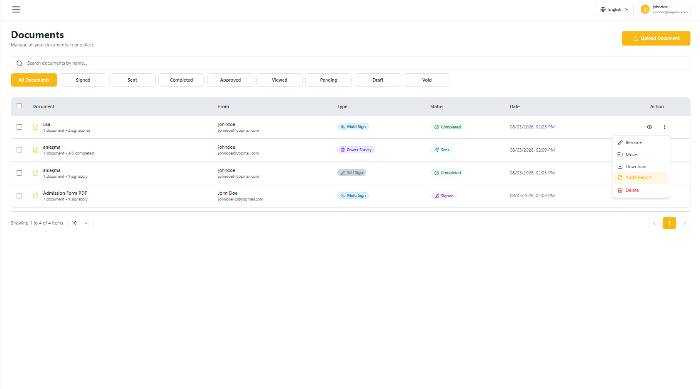
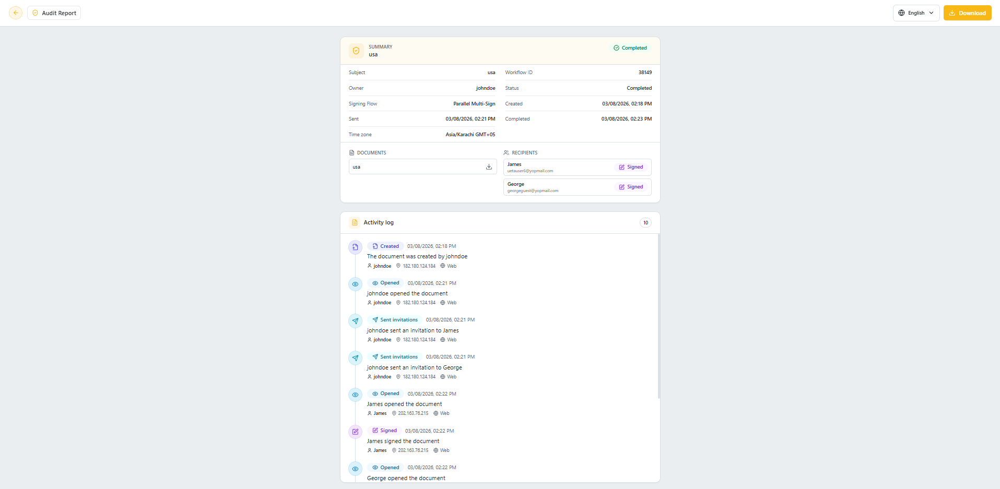
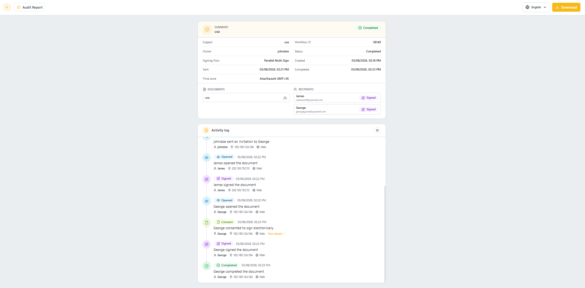
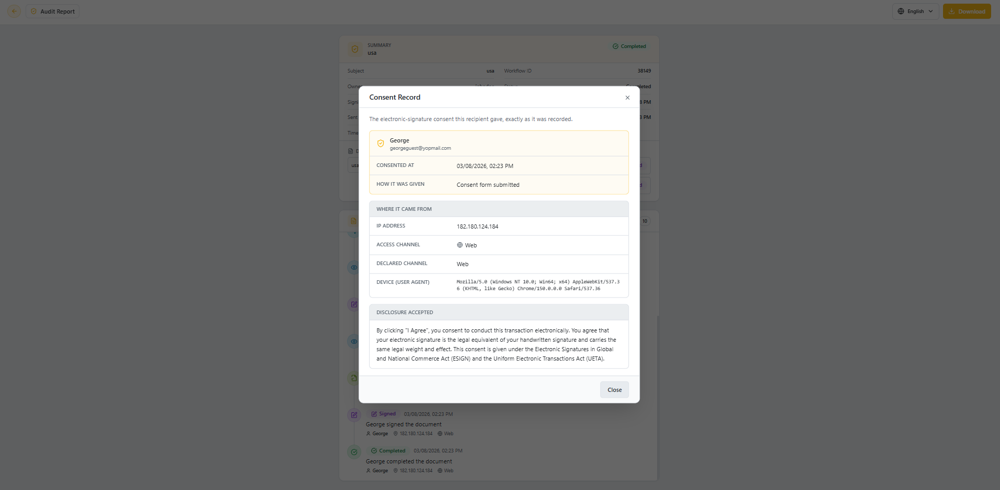

## Overview

The **Audit Report** is a dedicated, full-page timeline of everything that happened to a document — from creation to completion. It replaces the older summary popup with a complete activity log, including a detailed **Consent Record** for every recipient's e-signature consent.

## Opening the Audit Report

1. Go to the **Documents** list.
2. Click the **⋮** (three-dot) menu on the document you want to inspect.
3. Select **Audit Report**.

## Summary and Activity Log

The Audit Report opens as a full page with two sections:

- **Summary** – Subject, Owner, Signing Flow, Status, Workflow ID, Sent/Created/Completed timestamps, Time zone, the list of **Documents**, and the list of **Recipients** with their current status.
- **Activity log** – A chronological, timestamped list of every event on the document (Created, Opened, Sent invitations, Consent, Signed, Completed), each showing who performed it, their IP address, and access channel.

You can download the document and its evidence report from the **Download** button in the top-right corner.

## Viewing Consent Details

Whenever a recipient consents to sign electronically, a **Consent** entry appears in the Activity log with a **View details** link.

Click **View details** to open the **Consent Record** dialog, showing exactly what was captured at the moment of consent:

- Recipient **name and email**
- **Consented at** timestamp and **How it was given**
- **Where it came from** — IP address, access channel, declared channel, and device (user agent)
- **Disclosure accepted** — the full consent text the recipient agreed to

Click **Close** to return to the Activity log.
