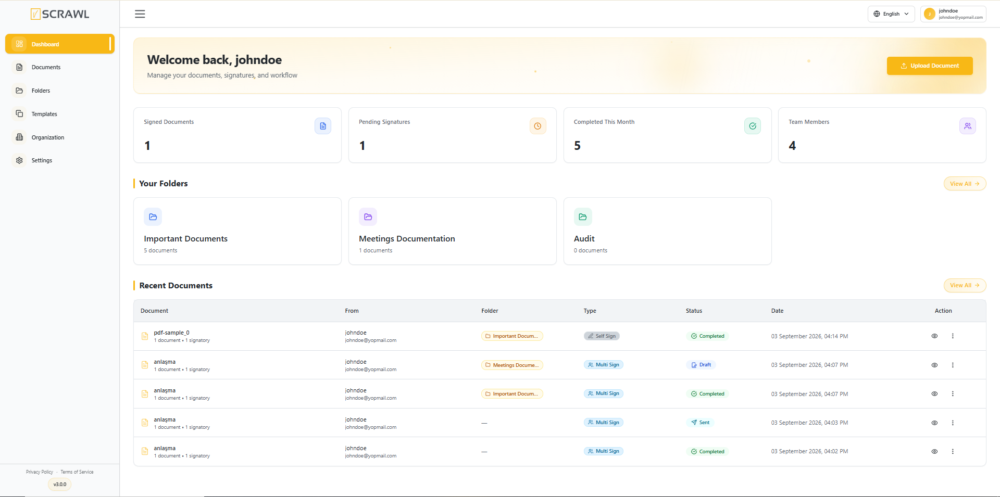

# Dashboard Overview

The **Dashboard** serves as the central hub of the vScrawl platform, providing users with a comprehensive overview of their document activity, signature progress, workflow status, and team engagement. It is designed to offer quick access to key information and frequently used actions, enabling users to manage their digital document processes efficiently.

Upon signing in, users are directed to the Dashboard, where they can monitor document statistics, review recent activity, and initiate new document workflows.

### Dashboard Components

The Dashboard is organized into several sections that provide visibility into document management and workflow performance.

#### Welcome Section

At the top of the Dashboard, users are greeted with a welcome message displaying their account name.

This section provides:

- A personalized user experience.
- Quick access to the document management workspace.
- A convenient shortcut to upload new documents.

#### Upload Document

The **Upload Document** button allows users to quickly initiate a new document workflow.

To upload a document:

1. Click **Upload Document**.
2. Choose a signing method from the dialog that opens: **Sign Yourself**, **Multiple Recipients**, or **Power Survey**. See [Documents](documents.md) for details on each option.
3. Select the desired file from your device.
4. Configure recipients, signatures, and workflow settings as required.
5. Submit the document for processing.

This action provides a fast and efficient way to begin a new signing or approval process directly from the Dashboard.

---

#### Summary Cards

The Dashboard includes summary cards that display important document and workflow metrics in real time.

#### Signed Documents

Displays the total number of documents that have been successfully signed.

This metric helps users monitor completed signing activities across the platform.

#### Pending Signatures

Displays the number of documents awaiting signatures from one or more recipients.

Users can use this information to track outstanding actions and follow up when necessary.

#### Completed This Month

Shows the total number of document workflows completed during the current month.

This metric provides insight into monthly productivity and workflow completion rates.

#### Team Members

Displays the total number of users associated with the organization or workspace.

This information helps administrators and team leads monitor user participation and collaboration within the platform.

---

#### Your Folders

If you have any folders, a **Your Folders** section appears between the summary cards and Recent Documents, giving you quick access to your folders directly from the Dashboard without navigating to the [Folders](folders.md) page.

---

#### Recent Documents

The **Recent Documents** section provides a quick view of the latest documents created, uploaded, or processed within the account.

Each document entry includes:

- **Document Name** – The title of the document.
- **Document Details** – Information such as document count and number of signatories.
- **Sender Information** – The user who created or submitted the document.
- **Folder** – The folder the document has been filed into, if any. Documents that are not in a folder show a dash (—).
- **Status** – The current stage of the document workflow.
- **Date** – The date and time of the most recent activity.
- **Actions** – Available options for viewing or managing the document.

This section enables users to quickly access and monitor their most recent document activity without navigating to the Documents page.

---

#### Document Status Indicators

Documents displayed on the Dashboard may contain status indicators that represent their current workflow stage.

|Status|Description|
|---|---|
|Draft|The document has been created but has not yet been sent for signing.|
|Pending|The document is awaiting action from one or more recipients.|
|Completed|All required signatures and workflow steps have been successfully completed.|
|Signed|The document has been signed by the required participants.|
|Void|The document has been cancelled or invalidated and can no longer be processed.|

---

#### Viewing All Documents

The **View All** option allows users to navigate directly to the complete document repository.

This page provides additional capabilities such as:

- Searching documents.
- Filtering by status.
- Managing document workflows.
- Viewing document details.
- Performing document-related actions.

---

#### Sidebar Navigation

The sidebar on the **left side** of the dashboard provides quick access to the platform’s main modules and account features.

Available navigation options include:

- **Dashboard** – View an overview of your account activity, document statistics, pending signatures, team members, and recent documents.
- **Documents** – Access, manage, and organize all uploaded and shared documents.
- **Folders** – Create and manage folders to keep documents organized and easily accessible.
- **Templates** – Manage reusable document templates for faster document preparation and workflows.
- **Organization** – Access organization-related settings, team management, and collaborative workspace features.
- **Settings** – Configure account preferences, signature settings, notifications, language options, and security settings.

The sidebar is designed to provide fast and convenient navigation throughout the platform while maintaining a clean and user-friendly experience.

## Benefits of the Dashboard

The Dashboard provides users with:

- A centralized view of document activity.
- Real-time workflow monitoring.
- Quick access to important statistics.
- Faster document management and tracking.
- Improved visibility into signing progress and team performance.
