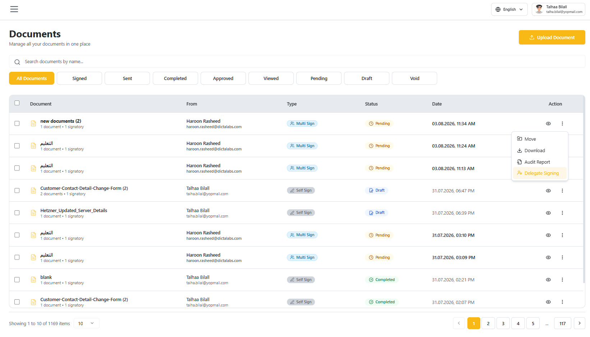
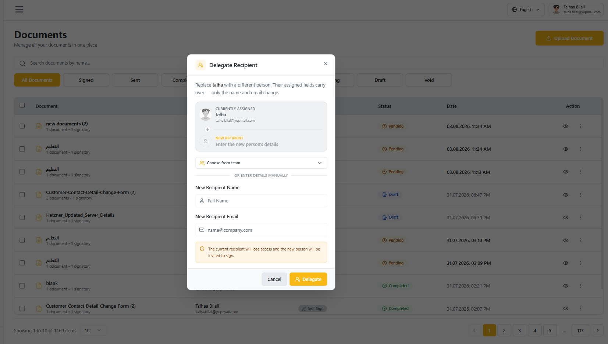
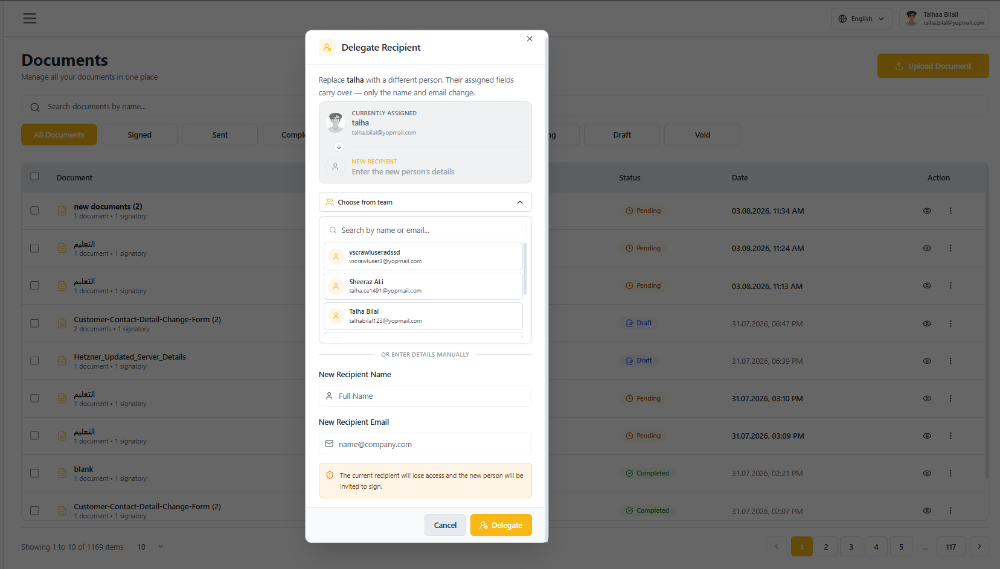

## Overview

**Delegate Recipient** lets a document owner (or a recipient themselves) hand off a pending signing task to a different person. The original recipient loses access to the document and the new person is invited to complete the fields in their place — only the **name and email** change; any fields already assigned to that recipient carry over automatically.

This is useful when the person a document was originally sent to is unavailable and someone else needs to review, fill, or sign on their behalf.

## Delegating a Recipient

1. Open the **Documents** list.
2. Find the document with the pending recipient you want to delegate.
3. Click the **⋮** (three-dot) menu on that document's row.
4. Select **Delegate Signing**.

!!! note ""
    The same **Delegate** action is also available from the recipient list inside a document's viewer/sidebar, for owners managing multiple recipients on a Multi Sign document.

## The Delegate Recipient Dialog

The dialog shows who the task is currently assigned to and lets you choose the replacement in one of two ways:

- **Choose from team** – search and pick an existing team member from a dropdown.
- **Enter details manually** – type the new recipient's full name and email directly.

### Choosing a Team Member

Click **Choose from team** to expand the picker, then search by name or email. Select a match from the list to auto-fill the new recipient's name and email.

### Entering Details Manually

If the new recipient isn't part of your team, skip the dropdown and fill in:

- **New Recipient Name** – full name of the person taking over.
- **New Recipient Email** – their email address.

!!! note ""
    You cannot delegate to the recipient's own email — the new email must be different from the one currently assigned.

### Confirming the Delegation

Once a new recipient is selected or entered, click **Delegate**.

- The current recipient immediately **loses access** to the document.
- The new recipient receives an invitation to complete the assigned fields, with the same fields the original recipient had.

Click **Cancel** at any point to close the dialog without making changes.
