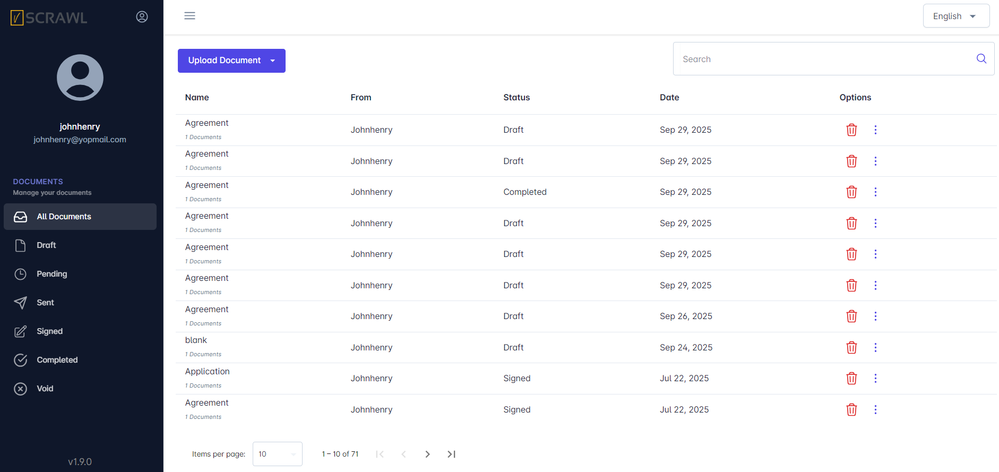
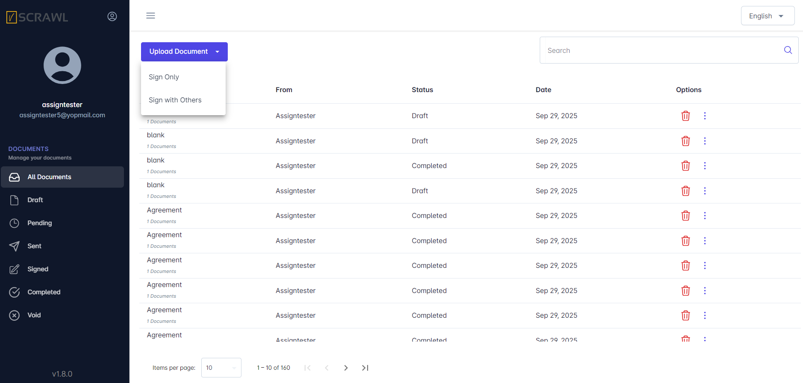
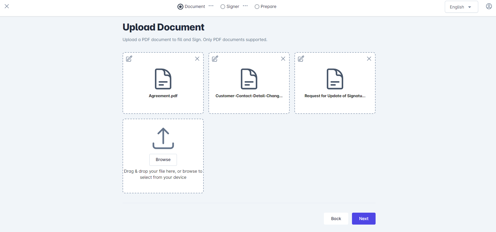
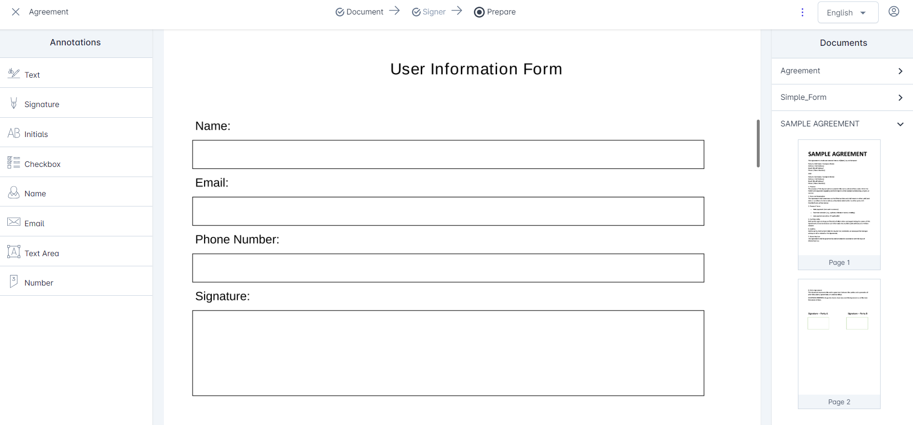
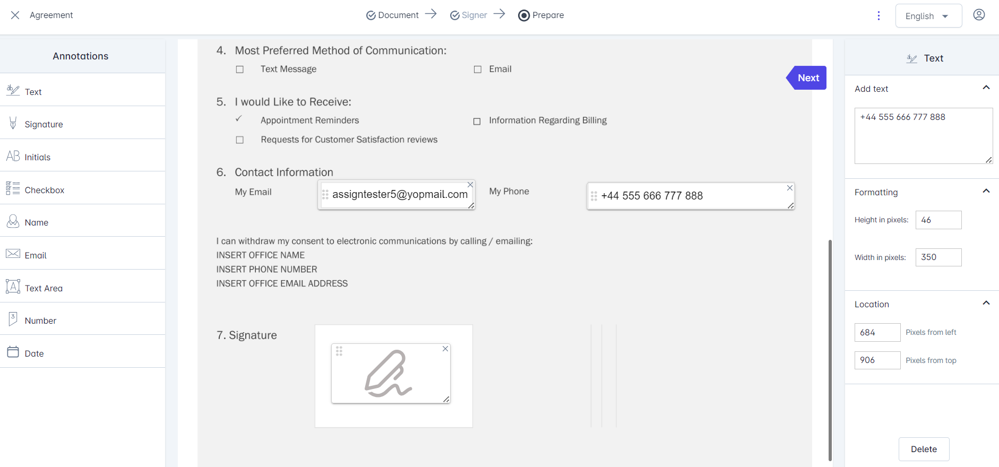
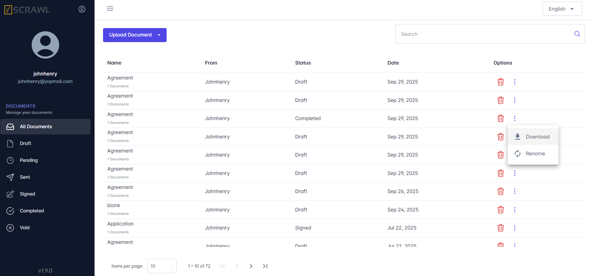
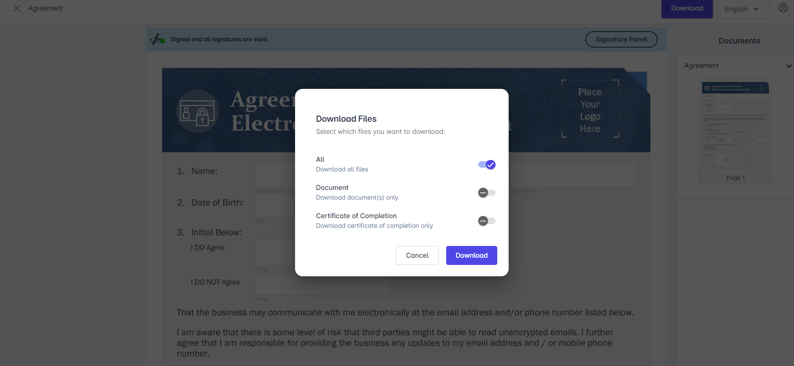
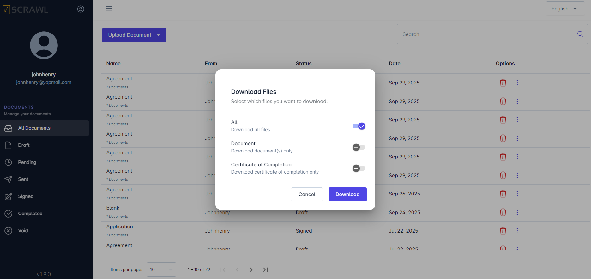

# Document Management

The **vScrawl Dashboard** is the **central hub** of the platform. From here, you can upload new documents, track their **signing progress, manage multiple files**, and quickly navigate to everything you need in your **workflow.** It is designed to be simple, efficient, well-detailed and powerful, so both **first-time users** and **advanced users** can **work efficiently**.

## Sidebar Navigation

The sidebar on the **left** helps you quickly move between document categories:

- **All Documents** – Displays every document in your account.
    
- **Draft** – Documents uploaded but not yet sent or signed.
    
- **Pending** – Documents that are waiting for signatures from recipients.
    
- **Sent** – Documents you have sent out for signing.
    
- **Signed** – Documents that have been successfully signed.
    
- **Completed** – Finalized documents, ready to download or archive.
    
- **Void** – Cancelled or invalid documents.

## Document List

The central area of the Dashboard displays a **table of documents** with clear details for each file:

- **Name** – The title of the document (e.g., _Agreement_, _Application_).
    
- **From** – The person who uploaded or sent the document.
    
- **Status** – The current stage of the document (Draft, Pending, Signed, Completed, etc.).
    
- **Date** – When the document was created or uploaded.
    
- **Options** – Quick actions available for each document:
    
    - **Trash** **Bin** – **Delete** the document.
        
    - ⋮ **More Options** – **Rename** and **Download** the document.
        

The document list is **paginated**. At the bottom, you can adjust how many items to display per page and use navigation arrows to move between pages.

## Search Bar

The **Search Bar** at the top of your Document **Dashboard** makes it quick and easy to find specific documents without scrolling through the entire list.

- Simply type a keyword such as the **document name, sender name, or status** in the search field.
    
- As you type, the **dashboard** will **instantly filter** and **display** only the **documents** that match your search criteria.
    
- This **feature** is especially useful when managing a large number of documents, helping you locate files in seconds.
    

This categorization makes it easy to monitor the status of all your documents at a glance.

## Uploading Single and Multiple Documents

At the top of the **Dashboard,** you will find the **Upload Document** button, the primary action for starting a workflow. You can choose between two options:

- **Sign Only** – Use this option if you are the only person who needs to sign the document.
    
- **Sign with Others** – Use this when multiple recipients must collaborate and sign the document.
    

The initial chapters only mention the **Sign Only** option. **Sign with Others** option is explained in section Workflow Management.

When uploading, you can add up to **five PDF documents at a time (Browse from your PC or Drag a Document)**. The documents appear in the upload screen where you can:

- **Reorder** them by dragging and dropping into your preferred sequence.
    
- **Rename** a file using the ✎ edit option.
    
- **Delete** a file using the ✕ remove option.

## Document Preparation

- Clicking on the Next button  on Upload Document screen moves to Document Preparation Screen.  You may navigate between **multiple open documents** using the **right-hand panel**, without leaving the workspace.
    
- You can **drop annotations** from the **left-hand panel** like **(Text Field, Text Area, Number, Email, Signature)** on the documents.
    
- You can also customize the **Formatting and Location** of each **annotation** on the document from the **right-hand panel.**
    
- You can **delete the annotation** by clicking on the **close icon on it** or from the **right-hand panel** on the document.
    

This ensures your **documents are organized** before moving into the signing workflow. This saves time and makes managing complex signing processes easier.

## Downloading the Documents

- You can **download** the **document** by clicking on the **three dots** in the **dashboard** document list screen.

- You can also **rename** documents directly from the **documents list screen** ensuring better organization and easier identification. You may rename only those documents which are uploaded by you.
    
- You can also **download** the **document** on the **document viewing screen** after **performing signatures** on it.

- You can download **complete document** and its **certificate of completion (Evidence Report**) in the form of a **.zip file** or either you can choose **selective download.**

