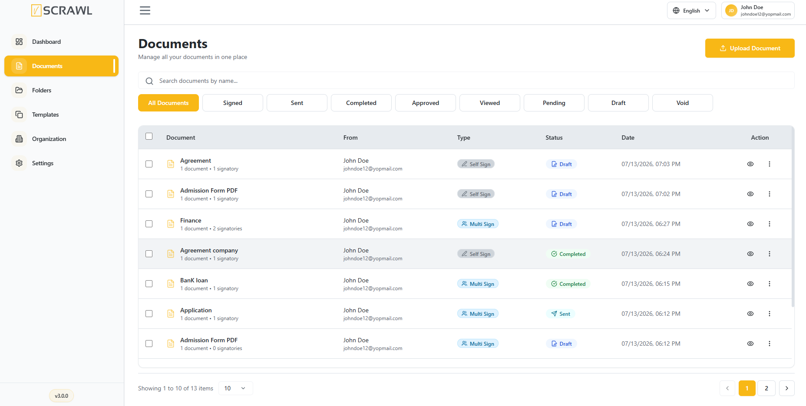
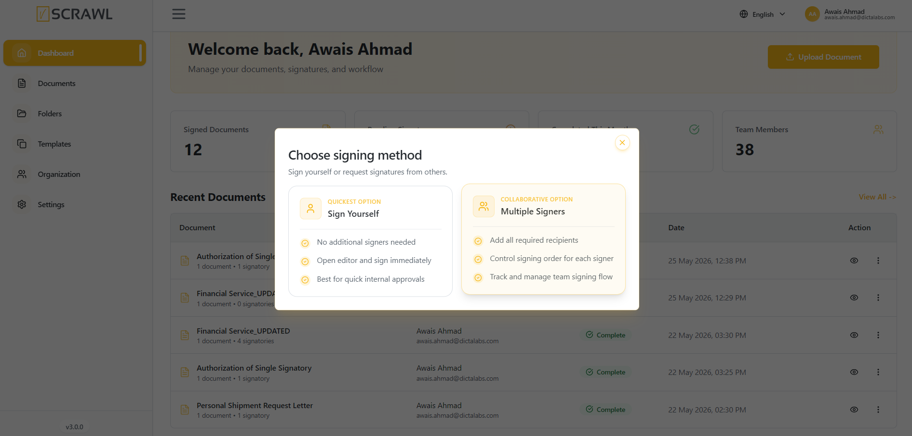
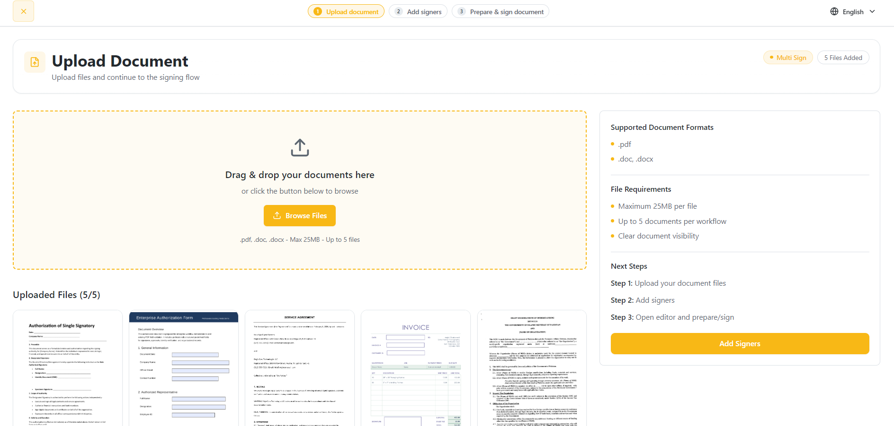
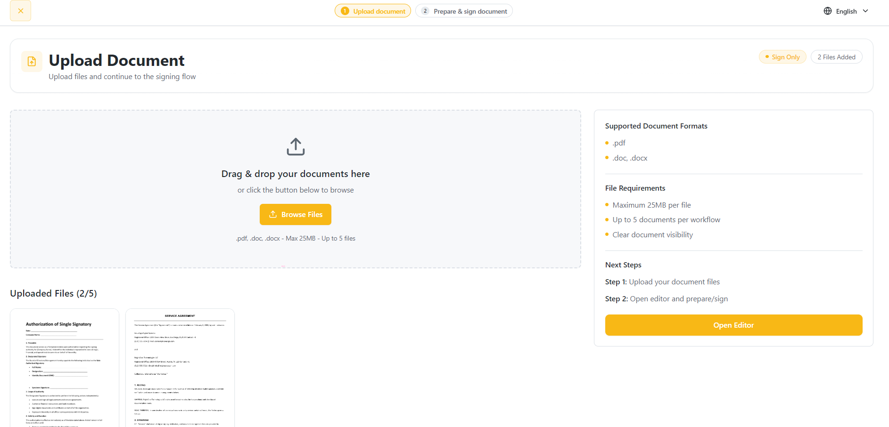
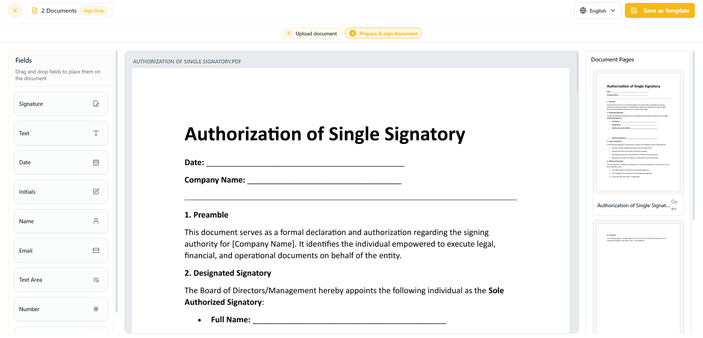
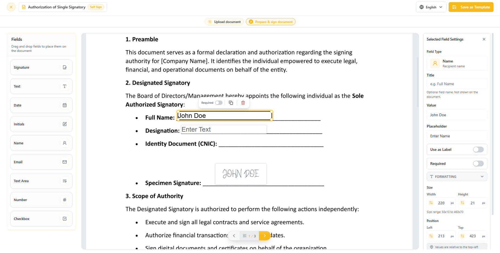
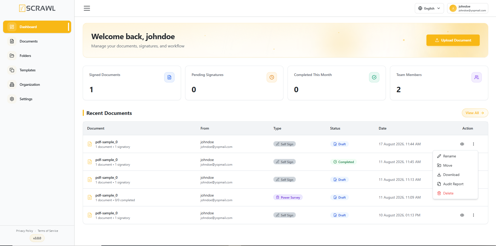
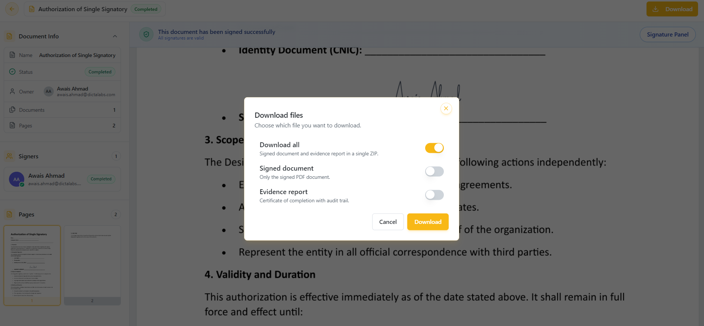
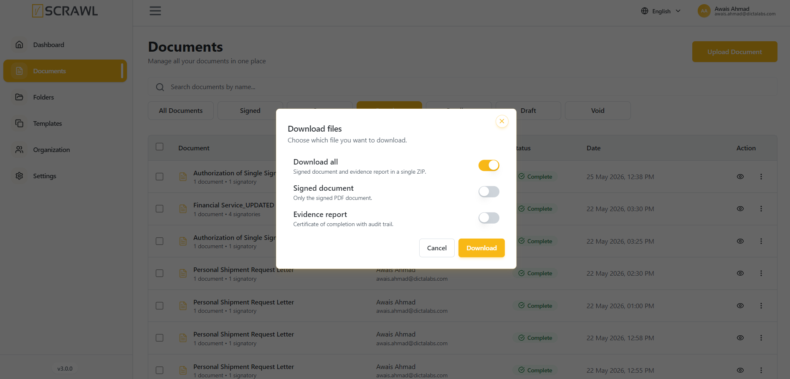

## Overview

The **Documents** module is the primary workspace within vScrawl for managing digital documents and signature workflows. It provides users with a centralized repository where they can upload, view, track, search, and manage documents throughout their lifecycle.

The Documents page offers powerful filtering, search, and document management capabilities, enabling users to efficiently monitor document status and access important information from a single interface.

## Accessing the Documents Module

To access the Documents module:

1. Sign in to your vScrawl account.
2. From the left navigation menu, click **Documents**.
3. The Documents page will open, displaying all documents available within your account.

### Search Documents by Name

The **Search Documents by Name** feature allows users to quickly locate specific documents within the vScrawl document repository. Instead of manually browsing through the document list, users can search using document names or keywords to find the required file instantly.

### How to Search for a Document

1. Navigate to the **Documents** page from the left navigation menu.
2. Locate the **Search documents by name...** search bar at the top of the document list.
3. Enter the full document name or a keyword related to the document.
4. The document list will automatically update and display matching results.

### Combining Search with Status Filters

Search results can be further refined using the document status filters available above the document list:

- All Documents
- Signed
- Sent
- Completed
- Approved
- Viewed
- Pending
- Draft
- Void

For example, you can search for **"Authorization"** and then select the **Completed** filter to view only completed authorization documents.

### Uploading Single and Multiple Documents

At the top of the **Documents,** you will find the **Upload Document** button, the primary action for starting a workflow. Clicking it opens a **Choose signing method** dialog with three options:

- **Sign Yourself** *(Quickest option)* – No additional recipients needed. Open editor and sign immediately. Best for quick internal approvals.

- **Multiple Recipients** *(Collaborative option)* – Add all required recipients. Control signing order for each recipient. Track and manage team signing flow.

- **Power Survey** *(Bulk distribution)* – Send a personal copy to every recipient. Design the fields once — applied to all recipients. Import recipients in bulk from a CSV.

!!! note ""
    This section focuses exclusively on the document upload process. Detailed information regarding document signing workflows is provided in the workflows section of this guide: [Sign Yourself](sign_yourself.md), [Multiple Signers](multiple_signers.md), and [Power Survey](power_survey.md).

Users can upload up to **five documents simultaneously** in supported formats, including **PDF, DOC, and DOCX**, by either **browsing files from their computer** or using the **drag-and-drop upload** feature.. The documents appear in the upload screen where you can:

- **Reorder** them by dragging and dropping into your preferred sequence.
    
- **Rename** a file using the ✎ edit option.
    
  **Delete** a file using the 🗑️ icon.

### Document Preparation

After uploading documents, the next step depends on the selected signing workflow:

- If the document is uploaded using the **Self Sign** option, clicking **Open Editor** will take you directly to the **Document Preparation Screen**, where you can prepare and sign the document

If the document is uploaded using the **MultiSign** option, clicking **Add Signers** allows you to configure recipients and signing roles before proceeding to the **Open Editor** screen for document preparation.

Within the Document Preparation workspace, users can conveniently switch between **multiple uploaded documents** using the **right-side document panel** without leaving the editor. This enables a smoother and more efficient document preparation experience.

- You can **drop annotations** from the **left-hand panel** — **Signature, Text, Date, Initials, Name, Email, Text Area, Number, Checkbox** — on the documents.
    
- You can also customize the **Formatting and Location** of each **annotation** on the document from the **right-hand panel.**
    
- You can **delete the annotation** by clicking on the **close icon on it** or from the **right-hand panel** on the document.

This ensures your **documents are organized** before moving into the signing workflow. This saves time and makes managing complex signing processes easier.

### Downloading Documents

- **Download** documents directly from the **Documents List** screen by selecting the **Download** option from the three-dot menu next to the desired document.

- **Audit Report** can be accessed from the three-dot menu by selecting **Audit Report**, opening a full-page timeline of the document workflow, including recipient actions, timestamps, status updates, and consent details. See [Audit Report](audit_report.md) for details.

- Keep documents organized by using the **Move** option to place them into folders for easier management and retrieval.

- Remove documents that are no longer required using the **Delete** option available in the document actions menu.
 

Improve document organization and identification by using the **Rename** option to update document names. Only documents uploaded by you can be renamed.
    
- You can also **download** the **document** on the **document viewing screen** after **performing signatures** on it.

You can download **complete document** and its **certificate of completion (Evidence Report**) in the form of a **.zip file** or either you can choose **selective download.**

