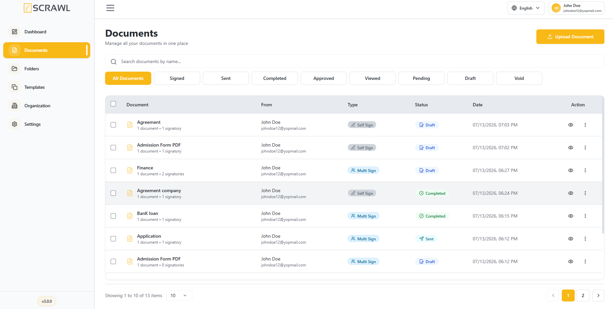
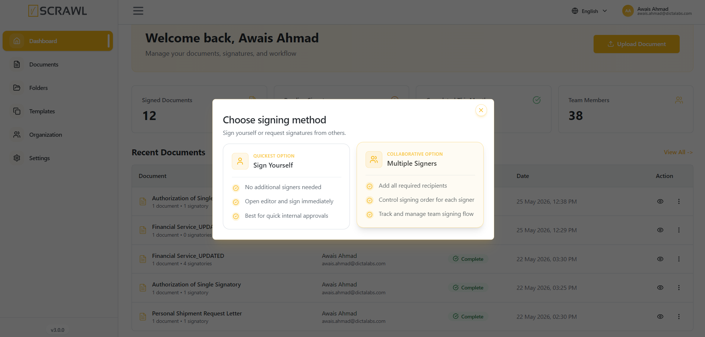
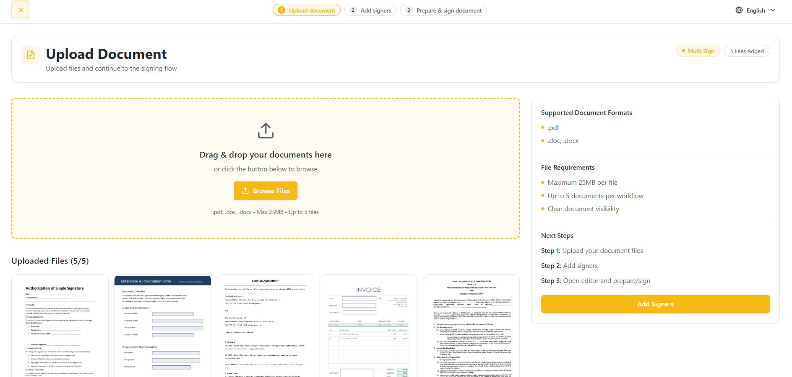
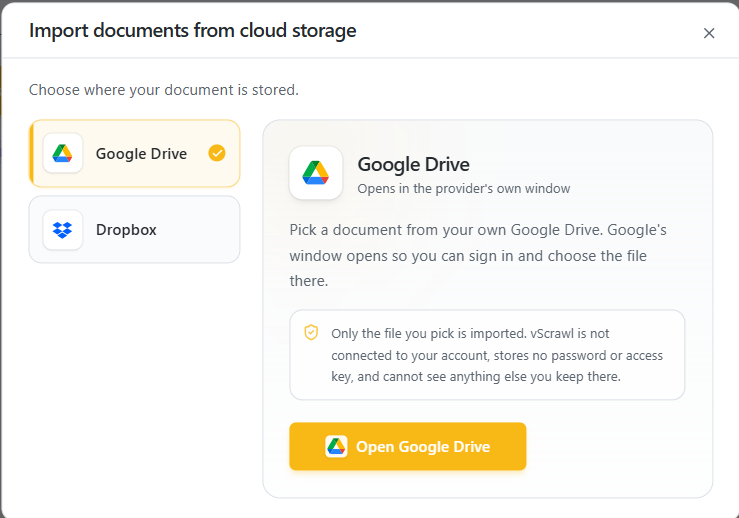
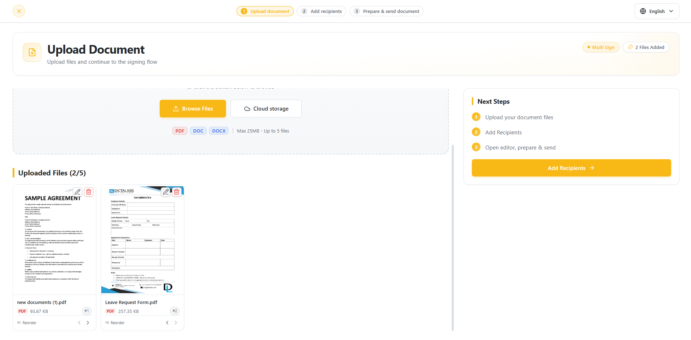
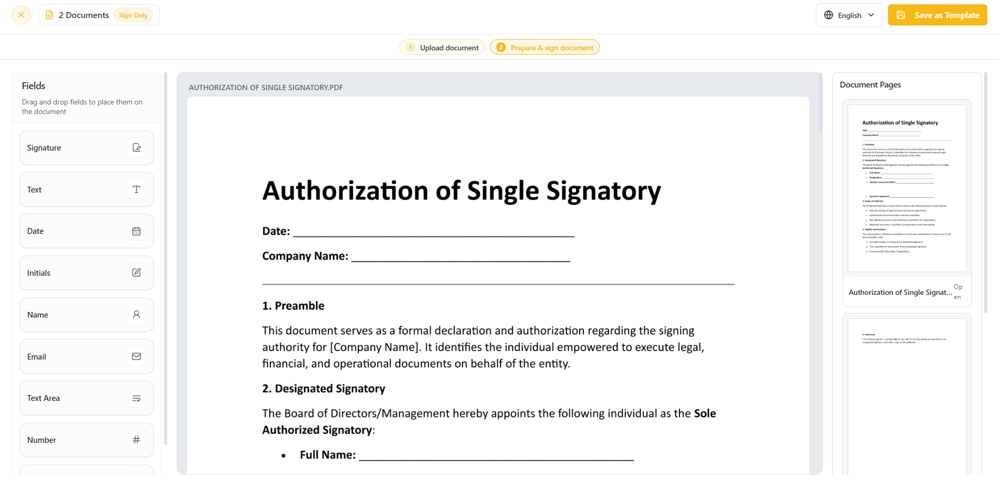
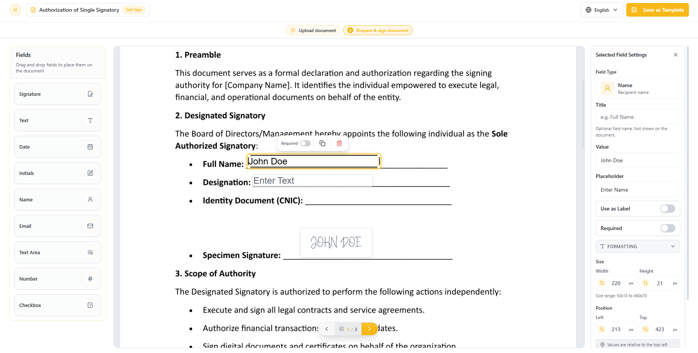
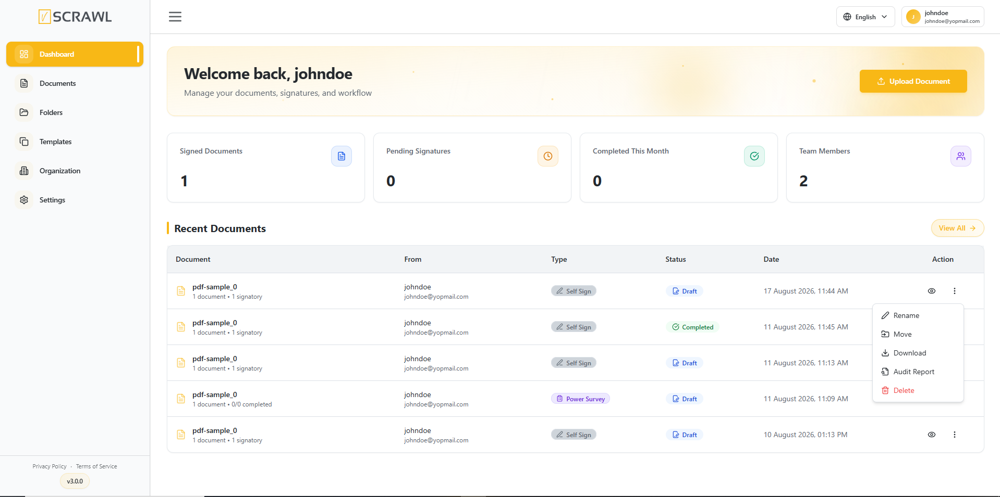
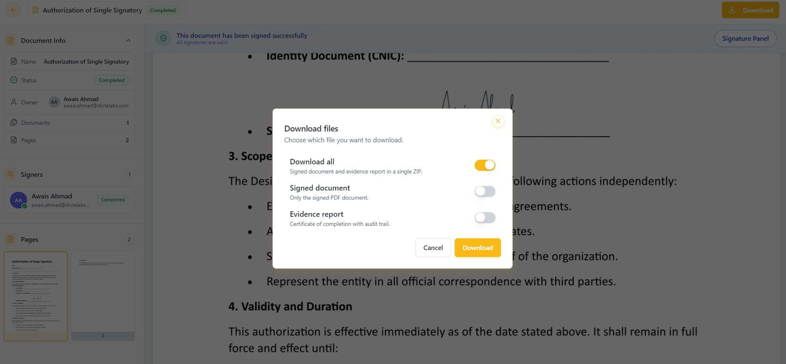
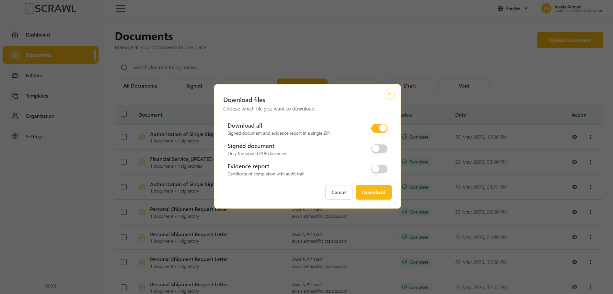

## Overview

The **Documents** module is the primary workspace within vScrawl for managing digital documents and signature workflows. It provides users with a centralized repository where they can upload, view, track, search, and manage documents throughout their lifecycle.

The Documents page offers powerful filtering, search, and document management capabilities, enabling users to efficiently monitor document status and access important information from a single interface.

## Accessing the Documents Module

To access the Documents module:

1. Sign in to your vScrawl account.
2. From the left navigation menu, click **Documents**.
3. The Documents page will open, displaying all documents available within your account.

### Search Documents by Name

The **Search Documents by Name** feature allows users to quickly locate specific documents within the vScrawl document repository. Instead of manually browsing through the document list, users can search using document names or keywords to find the required file instantly. The same box also matches the **owner's name** and the **status**.

### How to Search for a Document

1. Navigate to the **Documents** page from the left navigation menu.
2. Locate the **Search by document name, owner or status...** search bar at the top of the document list.
3. Enter the full document name, part of it, or the owner's name.
4. The document list updates automatically a moment after you stop typing and displays matching results.

### Combining Search with Status Filters

Search results can be further refined using the document status filters available above the document list:

- All Documents
- Signed
- Sent
- Completed
- Approved
- Viewed
- Pending
- Draft
- Void

Pick the status first, then type your search: switching to another status filter clears the search box. For example, select the **Completed** filter and then search for **"Authorization"** to view only completed authorization documents.

### Filtering by Date

The **Date** button at the end of the filter row narrows the list to documents whose last activity (the **Date** column) falls in a period:

- **All** (no date limit), **Today**, **Last 7 days**, **Last 30 days** or **This month**.
- **Custom range** – pick a start date and, optionally, an end date in the calendar, then click **Apply**. With only a start date, every document from that day onward is shown.

The button then shows the period you chose — for example **Date: Last 7 days**. Click the **×** on it (**Clear date filter**) to remove the date limit. The date filter stays in place when you switch status filters, and your search, status and date choices are kept when you refresh the page or come back to the list from a document.

### The Document List

The list shows the columns **Document** (name, with the number of documents and signatories underneath), **From**, **Folder** (a dash — when the document is not in a folder), **Type** (**Self Sign**, **Multi Sign** or **Power Survey**), **Status**, **Date** and **Action**. Dates are shown as date and time, to the minute.

- Click a column heading to sort by it; click again to reverse the order, and a third time to return to the default order (newest first).
- Tick the checkboxes beside several documents to act on them together with **Move Selected** or **Delete Selected**.
- Use the controls under the list to move between pages and choose how many documents are shown per page.

### Uploading Single and Multiple Documents

At the top of the **Documents,** you will find the **Upload Document** button, the primary action for starting a workflow. Clicking it opens a **Choose signing method** dialog with three options:

- **Sign Yourself** *(Quickest option)* – No additional recipients needed. Open editor and sign immediately. Best for quick internal approvals.

- **Multiple Recipients** *(Collaborative option)* – Add all required recipients. Control signing order for each recipient. Track and manage team signing flow.

- **Power Survey** *(Bulk distribution)* – Send a personal copy to every recipient. Design the fields once — applied to all recipients. Import recipients in bulk from a CSV.

!!! note ""
    This section focuses exclusively on the document upload process. Detailed information regarding document signing workflows is provided in the workflows section of this guide: [Sign Yourself](sign_yourself.md), [Multiple Signers](multiple_signers.md), and [Power Survey](power_survey.md).

Users can upload up to **five documents simultaneously** in supported formats — **PDF, DOC, and DOCX**, up to **25MB** each — by clicking **Browse Files**, using the **drag-and-drop upload** feature, or by importing from [Google Drive or Dropbox](#importing-from-google-drive-or-dropbox) where the organization offers it. **Power Survey** takes a **single document**. The documents appear in the upload screen where you can:

- **Reorder** them with the **Move left** / **Move right** arrows under **Reorder** on each file card.
    
- **Rename** a file using the ✎ edit option (names can be up to 50 characters).
    
- **Delete** a file using the 🗑️ icon.

A file is refused, with a message naming it, if it is not a PDF, DOC or DOCX, is larger than 25MB, is empty, is password protected, is already signed, or has already been added.

### Importing from Google Drive or Dropbox

Alongside **Browse Files**, the upload screen may show a **Cloud storage** button. It lets you bring in a document you keep in your own Google Drive or Dropbox, without downloading it to your computer first.

The button appears only where your organization's plan includes it, and only for the providers your administrator has set up. If you do not see it, ask your administrator whether cloud import is enabled for your organization.

To import a document:

1. Click **Cloud storage**.
2. Choose **Google Drive** or **Dropbox** in the **Import documents from cloud storage** dialog that opens.
3. Click **Open Google Drive** / **Open Dropbox**. The provider's own window appears — sign in there if you are asked to.
4. Pick your document. It is copied into vScrawl and appears in the upload list exactly like a file you had browsed for.

!!! note "Only the file you pick is imported"
    vScrawl is not connected to your Drive or Dropbox account. It stores no password and no access key for it, cannot browse it, and cannot see anything else you keep there. You choose the file inside the provider's own window, and only that one file is sent across.

Imported documents follow the same rules as uploaded ones:

- **PDF, DOC and DOCX** only. A file of any other type is skipped, with a message naming it.
- **25MB** maximum per file. A larger file is skipped the same way.
- They count towards the **five documents** you can prepare at once.

Once imported, a document is an ordinary uploaded document. Renaming, reordering, deleting or signing it works exactly as it does for anything else in the list, and nothing is ever written back to your Drive or Dropbox.

### Document Preparation

After uploading documents, the next step depends on the selected signing workflow:

- If the document is uploaded using the **Sign Yourself** option, clicking **Open Editor** will take you directly to the **Document Preparation Screen**, where you can prepare and sign the document

If the document is uploaded using the **Multiple Recipients** option (or **Power Survey**), clicking **Add Recipients** allows you to configure recipients and signing roles before proceeding to the **Open Editor** screen for document preparation.

Within the Document Preparation workspace, users can conveniently switch between **multiple uploaded documents** using the **right-side document panel** without leaving the editor. This enables a smoother and more efficient document preparation experience.

- You can **drop annotations** from the **left-hand panel** — **Signature, Name, Email, Text, Text Area, Date, Number, Initials, Stamp, Checkbox** — on the documents.
    
- You can also customize the **Formatting and Location** of each **annotation** on the document from the **right-hand panel.**
    
- You can **delete the annotation** by clicking on the **close icon on it** or from the **right-hand panel** on the document.

This ensures your **documents are organized** before moving into the signing workflow. This saves time and makes managing complex signing processes easier.

### Leaving Before You Finish

Every file is stored as soon as it finishes uploading, so nothing is lost if you stop part-way. If you try to leave the upload or **Add Recipients** step after a document has been uploaded — with the close (✕) button, your browser's back button, or a link elsewhere in the app — a **Leave and save as draft?** dialog asks you to confirm:

- **Stay** keeps you where you are.
- **Save as Draft & Leave** takes you out of the flow. A **Saved as draft** message confirms it, and the document waits in **Documents** with the **Draft** status so you can continue it anytime.

Files that are still uploading when you leave finish and are added to the draft. If you refresh or close the browser tab instead, your browser shows its own "leave site?" prompt.

### Downloading Documents

- **Download** documents directly from the **Documents List** screen by selecting the **Download** option from the three-dot menu next to the desired document.

- **Audit Report** can be accessed from the three-dot menu by selecting **Audit Report**, opening a full-page timeline of the document workflow, including recipient actions, timestamps, status updates, and consent details. See [Audit Report](audit_report.md) for details.

- Keep documents organized by using the **Move** option to place them into folders for easier management and retrieval.

- Remove documents that are no longer required using the **Delete** option available in the document actions menu.

- For a **Void** document, **Rejection Detail** opens **Reject Details**, showing who rejected the document and the reason they gave.

- While a document is out for signing, **Delegate Signing** may also appear, letting the right person hand a pending signing task to someone else. See [Delegate a Recipient](delegate.md).
 

Improve document organization and identification by using the **Rename** option to update document names. **Rename** and **Delete** appear only on documents you own.
    
- You can also **download** the **document** on the **document viewing screen** after **performing signatures** on it.

For a **completed** document that has a separate evidence report, **Download** opens the **Download Files** dialog, where you choose one of:

- **Download all** – the signed document and its evidence report (certificate of completion with audit trail) in a single **ZIP** file.
- **Signed document** – only the signed PDF.
- **Evidence report** – only the certificate of completion.

For any other document, **Download** saves the document straight away. Where your organization has turned on **Attach evidence report to signed document**, the evidence report is already part of the signed PDF of a single-document workflow, so there is nothing separate to choose and the file downloads directly.

