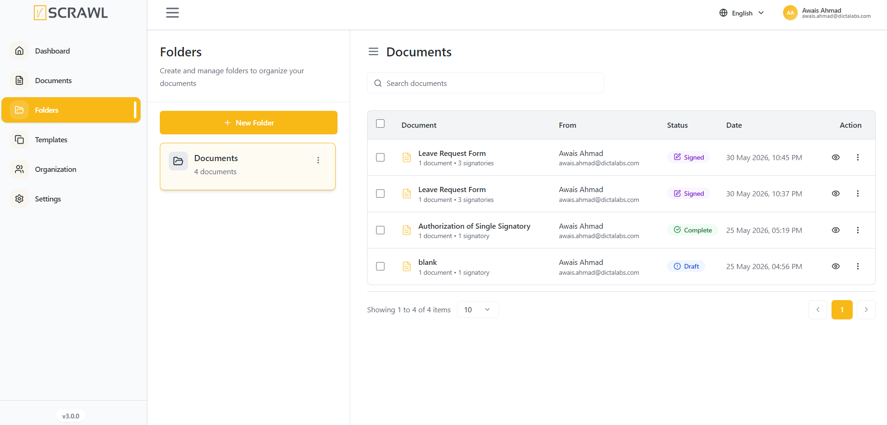
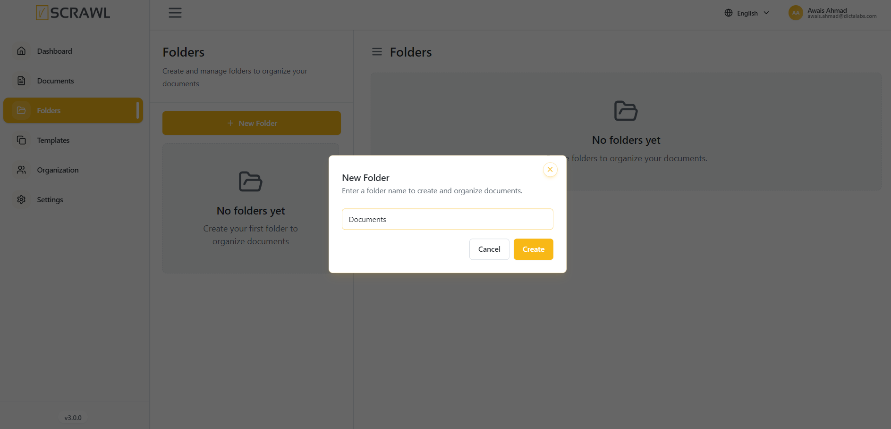
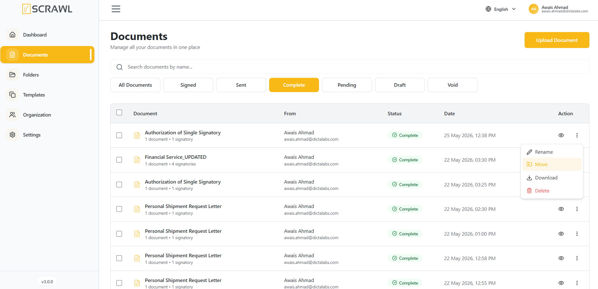
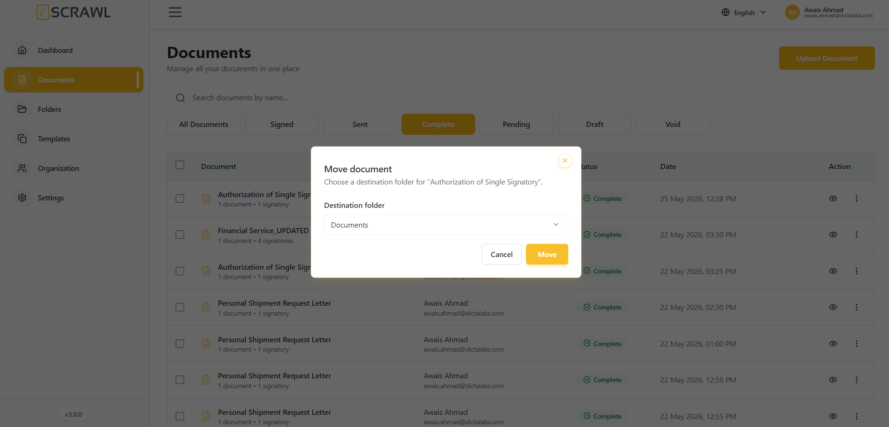

# folder management

The **Folders** feature in vScrawl helps users organize and manage documents efficiently. By creating folders, users can group related documents together, making them easier to locate, review, and manage.

Folders provide a structured way to maintain documents and improve workflow organization, especially when working with multiple files.

---
## Accessing Folders

1. Sign in to your vScrawl account.
2. From the left navigation menu, click **Folders**.
3. The Folders page will open, displaying all available folders and their associated documents.

---
## Creating a New Folder

To create a new folder:

1. Navigate to the **Folders** page.
2. Click the **New Folder** button.
3. Enter a name for the folder.
4. Confirm the creation.

The new folder will appear in the folder list and will be available for organizing documents.

---

## Move Documents into a Folder

- Open All **Documents** (or any other document list).
- Click the **three dots (****⋮****)** next to the document.
- Select **Move** to Folder.
- Choose the **folder** where you want to **move** the document.

## Viewing Folder Contents

When a folder is selected from the folder list:

- The folder details are displayed on the left panel.
- Documents contained within the selected folder are displayed on the right panel.
- Users can quickly review all documents stored in that folder.

Document information includes:

- Document Name
- Sender Information
- Status
- Date and Time
- Available Actions

---
## Searching Documents Within Folders

The document panel includes a **Search Documents** field.

To search for a document:

1. Click inside the search box.
2. Enter a document name or keyword.
3. Matching documents will be displayed automatically.

This feature helps users quickly locate specific documents within the selected folder.

---
## Understanding Document Status

Documents may display different statuses, such as:

|Status|Description|
|---|---|
|Draft|The document is still being prepared and has not been sent for signing.|
|Pending|The document is awaiting action from one or more recipients.|
|Sent|The document has been sent to recipients but no action has been taken yet.|
|Viewed|A recipient has opened the document.|
|Signed|The signing process has been completed successfully.|
|Approved|The document has been approved by an approver in the workflow.|
|Completed|All required actions and signatures have been finalized.|
|Void|The document has been cancelled or invalidated and can no longer be processed.|

---
## Document Actions

Users can perform actions on documents directly from the folder view.

Available actions may include:

- View Document
- Review Details
- Manage Workflow
- Access Additional Options through the Actions menu

The available actions may vary depending on the document status and user permissions.

