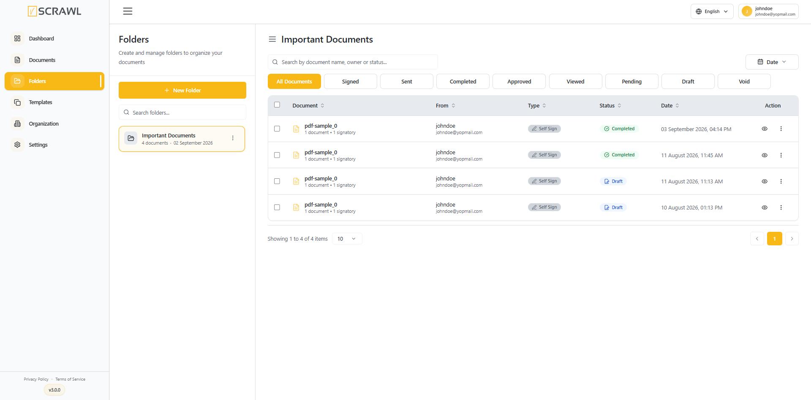
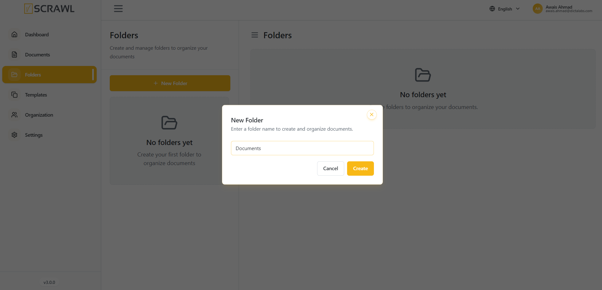
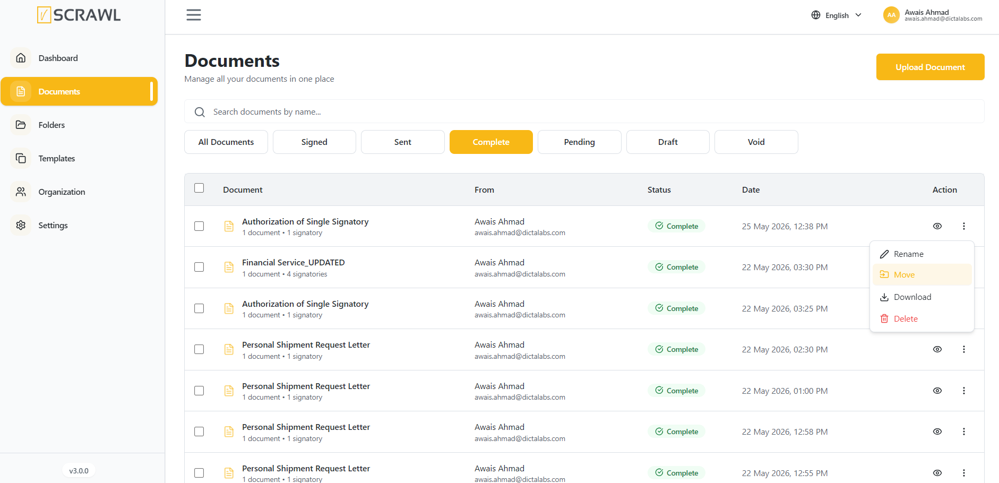
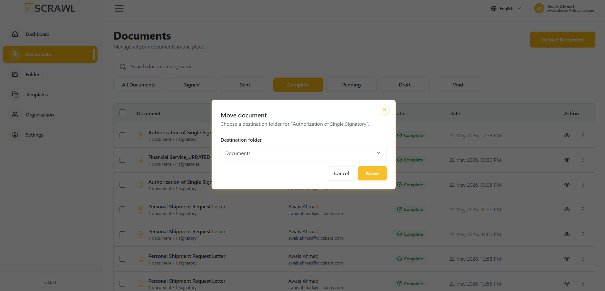

# Folder management

The **Folders** feature in vScrawl helps users organize and manage documents efficiently. By creating folders, users can group related documents together, making them easier to locate, review, and manage.

Folders provide a structured way to maintain documents and improve workflow organization, especially when working with multiple files.

---
## Accessing Folders

1. Sign in to your vScrawl account.
2. From the left navigation menu, click **Folders**.
3. The Folders page will open, listing your folders on the left, each with the number of documents it holds.

Use the **Search folders...** box above the list to find a folder by name. Long lists load more folders automatically as you scroll down.

---
## Creating a New Folder

To create a new folder:

1. Navigate to the **Folders** page.
2. Click the **New Folder** button.
3. Enter a name in the **Folder Name** field.
4. Click **Create**.

The new folder will appear in the folder list and will be available for organizing documents.

A folder name must follow these rules — if it does not, a message under the field tells you what to change:

- It is required and can be up to **50 characters** long (extra spaces are trimmed).
- It cannot contain any of these characters: `< > : " / \ | ? *`
- It must be different from the names of your other folders (capitals do not count as a difference).

---
## Renaming or Deleting a Folder

Open the **Folder actions** menu (**⋮**) on a folder in the list:

- **Rename** opens the **Rename Folder** dialog. Enter the new name and click **Save**. The same naming rules apply as when you create a folder.
- **Delete** asks you to confirm with **Delete Folder?**. Deleting a folder does not delete the documents in it: they simply leave the folder and remain available in **Documents**.

---

## Move Documents into a Folder

- Open All **Documents** (or any other document list).
- Click the **three dots (****⋮****)** next to the document.
- Select **Move**.
- In the **Move Document** dialog, choose the **Destination folder** and click **Move**.

To move several documents at once, tick their checkboxes in the list and click **Move Selected**. If you have no folders yet, the dialog asks you to create one first.

## Viewing Folder Contents

When a folder is selected from the folder list:

- The folder list stays on the left panel, with the selected folder highlighted.
- Documents contained within the selected folder are displayed on the right panel, under the folder's name.
- Users can quickly review all documents stored in that folder.

Document information includes:

- Document — the name, with the number of documents and signatories
- From — the sender
- Type
- Status
- Date — date and time, to the minute
- Action — open the document, or use the **⋮** menu for more options

---
## Searching Documents Within Folders

The document panel includes a **Search by document name, owner or status...** field.

To search for a document:

1. Click inside the search box.
2. Enter a document name, part of it, or the owner's name.
3. Matching documents will be displayed automatically.

This feature helps users quickly locate specific documents within the selected folder. The same status filters and **Date** filter as on the [Documents](documents.md#filtering-by-date) page are available here too.

---
## Understanding Document Status

Documents may display different statuses, such as:

|Status|Description|
|---|---|
|Draft|The document is still being prepared and has not been sent for signing.|
|Pending|The document is awaiting action from one or more recipients.|
|Sent|The document has been sent to recipients but no action has been taken yet.|
|Viewed|A recipient has opened the document.|
|Signed|The signing process has been completed successfully.|
|Approved|The document has been approved by an approver in the workflow.|
|Completed|All required actions and signatures have been finalized.|
|Void|The document has been cancelled or invalidated and can no longer be processed.|

---
## Document Actions

Users can perform actions on documents directly from the folder view.

Available actions may include:

- **Open** the document with the eye icon (or by clicking its name)
- **Rename**, **Move**, **Download**, **Audit Report** and **Delete** from the **⋮** menu — the same menu as on the [Documents](documents.md#downloading-documents) page, including **Rejection Detail** for void documents and **Delegate Signing** while a document is out for signing
- **Move Selected** and **Delete Selected** after ticking several documents

The available actions may vary depending on the document status and user permissions. **Rename** and **Delete** appear only on documents you own.

