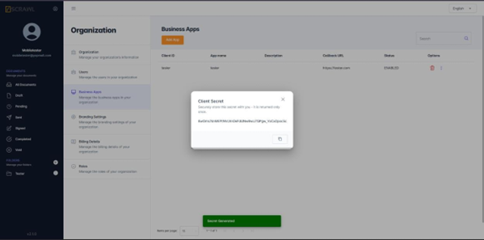

# vScrawl Integration Guide

This guide explains how to Integrate **vScrawl** into your website or application, so you can prepare and sign documents without leaving your app. It covers business application registration, credential generation, access token creation, and iFrame implementation.

Once a document workflow is created, the signing/preparation experience runs entirely inside your own interface.
## Register a Business Application

To use the vScrawl Integration, you must first register a **Business Application** in vScrawl.

1. Log in to your **vScrawl** account.
2. Navigate to **Organization** from the left panel, then click on **Business App**.
3. Click **Add**.
4. Fill in the required fields (App Name, description, etc.).
5. Click **Add** again to save.


Once created, your application will appear in the **App List**.
## Generate Client Secret

After registering the application, generate security credentials.

1. Locate your application in the **App List**.
2. Click the **three dots (options menu)**.
3. Select **Generate Secret**.

Copy the **Client Secret** immediately and store it securely.


**Important:** The Client Secret is shown only once. If lost, you must regenerate it.

## Generate an Access Token

An **Access Token** is required to authenticate and load the vScrawl .

**API Details**

- **Method:** POST
- **Endpoint:**  
    https://api.yourdomain.com/auth/v1/signin

**Request Body (JSON)**

```json
{
  "grant_type": "CLIENT_CREDENTIALS",
  "clientId": "{{app_name}}",
  "clientSecret": "{{client_secret}}",
  "email": "{{user_email}}"
}
```

**Response**

On success, the API returns an **access token**. Save this token and use it in the URL.

## Integrate vScrawl Using an iFrame

Once you have the access token and workflow ID, Integrate the vScrawl editor in your application using an iFrame.

**Sample HTML**

```html
<!DOCTYPE html>

<html>
  <body>
    <h1>My vScrawl Integration </h1>
    <iframe
      src="https://app.yourdomain.com/documents/prepare?wId={{WORKFLOW_ID}}&clientToken={{ACCESS_TOKEN}}"
      width="100%"
      height="800px"
      frameborder="0"
      allow="clipboard-read; clipboard-write; fullscreen"
      title="vScrawl Document Editor">
    </iframe>
  </body>
</html>
```

**Parameters**

- **WORKFLOW_ID**: The workflow ID for the document signing process.
- **ACCESS_TOKEN**: The access token generated from the signing API.

## Best Security Practices

- Never expose **Client Secret** in frontend code.
- Always generate the **Access Token** from a secure backend service.
- Rotate secrets periodically.
- Use HTTPS for all API and iframe integrations.

For any issues or questions, contact the vScrawl support team.
