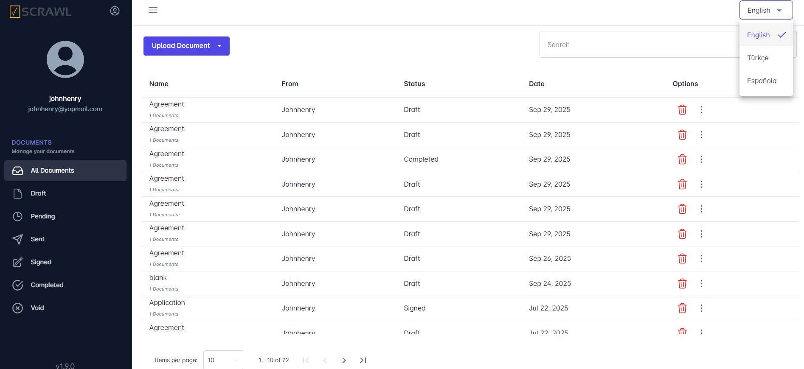

# Languages Support

**vScrawl** supports a **multilingual interface** that allows users to operate the platform in their preferred **language**. This guide walks you through how to change the language and lists the currently supported languages.

# Locate The Language Dropdown

- **Locate the Language Dropdown**
    
    - At the top-right corner of the screen, you’ll see a **dropdown** labeled with the **current language** (e.g., "English").
        
- **Click the Dropdown Arrow**
    
    - This will display the **available** language options.
        
- **Select Your Preferred Language**
    
    - Choose from the list of available languages:
        
        - **English**
            
        - **Türkçe**
            
        - **Española**
            
- **Interface Update**
    
    - Once selected, the interface will automatically update to the selected language without requiring a page refresh.

