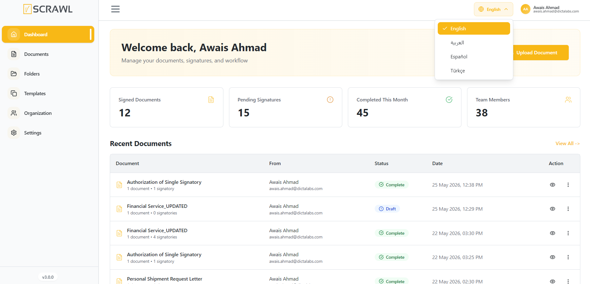
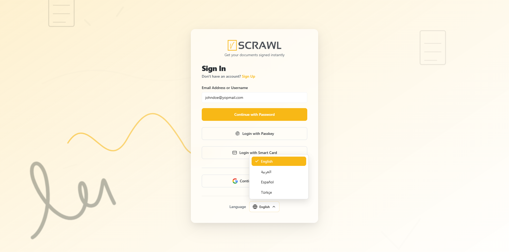

# Languages Support

**vScrawl** supports a **multilingual interface** that allows users to operate the platform in their preferred **language**. This guide walks you through how to change the language and lists the currently supported languages.

## Locate the Language Dropdown

- **Locate the Language Dropdown**
    - At the top-right corner of the screen, you’ll see a dropdown labeled with the current language (e.g., "English").
- **Click the Dropdown Arrow**
    - This will display the available language options.
- **Select Your Preferred Language**
    - Choose from the list of available languages:
        - **English**
        - **Türkçe**
        - **Español**
        - **العربية**
- **Interface Update**
    - Once selected, the interface will automatically update to the selected language without requiring a page refresh.

## Choosing a language before you sign in

The sign-in page has its own language control, at the foot of the card. Picking a language there
translates the sign-in pages **and carries into the application**: sign in through an Arabic
sign-in page and vScrawl opens in Arabic, right to left, with no second choice to make.

!!! note ""
    Your choice is remembered on your account, not just in that browser, so it follows you to your
    other devices the next time you sign in there.

    A language you pick **inside** the application wins over the sign-in page. If you set Spanish in
    the dropdown above and later sign in on a machine whose sign-in page is still showing Arabic,
    vScrawl opens in Spanish — the deliberate choice is the one that is kept.

