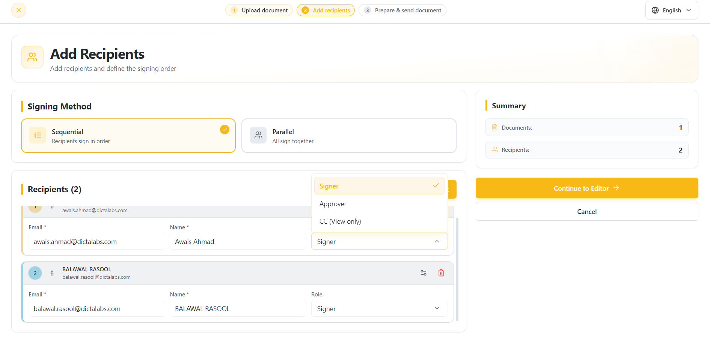
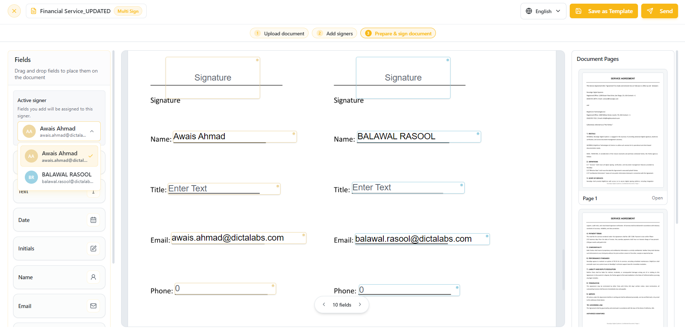
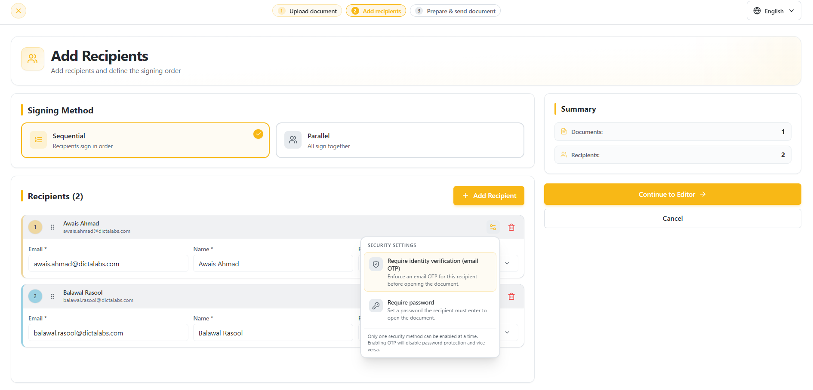
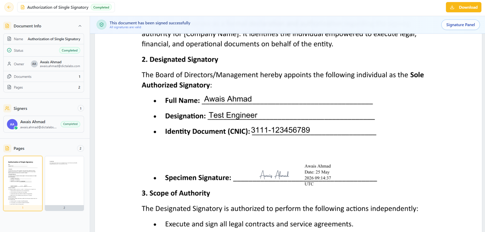
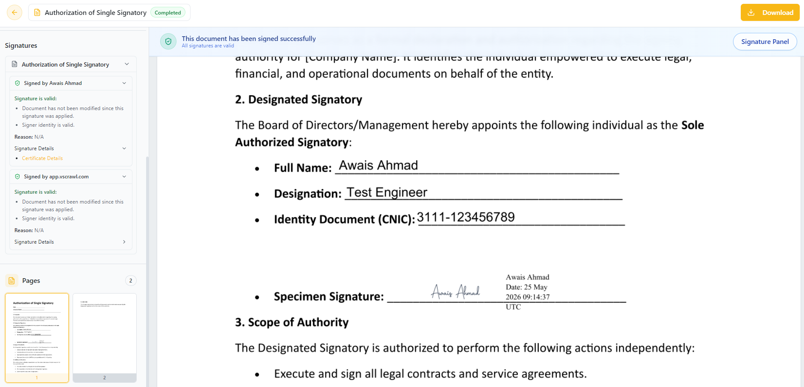

# Multi-Sign Workflows 

## Multi-User Signing

- Click Upload Document → **Sign with Others**
- Select your file **(Browser from your PC or drag a document to upload)** Now click on the **Add Signers button**.  
    

- Add the **Signer name** and **email address** for as many signers as you need for the workflow. To be able to add more than one signers, use **Add Signers** button.
!!! note ""
    **Note:** You can assign a role to each recipient based on their responsibility within the workflow. Signers can complete fields and electronically sign the document, Approvers can review and approve or decline the document, and CC (View Only) recipients can view the document without making any changes.
    
- You can also set signing order for the recipients. When this option is enabled, each signer will sign on his own turn. When disabled, the added signers can sign the document in any order.
    
- After clicking on the **Continue to Editor** you will get **document preparation screen** with the **signers** drop down on the **top left**. Select all the **signers** one by one and add **annotations** and **signature fields for the particular signer.**  
!!! note ""
    It is necessary to include the signature field for all the signers for sending the document(s) otherwise it will show you the notification “You cannot send the document without a signature field”. Click on the Send button on the top right corner to send the document to signers.
    
    
    
- You can move back to **Add Signers** screen by clicking on the **Add Signers** button on top of the document and **edit their details** before the document is sent for signing.
    
- Before Sending the document, you may click on **Save as Template** button to choose **Save as Template.** A form will open where you can specify a template name and optional description. Such saved templates can later be reused to avoid uploading an preparing the same document in the future. This is explained more in [Templates](templates.md).

- Each signer will receive an email with the link to sign the document. The signer can login and sign the document in pending sate.
    
- After signing, the **document** automatically updates in real time, and other **designated signers** can proceed with their part of the **signing process**.

# Protecting Documents with Recipient Security Settings in Multi-Sign Flow

vScrawl allows you to enhance document security during a Multi-Sign Flow by configuring recipient-level security settings. You can choose between **Require Identity Verification (Email OTP)** or **Require Password** to ensure that only authorized recipients can access the document.

## What Are Recipient Security Settings?

Recipient Security Settings provide an additional layer of protection before a recipient can open a document. These settings can be configured individually for each recipient by clicking the **Security Settings** icon next to the recipient.

**Available options:**

- **Require Identity Verification (Email OTP)** – Sends a one-time password (OTP) to the recipient's email address, which must be entered before opening the document.
- **Require Password** – Requires the recipient to enter a predefined password before accessing the document.

!!! note ""
    **Note:** Only one security method can be enabled at a time. Enabling OTP verification will disable password protection and vice versa.

## Why Use Recipient Security Settings?

Using recipient security settings helps:

- Prevent unauthorized access to sensitive documents.
- Verify the identity of intended recipients.
- Protect confidential information throughout the signing process.
- Maintain a secure and controlled document workflow.
- Meet organizational security and compliance requirements.

## How to Enable Security for a Recipient

1. Navigate to the **Add Recipients** step of the workflow.
2. Add the required recipients and assign their roles.
3. Click the **Security Settings** icon for the desired recipient.
4. Select either:
    - **Require Identity Verification (Email OTP)**, or
    - **Require Password**
5. Complete the workflow setup and send the document.

Recipients will be required to successfully complete the selected security verification before they can access the document.
## Using the Signature Panel in vScrawl

The **Signature Panel** in **vScrawl** allows you to review **digital signatures** applied to a **document.** It provides a clear breakdown of **who signed,** and **whether the document has been modified since signing.** This ensures both **transparency** and trust in the **document’s authenticity**.

- When viewing a signed document in vScrawl, click on the **“Signature Panel”** button located at the top-right of the interface.
    
- Once opened, the **right-hand panel** displays a list of all signatures applied to the document.

## The vScrawl Seal

In addition to individual signers, on the completed documents, you will also see a digital signature from **vScrawl** itself:

- **vScrawl** applies a **sealing signature** to the document.
    
- This acts as a final certification that:
    
    - The document is locked and cannot be modified without breaking the seal.
        
    - All signatures remain intact and verifiable.
        
    - An identification that the document has been signed through vScrawl.

