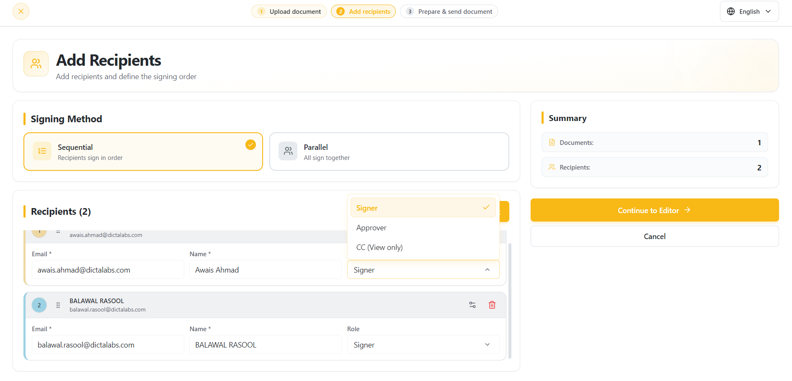
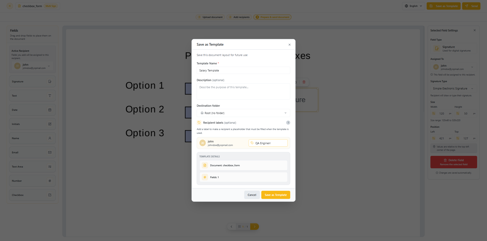
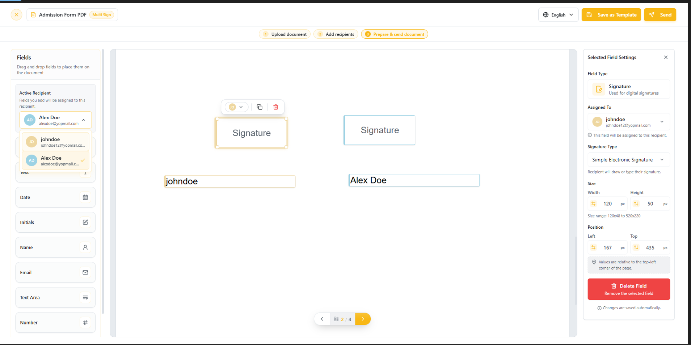
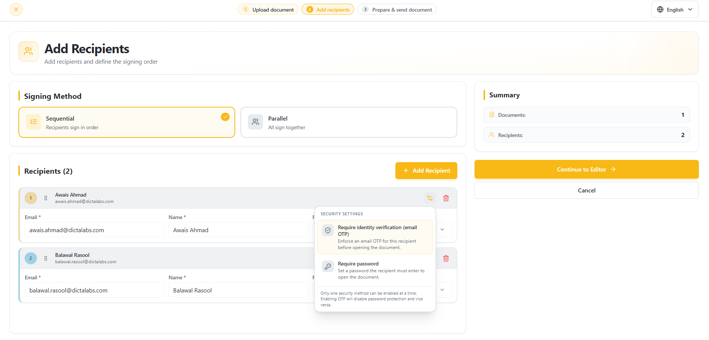
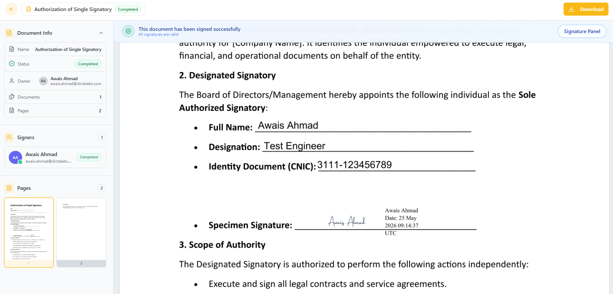
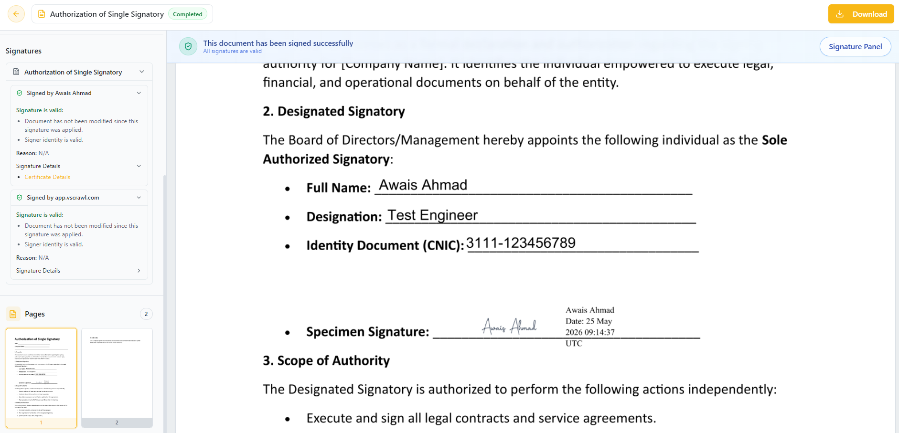

# Multi-Sign Workflows 

## Multi-User Signing

- Click Upload Document → **Multiple Recipients**
- Select your file — browse from your PC, drag a document in, or click **Cloud storage** to import one from your Google Drive or Dropbox (see [Importing from Google Drive or Dropbox](documents.md#importing-from-google-drive-or-dropbox)). Now click on the **Add Recipients** button.  
    

- Click **Add Recipient** for each person you need in the workflow: use **Add Me** to add yourself, pick a colleague from the **Team Members** tab, or use **Add Custom** to enter someone new. Every recipient needs a **Name** and an **Email**; names must be 3–50 characters long and contain only letters, with single spaces between words.
!!! note ""
    **Note:** You can assign a role to each recipient based on their responsibility within the workflow. Signers can complete fields and electronically sign the document, Approvers can review and approve or decline the document, and CC (View only) recipients can view the document without making any changes.
    
- Under **Signing Method**, choose **Sequential** (recipients sign in order — drag recipients to change the order) or **Parallel** (all recipients can sign at the same time, in any order).

- Optionally, under **Reminders**, turn on **Send Automatic Reminders** to email recipients a one-time reminder. Choose a **Reminder Interval** of 1–30 days after they receive the document, or **Custom Time** to set the delay in hours and minutes.
    
- After clicking on the **Continue to Editor** you will get **document preparation screen**. Use the **Active Recipient** selector in the left panel to pick each recipient in turn, then add **annotations** and **signature fields for that recipient.** Approvers and CC recipients are not assigned any fields.  
!!! note ""
    Every recipient with the **Signer** role needs at least one signature field before the document can be sent; otherwise you will see the message “Each recipient must have at least one signature field. Missing for: …”. Click on the **Send** button on the top right corner to send the document to the recipients.
    
    
    
- Before the document is sent, you can go back to the **Add recipients** step by clicking it in the step indicator at the top of the editor, and **edit the recipients' details**.
    
- Before Sending the document, you may click on **Save as Template** button to choose **Save as Template.** A form will open where you can specify a **Template Name**, optional **Description**, and a **Destination folder** to save it into. Template names are unique within your organization — if the name is already in use, you are asked whether to overwrite the existing template. Such saved templates can later be reused to avoid uploading and preparing the same document in the future. This is explained more in [Templates](templates.md).

- In the same form, under **Recipient labels (optional)**, you can turn any recipient into a **placeholder role** (e.g. "QA Engineer") instead of keeping their real name and email. Whoever applies the template later will be required to fill in the actual recipient for that role.

- Each signer will receive an email with the link to sign the document. The signer can login and sign the document in pending state. With **Sequential** signing, a recipient can act only after the recipients ahead of them have completed their part.
    
- After signing, the **document** automatically updates in real time, and other **designated signers** can proceed with their part of the **signing process**.

# Protecting Documents with Recipient Security Settings in Multi-Sign Flow

vScrawl allows you to enhance document security during a Multi-Sign Flow by configuring recipient-level security settings. You can choose between **Require identity verification (email OTP)** or **Require password** to ensure that only authorized recipients can access the document.

## What Are Recipient Security Settings?

Recipient Security Settings provide an additional layer of protection before a recipient can open a document. These settings can be configured individually for each recipient by clicking the **Security settings** icon next to the recipient.

**Available options:**

- **Require identity verification (email OTP)** – Sends a one-time password (OTP) to the recipient's email address, which must be entered before opening the document.
- **Require password** – Requires the recipient to enter a password you set (4–20 characters) before accessing the document.

!!! note ""
    **Note:** Only one security method can be enabled at a time. Enabling OTP verification will disable password protection and vice versa.

## Why Use Recipient Security Settings?

Using recipient security settings helps:

- Prevent unauthorized access to sensitive documents.
- Verify the identity of intended recipients.
- Protect confidential information throughout the signing process.
- Maintain a secure and controlled document workflow.
- Meet organizational security and compliance requirements.

## How to Enable Security for a Recipient

1. Navigate to the **Add Recipients** step of the workflow.
2. Add the required recipients and assign their roles.
3. Click the **Security settings** icon for the desired recipient.
4. Select either:
    - **Require identity verification (email OTP)**, or
    - **Require password**
5. Complete the workflow setup and send the document.

Recipients will be required to successfully complete the selected security verification before they can access the document.
## Using the Signature Panel in vScrawl

The **Signature Panel** in **vScrawl** allows you to review **digital signatures** applied to a **document.** It provides a clear breakdown of **who signed,** and **whether the document has been modified since signing.** This ensures both **transparency** and trust in the **document’s authenticity**.

- When viewing a signed document in vScrawl, click on the **“Signature Panel”** button located at the top-right of the interface.
    
- Once opened, the **right-hand panel** displays a list of all signatures applied to the document.

## The vScrawl Seal

In addition to individual signers, on the completed documents, you will also see a digital signature from **vScrawl** itself:

- **vScrawl** applies a **sealing signature** to the document.
    
- This acts as a final certification that:
    
    - The document is locked and cannot be modified without breaking the seal.
        
    - All signatures remain intact and verifiable.
        
    - An identification that the document has been signed through vScrawl.

