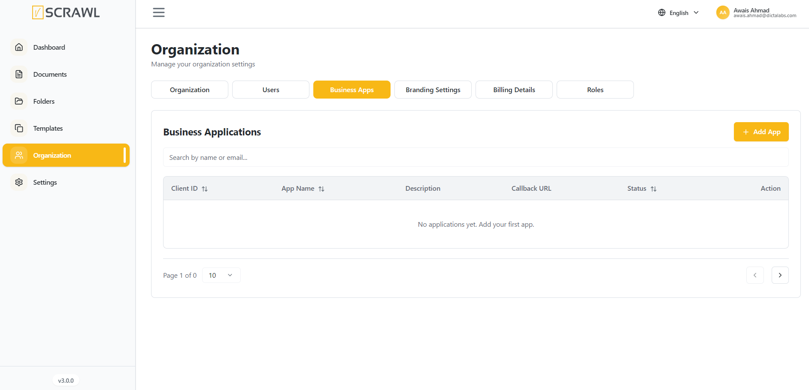
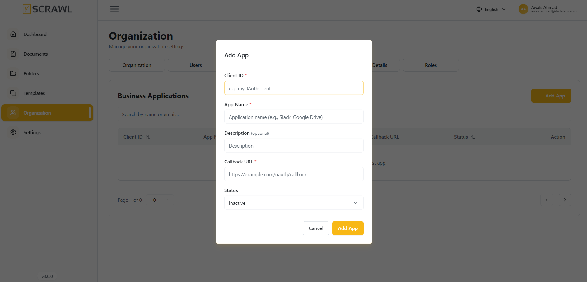

# Business Applications 

The **Business Applications** feature allows organizations to integrate external applications and services directly within the vScrawl platform using **iFrame-based integration**. This enables users to access third-party business tools without leaving the vScrawl environment, creating a seamless and centralized workflow experience.

### Adding a Business Application

To add a new business application:

1. Navigate to **Organization → Business Apps**.
2. Click **Add App**.
3. Complete the required fields:
    - **Client ID** – A unique identifier for the integrated application.
    - **App Name** – The name of the application being integrated.
    - **Description** _(Optional)_ – A brief description of the application's purpose.
    - **Callback URL** – The URL used to handle authentication and communication between vScrawl and the external application.
    - **Status** – Set the application as **Active** or **Inactive**.
4. Click **Add App** to save the integration.

### Accessing Integrated Applications

Once configured and activated, the application can be accessed directly from within vScrawl through its embedded iFrame interface. Users can interact with the external application while remaining within the vScrawl workspace, improving productivity and reducing the need to switch between multiple platforms.
#### Benefits

- Centralized access to external business applications.
- Improved user experience through embedded application access.
- Reduced context switching between systems.
- Simplified integration of business-specific tools and services.
- Enhanced workflow efficiency across the organization.
