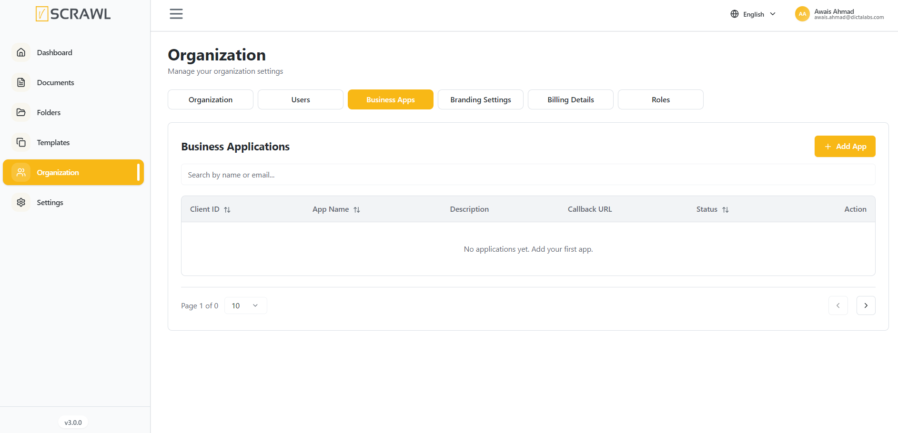
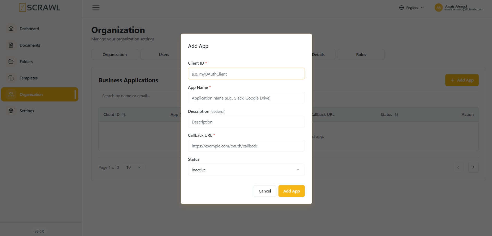

# Business Applications 

The **Business Applications** feature allows organizations to register their own applications so they can integrate vScrawl using **iFrame-based integration**. Each registered app gets a **Client ID** and **Client Secret** that its backend uses to obtain an access token and embed vScrawl's document preparation and signing screens inside the app, so your users can sign without leaving it. See [vScrawl Integration](../iframe.md) for the integration steps.

### Adding a Business Application

To add a new business application:

1. Navigate to **Organization → Business Apps**.
2. Click **Add App**.
3. Complete the required fields:
    - **Client ID** – A unique identifier for the integrated application (3–20 characters, starting with a letter and containing only letters, numbers, underscores and hyphens). It cannot be changed later.
    - **App Name** – The name of the application being integrated.
    - **Description** _(Optional)_ – A brief description of the application's purpose.
    - **Callback URL** – The URL in your application that users are returned to when they finish with an embedded document.
    - **Status** – Set the application as **Active** or **Inactive**. In the app list, active apps are shown as **Enabled** and inactive apps as **Disabled**.
4. Optionally configure **Webhooks** — notify this app's endpoint when signing events occur:
    - Toggle **Webhooks** on to reveal the webhook fields.
    - **Webhook URL** – The endpoint that will receive event notifications.
    - **Events** – Select at least one event to notify on: **Document sent**, **Document signed**, **Document declined**, **Workflow completed**.
5. Click **Add App** to save the integration.

After the app is added, a **Client secret** dialog shows the app's secret. Copy it and store it securely — it will not be shown again.

### Managing Business Applications

From the **⋮** menu on an app's row:

- **Update App** – change the app's details, status and webhooks.
- **Generate Secret** – create a new client secret, replacing the previous one. This is not available while the app is disabled.

Use the delete (trash) icon to remove an app.
### Accessing Integrated Applications

Once configured and activated, your application's backend uses the app's **Client ID** and **Client Secret** to request an access token, then opens vScrawl documents in an embedded iFrame inside your application. Users can prepare and sign documents while remaining within your application, reducing the need to switch between multiple platforms.
#### Benefits

- Document preparation and signing embedded in your own application.
- Improved user experience through embedded access.
- Reduced context switching between systems.
- Signing events delivered to your application through webhooks.
- Separate credentials for each application, which you can disable at any time and regenerate while the application is enabled.
