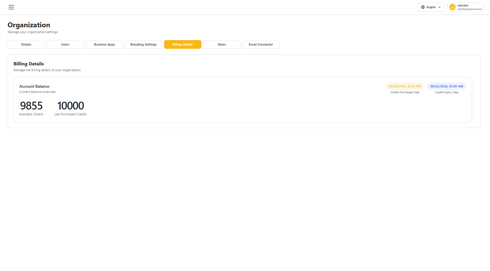

# Billing Details

The **Billing Details** tab shows your organization's current signature-credit balance and purchase history at a glance.

## Accessing Billing Details

1. Sign in to your vScrawl account.
2. From the left navigation menu, click **Organization**.
3. Select the **Billing Details** tab.

## Account Balance

The **Account Balance** card shows:

- **Available Credits** – Credits currently available for your organization to use.
- **Last Purchased Credits** – The number of credits added in the most recent purchase.
- **Credits Purchased Date** – When the last credit purchase was made.
- **Credits Expiry Date** – When the current credit balance expires.

!!! note ""
    Only the **Organization Owner** and users with billing permissions can view this tab.
