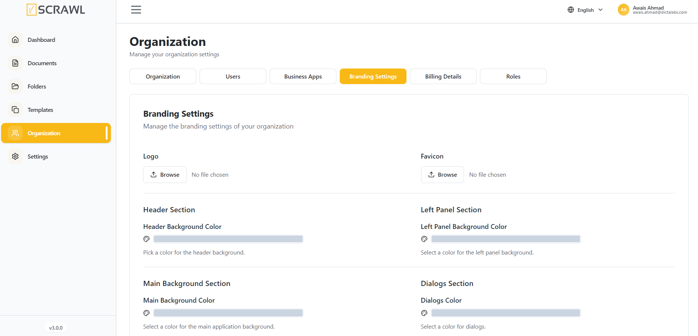
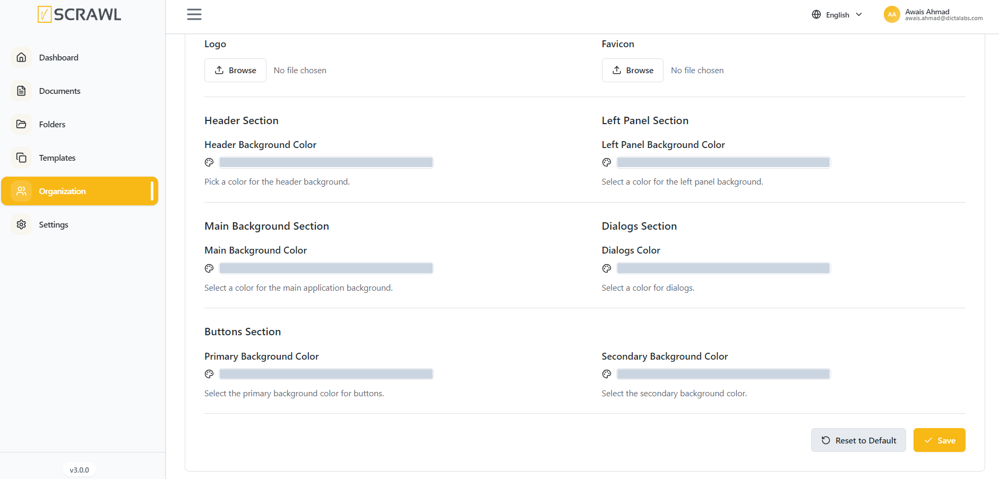

# Branding Settings 

The **Branding Settings** section allows administrators to customize the appearance of the vScrawl platform to match their organization's branding. This includes logos, icons, and interface color settings.

### Accessing Branding Settings

1. Navigate to **Organization**.
2. Select the **Branding Settings** tab.

### Logo

Upload a custom organization logo that will be displayed throughout the platform.

1. Click **Browse** under **Logo**.
2. Select an image file.
3. Save your changes.

### Favicon

Upload a custom favicon to be displayed in browser tabs.

1. Click **Browse** under **Favicon**.
2. Select an icon file.
3. Save your changes.

### Color Customization

Administrators can customize the following interface elements:

### Header Section

Configure the **Header Background Color** displayed across the top navigation area.

### Left Panel Section

Configure the **Left Panel Background Color** used for the navigation menu.

### Main Background Section

Configure the **Main Background Color** used throughout the application workspace.

### Dialogs Section

Configure the color used for dialog boxes and modal windows.

### Buttons Section

- **Primary Background Color** – Applied to primary action buttons such as **Save**, **Submit**, and **Upload**.
- **Secondary Background Color** – Applied to secondary actions such as **Cancel** and **Back**.

### Saving Changes

After making the desired updates, click **Save** to apply the branding settings.

To restore the default appearance, click **Reset to Default**.

