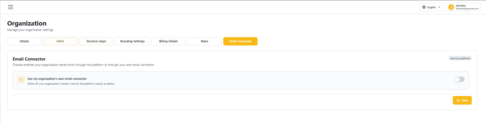
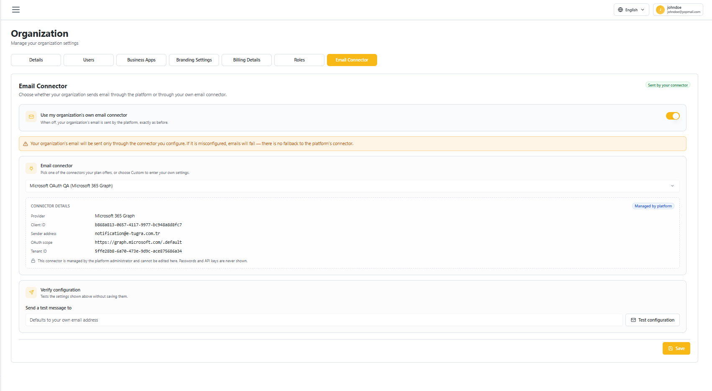
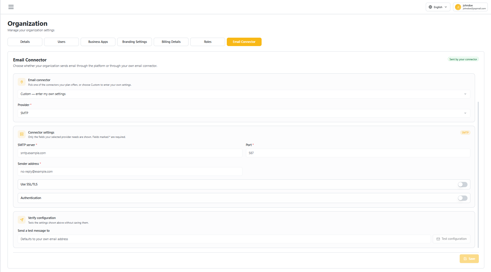

# Email Connector

The **Email Connector** tab controls whether your organization's outgoing emails (invitations, notifications, etc.) are sent through the vScrawl platform or through your own email connector.

## Accessing Email Connector

1. Sign in to your vScrawl account.
2. From the left navigation menu, click **Organization**.
3. Select the **Email Connector** tab.

By default, **Use my organization's own email connector** is off — email is **sent by the platform**, exactly as before.

## Enabling Your Own Connector

Toggle **Use my organization's own email connector** on. A warning appears reminding you that, once enabled, email is sent **only** through the connector you configure — if it's misconfigured, emails will fail with no fallback to the platform's connector.

Then choose one of two connector types from the **Email connector** dropdown:

### Platform-Managed Connector

Pick one of the pre-configured connectors your plan offers (e.g. **Microsoft OAuth QA — Microsoft 365 Graph**). Its **Connector Details** — Provider, Client ID, Sender address, OAuth scope, Tenant ID — are shown read-only; these are managed by the platform administrator and cannot be edited here, and passwords/API keys are never shown.

### Custom Connector

Select **Custom — enter my own settings** to configure your own mail server:

1. Choose a **Provider** (e.g. **SMTP**).
2. Fill in the **Connector settings** shown for that provider — for SMTP: **SMTP server**, **Port**, **Sender address**, and toggles for **Use SSL/TLS** and **Authentication**. Fields marked with `*` are required.

## Verifying Configuration

Before saving, use **Verify configuration** to test the settings shown above without saving them:

1. Enter an address under **Send a test message to** (defaults to your own email address).
2. Click **Test configuration**.

Once you're satisfied, click **Save**.
