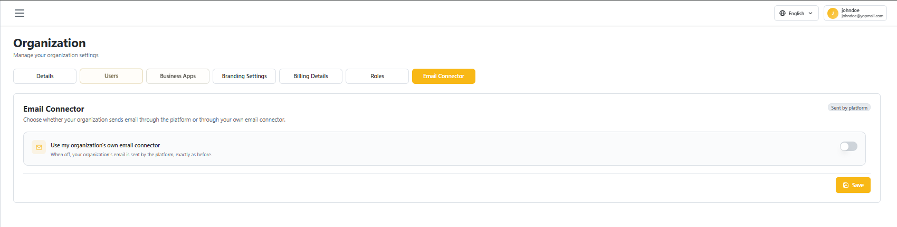
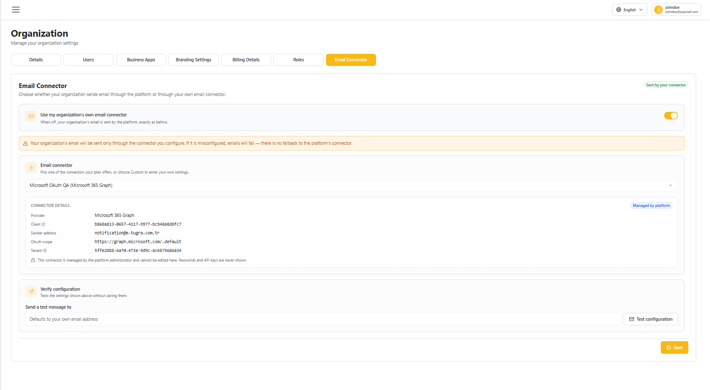
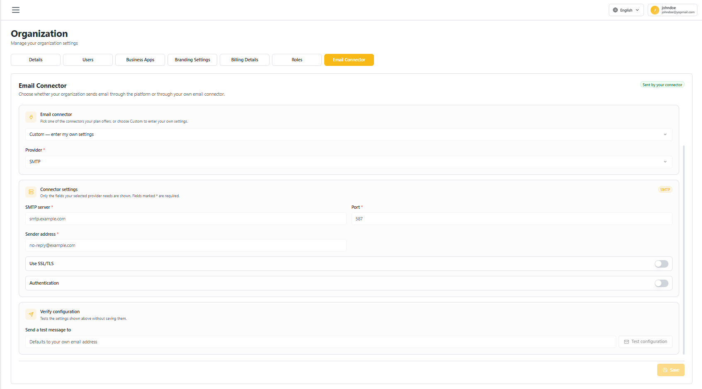

# Email Connector

The **Email Settings** tab controls whether your organization's outgoing emails (invitations, notifications, etc.) are sent through the vScrawl platform or through your own email connector.

## Accessing Email Connector

1. Sign in to your vScrawl account.
2. From the left navigation menu, click **Organization**.
3. Select the **Email Settings** tab.

!!! note ""
    The **Email Settings** tab is shown only to the **Organization Owner**, and only when your service plan allows your organization to use its own email connector.

By default, **Use my organization's own email connector** is off — email is **sent by the platform**, exactly as before. A badge at the top of the tab shows the current routing: **Sent by platform** or **Sent by your connector**.

## Enabling Your Own Connector

Toggle **Use my organization's own email connector** on. A warning appears reminding you that, once enabled, email is sent **only** through the connector you configure — if it's misconfigured, emails will fail with no fallback to the platform's connector.

Then choose one of two connector types from the **Email connector** dropdown:

### Platform-Managed Connector

Pick one of the pre-configured connectors your plan offers; each is listed by its name followed by its provider in brackets (e.g. **Company Mail (Microsoft 365 Graph)**). Its **Connector details** — the provider and its settings, such as Client ID, Sender address, OAuth scope and Tenant ID for a Microsoft 365 Graph connector — are shown read-only; these are managed by the platform administrator and cannot be edited here, and passwords/API keys are never shown.

If the connector your organization was using is no longer offered by your plan, a message asks you to pick another one; otherwise your email is sent by the platform.

### Custom Connector

Select **Custom — enter my own settings** to configure your own mail server:

1. Choose a **Provider**: **SMTP**, **SendGrid**, **Amazon SES** or **Microsoft 365 Graph**.
2. Fill in the **Connector settings** shown for that provider — for SMTP: **SMTP server** (a host name or IP address only, e.g. `smtp.example.com`), **Port**, **Sender address**, and toggles for **Use SSL/TLS** and **Authentication**; when **Authentication** is on, **Username** and **Password** are also required. Fields marked with `*` are required.

## Verifying Configuration

Before saving, use **Verify configuration** to test the settings shown above without saving them:

1. Enter an address under **Send a test message to** (defaults to your own email address).
2. Click **Test configuration**.

The result shows **Test message sent successfully.** when the test passes. When it fails, it names the step that failed (for example **Failed at: Connection** or **Failed at: Authentication**), or shows **The test message could not be sent.** if no step is reported.

Once you're satisfied, click **Save**.
