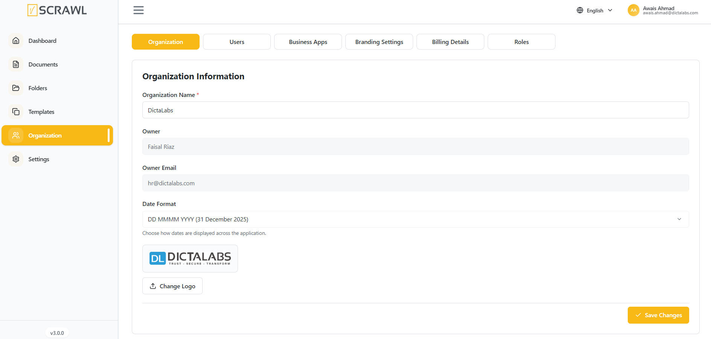

# Organization Overview 

The **Organization** module enables administrators to manage organization-wide settings, branding, user access, business integrations, billing information, and role-based permissions within vScrawl. It serves as the central location for configuring and maintaining organizational preferences that apply across the platform.

Through the Organization module, administrators can customize their workspace, manage team members, and ensure that the platform aligns with their organization's operational requirements.

## Accessing Organization Settings

To access organization settings:

1. Sign in to your vScrawl account.
2. From the left navigation menu, click **Organization**.
3. The Organization page will open, displaying various management tabs.

The available tabs may vary depending on your subscription plan and user permissions.

---
!!! note ""
    Only the **Organization Owner** has the authority to update the organization details.

### Organization Tab

The **Organization** tab contains core information about the organization and allows administrators to manage basic settings.

### Organization Name

The **Organization Name** field displays the official name of the organization associated with the workspace.

Administrators can update the organization name when required.

### Owner Information

The Owner section displays:

- Organization Owner Name
- Owner Email Address

This information identifies the primary account owner responsible for managing the organization.

### Date Format

The **Date Format** setting allows administrators to define how dates are displayed throughout the platform.

Examples include:

- DD MMMM YYYY (31 December 2025)
- MM/DD/YYYY
- DD/MM/YYYY

Selecting a consistent date format helps ensure clarity and standardization across all users.

### Organization Logo

Organizations can upload a custom logo to personalize their vScrawl workspace.

To update the logo:

1. Click **Change Logo**.
2. Select an image file from your device.
3. Upload and save the changes.

The uploaded logo may be displayed throughout the platform, depending on branding settings and subscription features.

