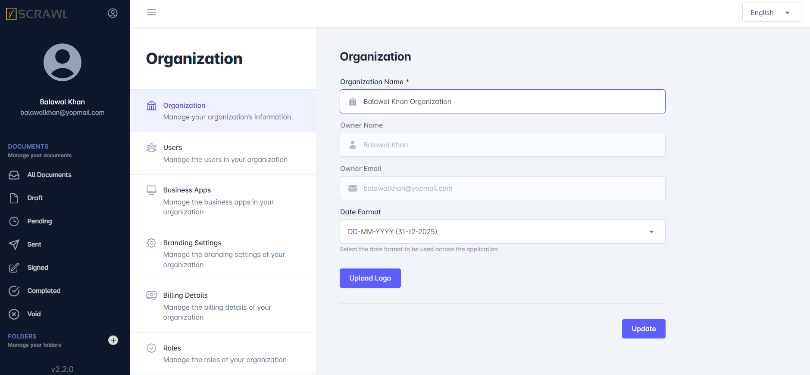

# Organization Overview 

The **Organization** module enables administrators to manage organization-wide settings, branding, user access, business integrations, billing information, and role-based permissions within vScrawl. It serves as the central location for configuring and maintaining organizational preferences that apply across the platform.

Through the Organization module, administrators can customize their workspace, manage team members, and ensure that the platform aligns with their organization's operational requirements.

## Accessing Organization Settings

To access organization settings:

1. Sign in to your vScrawl account.
2. From the left navigation menu, click **Organization**.
3. The Organization page will open, displaying various management tabs.

The available tabs may vary depending on your subscription plan and user permissions.

---
!!! note ""
    The **Organization Owner**, and members whose role grants **Update** on the **Organizations** module, can update the organization details. Other users see them read-only. The **Compliance Mode** settings can be changed only by the Organization Owner.

### Details Tab

The **Details** tab contains core information about the organization and allows administrators to manage basic settings.

### Organization Name

The **Organization Name** field displays the official name of the organization associated with the workspace.

Administrators can update the organization name when required. The name must be unique — it cannot be the same as another organization's name.

### Owner Information

The Owner section displays:

- Organization Owner Name
- Owner Email Address

This information identifies the primary account owner responsible for managing the organization.

### Date Format

The **Date Format** setting allows administrators to define how dates are displayed throughout the platform.

Examples include:

- DD MMMM YYYY (31 December 2025)
- MM/DD/YYYY
- DD/MM/YYYY

Selecting a consistent date format helps ensure clarity and standardization across all users.

### Organization Logo

Organizations can upload a custom logo to personalize their vScrawl workspace.

The logo is managed in the **Branding Settings** tab — see [Branding Settings](branding.md).

The uploaded logo may be displayed throughout the platform, depending on branding settings and subscription features.

### Compliance Mode

If your service plan includes them, the **Compliance Mode** section shows the signing modes your organization uses:

- **eIDAS (EU) — Advanced & Qualified Electronic Signatures**
- **ESIGN + UETA (US) — Simple Electronic Signatures with consent disclosure**

When your plan includes both modes, the Organization Owner can choose which ones are enabled; at least one must stay enabled. While the organization uses only ESIGN + UETA mode, Advanced (AES) and Qualified (QES) signatures are not available. If digital signatures are switched off for the whole platform, a note under the eIDAS option says so, and AES and QES stay unavailable regardless of this setting.

When ESIGN + UETA mode is active and evidence reports are enabled on the platform, the Organization Owner can also turn on **Attach evidence report to signed document**: single-document workflows then have the audit trail evidence report merged into the final signed PDF.

Click **Save** to apply your changes.

