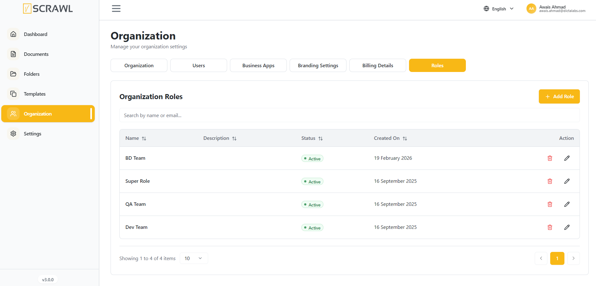
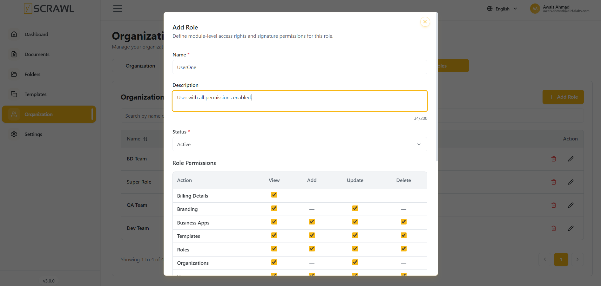
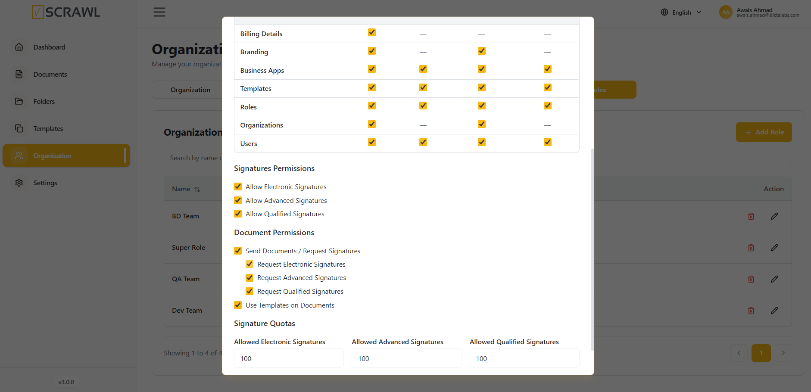
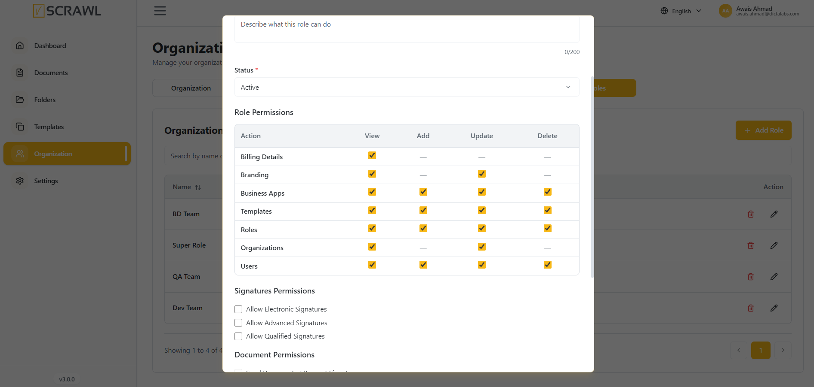

# Roles 

The **Roles** section enables administrators to define and manage role-based access within the organization. Roles help control user permissions by assigning access rights based on responsibilities and job functions.

### Viewing Roles

The Roles page displays all configured roles within the organization, including:

- **Role Name** – The name of the role.
- **Description** – A brief description of the role's purpose.
- **Status** – Indicates whether the role is active or inactive.
- **Created On** – The date the role was created.
- **Actions** – Options to edit or delete a role.

### Searching Roles

Use the **Search** field to quickly locate a role by name.

1. Enter the role name in the search box.
2. Matching results will be displayed automatically.

### Creating a Role

To create a new role:

1. Click **Add Role**.
2. Enter the role details.
3. Configure the required permissions.
4. Save the role.

The new role will become available for assignment to users.

### Managing Roles

Administrators can manage existing roles using the available action controls.

Available actions include:

- **Edit** – Modify role details and permissions.
- **Delete** – Remove a role that is no longer required.
 

