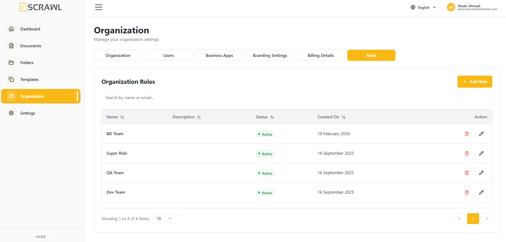
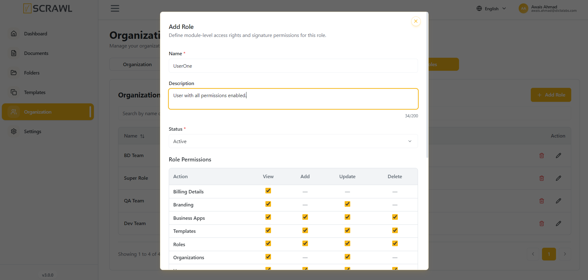
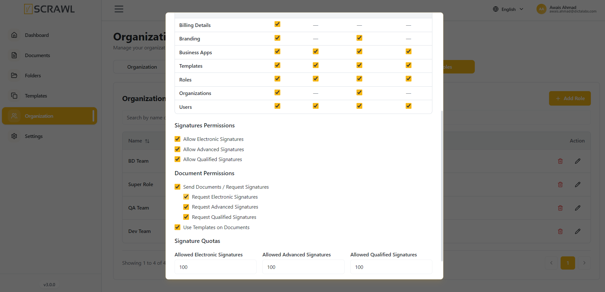
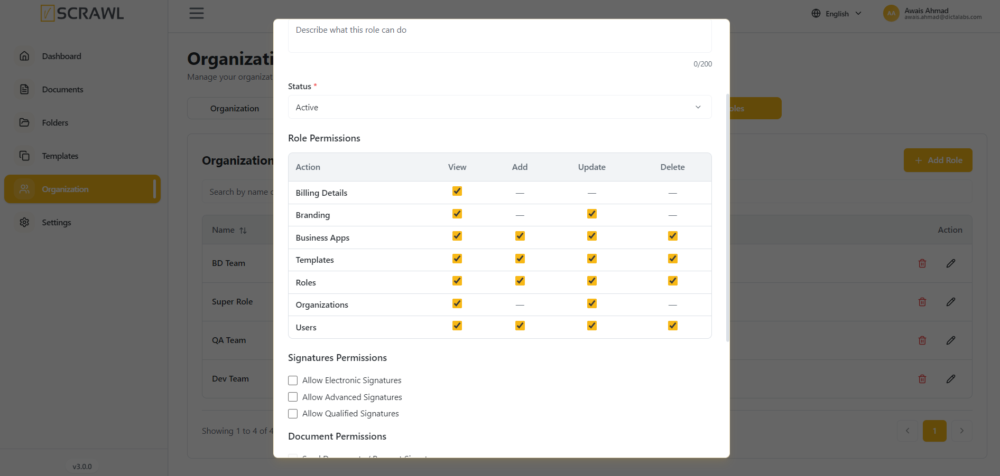

# Roles 

The **Roles** section enables administrators to define and manage role-based access within the organization. Roles help control user permissions by assigning access rights based on responsibilities and job functions.

### Viewing Roles

The Roles page displays all configured roles within the organization, including:

- **Name** – The name of the role.
- **Description** – A brief description of the role's purpose.
- **Status** – Indicates whether the role is active or inactive.
- **Created On** – The date the role was created.
- **Action** – Options to edit or delete a role.

### Searching Roles

Use the **Search** field to quickly locate a role by name or description.

1. Enter the role name or description in the search box.
2. Matching results will be displayed automatically.

### Creating a Role

To create a new role:

1. Click **Add Role**.
2. Enter the role details: a **Name** (3–20 characters, letters and spaces only, and not already used by another role), an optional **Description**, and a **Status**.
3. Configure the required permissions:
    - **Role Permissions** – for each module (Billing Details, Branding, Business Apps, Templates, Roles, Organizations, Users), tick **View**, **Add**, **Update** and/or **Delete**. Some modules offer only some of these rights.
    - **Signatures Permissions** – which signature types members with this role may sign with.
    - **Document Permissions** – whether they may send documents and request each signature type, and whether they may **Use Templates on Documents**.
    - **Signature Quotas** – how many signatures of each allowed type they may use.
4. Click **Add Role** to save the role.

The new role will become available for assignment to users. Only the signature types included in your service plan are listed.

### Managing Roles

Administrators can manage existing roles using the available action controls.

Available actions include:

- **Edit** – Modify role details and permissions. The role name cannot be changed after the role is created.
- **Delete** – Remove a role that is no longer required. A role that is still assigned to users cannot be deleted.
 

