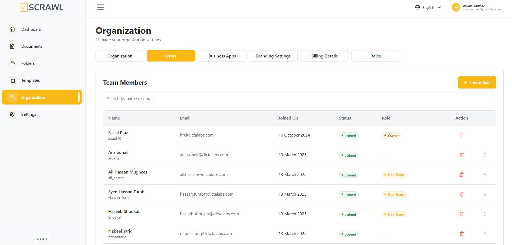
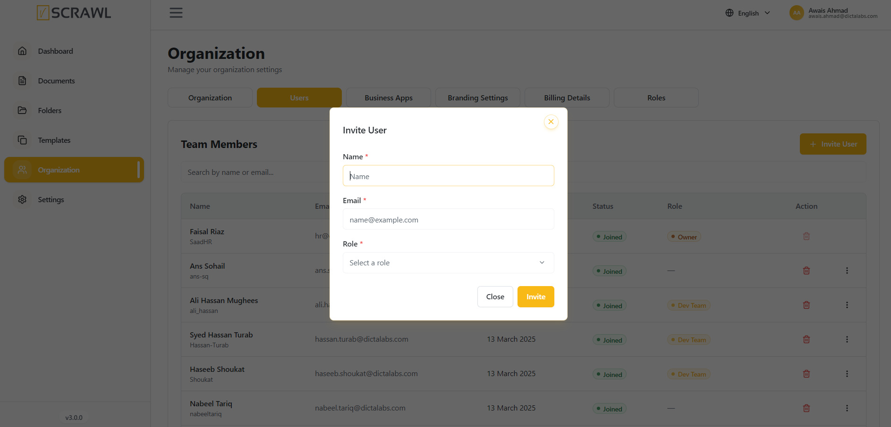

# Users 

The **Users** section allows administrators to manage organization members within vScrawl. From this page, administrators can view team members, monitor user status, assign roles, and invite new users to the organization.

### Viewing Team Members

The Team Members table provides an overview of all users associated with the organization.

The following information is displayed for each user:

- **Name** – User's full name and username.
- **Email** – Registered email address.
- **Joined On** – Date the user joined the organization.
- **Status** – Current membership status: **Joined**, **Invited** (invitation not yet accepted) or **Declined**.
- **Role** – Assigned role within the organization; the organization owner is shown as **Owner**.
- **Action** – Available user management options.

### Searching Users

Use the **Search by name or email** field to quickly locate users within the organization.

1. Enter a user's name or email address.
2. Matching results are displayed automatically.

### Updating the User Roles & Settings

- You can update the role of users in your organization: open the **⋮** menu on a joined user's row and select **Update Role**.
    
- You can also **renew** their **signature Quotas** from the same menu (**Renew Signature Quotas**), which adds the quotas defined by the user's role again.
    
- You can **delete user** from your organization with the delete (trash) icon. The organization owner cannot be deleted.
    
- You can invite a new user to your **organization** by giving him the **roles & permissions** you want: click **Invite User**, enter the **Name** (6–50 characters, letters and spaces only), **Email** and **Role**, and click **Invite**. The user appears as **Invited** until they accept the invitation. 

