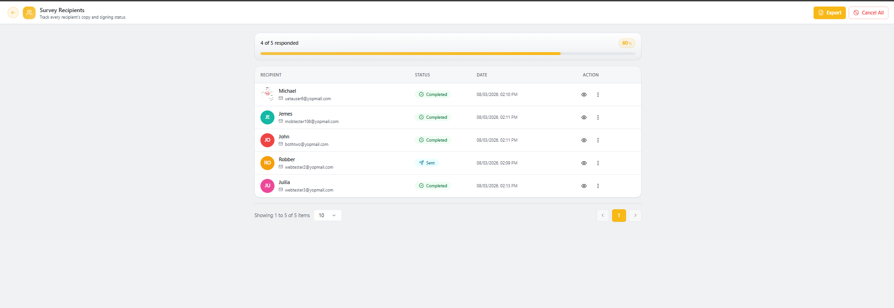
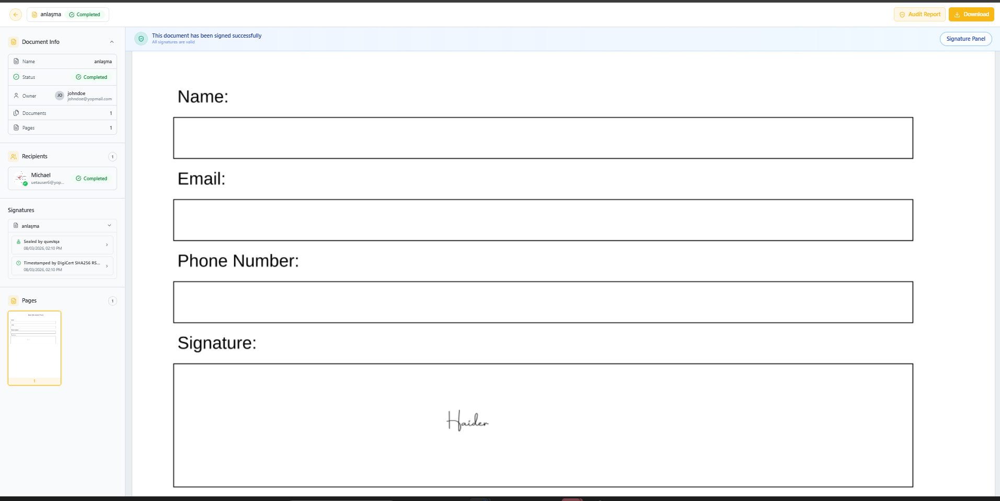

## Overview

**Power Survey** is a document type for sending the same form to many recipients at once, where each recipient fills and signs their **own independent copy** — unlike Multi Sign, recipients don't share a single document or wait on each other.

In the **Documents** list, Power Survey documents show their type as **Power Survey** and their progress as **X/Y completed** (e.g. "4/5 completed").

## Tracking Survey Recipients

Open a Power Survey document from the Documents list to see the **Survey Recipients** page — a live view of every recipient's copy and signing status.

The page shows:

- A progress bar with **X of Y responded** and a completion percentage.
- A **Recipient** table listing each person's name, email, **Status** (Sent / Completed), and the **Date** of their last action.

### Actions

From the top-right of the page:

- **Export** – download the survey results.
- **Cancel All** – cancel the survey for every recipient who hasn't yet responded.

From the **Action** column on each recipient row:

- Click the **eye icon** to view that recipient's individual completed copy, including their filled fields and signature.

- Use the **⋮** menu for further per-recipient actions.
