# User & Organization Settings

## User Specific Settings
### Profile Settings

The **Profile Settings page** in vScrawl allows you to manage your **account details, security preferences, online signatures, and notifications**. This is where you personalize your profile and ensure your signing experience is both secure and efficient.

- Displays your **name and email address**.
    
- Useful for confirming which account you are logged into.
    
- Clicking the user cog in the left side panel allows access to **Profile, Organization, Templates and sign out.**

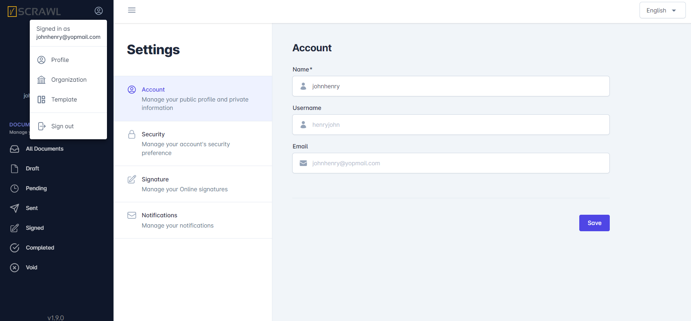

### Account Settings

- **Name** – Display name shown in your vScrawl account.
    
- **Username** – Unique identifier (used for login or internal reference).
    
- **Email** – Registered email address (used for login, notifications, and signing).
    
- After changes, click **Save** to update your profile.

### Security Settings

- Here you can set the security settings for your account by setting up:  
    Enable Security Question  
    Enable 2-Factor Authentication

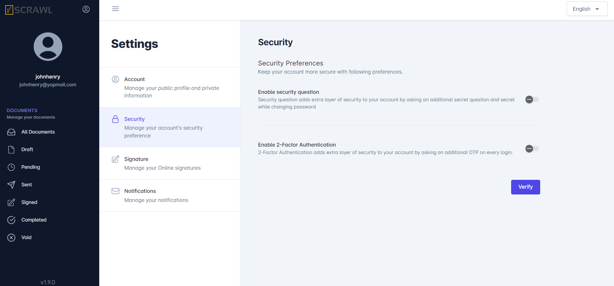

### Signature Settings

- In vScrawl, you can set up and manage the type of electronic signature you want to use by default, directly from your **Settings**. This ensures flexibility and compliance with different levels of security and legal requirements.
    
- You can change your **signature type** and **appearance** anytime, depending on the security level required and **Set or update** your signature by clicking **Update Signature**.

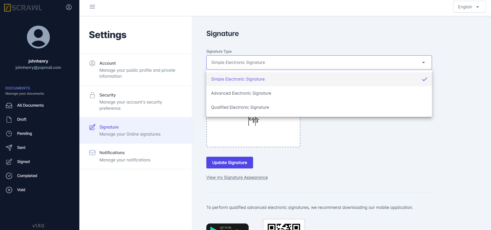

- Your signature settings are applied across all documents you upload or sign in vScrawl.
    
- If you are present in someone’s **organization** you can see your **signature quota’s** for **Simple** and **Digital Signatures**.

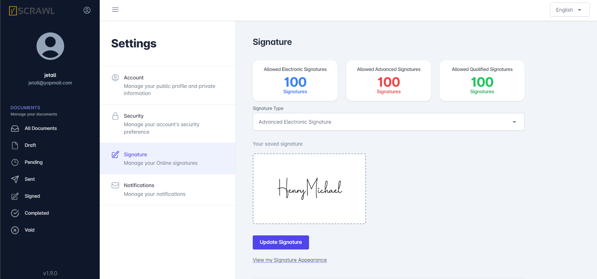

### Notifications Settings

The **Notifications** feature in vScrawl allows you to stay informed about the status of your documents throughout the signing workflow. You can customize which alerts you receive, ensuring that you are always up to date on important actions without unnecessary interruptions.

Here you can **choose** how you **receive updates**:

- **Notify me when someone shares a document with me**
    
- **Notify me when someone signs my document**
    
- **Notify me when a workflow is completed**
    
- **Notify me when someone declines to sign my document**
    
- **Notify all signers when the workflow is completed**

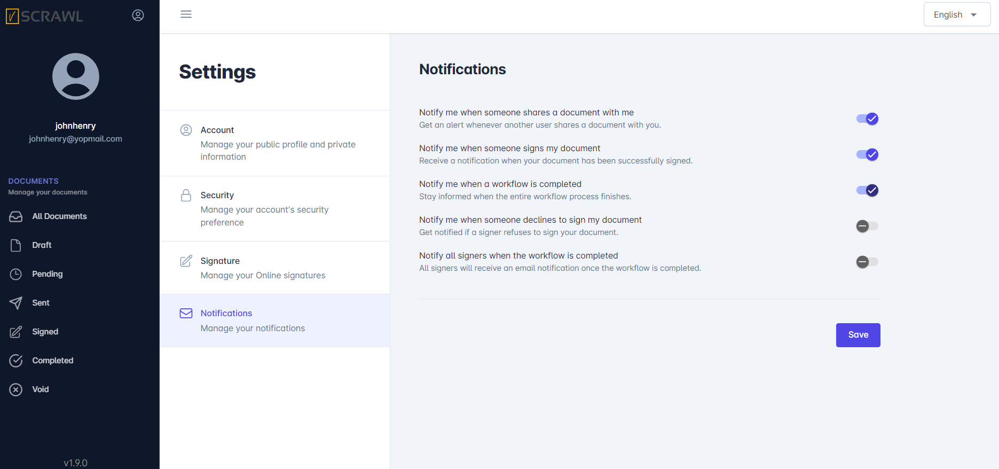

## Organization Specific Settings
### Organization

Here you can see the **organization details**:  
**Organization Name**  
**Owner Name**  
**Owner Email**

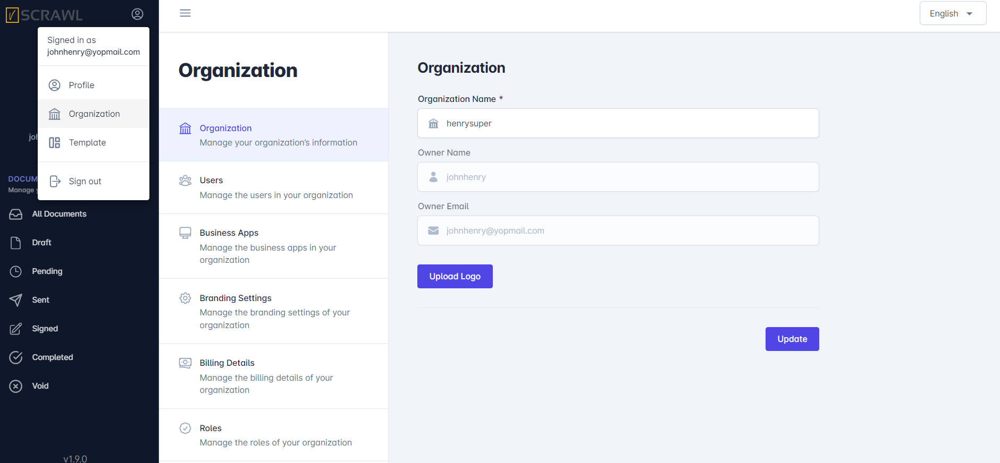

### Roles
Here you can **add roles** with different **permissions** and will **assign that role for inviting a new user** to your **organization.** The **roles** you will create will appear hear in the list. You can search different **roles** by using the **search** option.

- This is the **Add Role screen** when you click on the **Add Role button.**

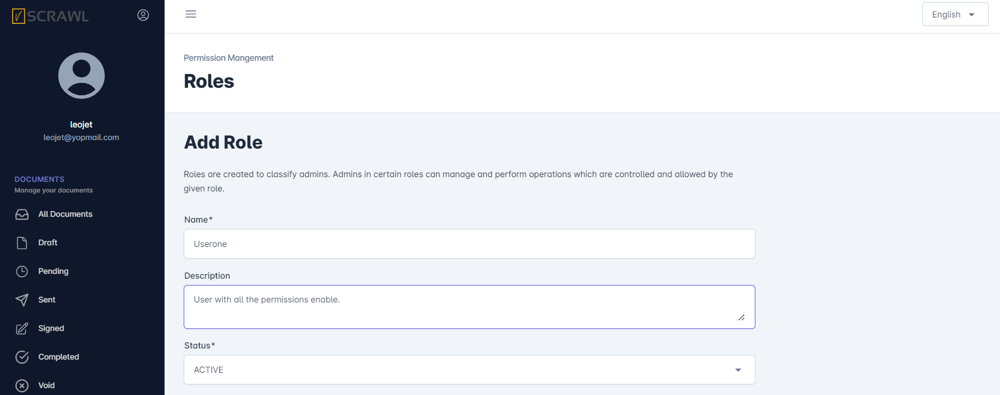

- You can create a role with the **different permissions (Billing Details, Branding, Business Apps, Templates, Roles, Organizations and Users)** and the **signature quotas** you want and then can assign that role to any **users** and invite them to your **organization**.

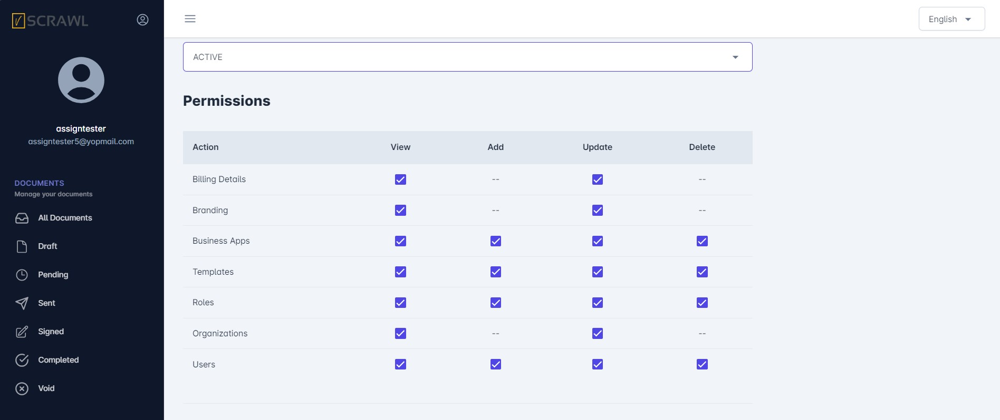

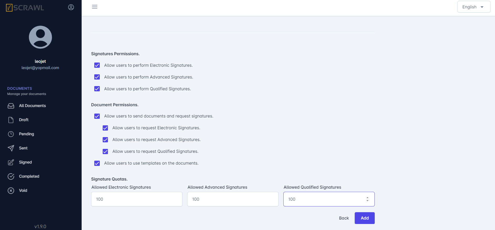

### Users

- Here you can see the list of **users** who have **joined your organization**.
    
- You can update the role of users in your organization.
    
- You can also **renew** their **signature Quotas.**
    
- You can **delete user** from your organization.
    
- You can invite a new user to your **organization** by giving him the **roles & permissions** you want.  

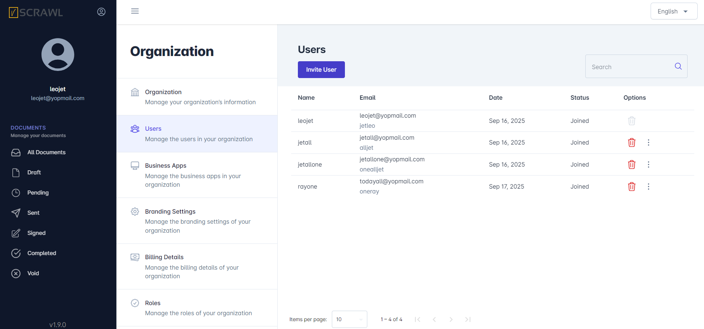

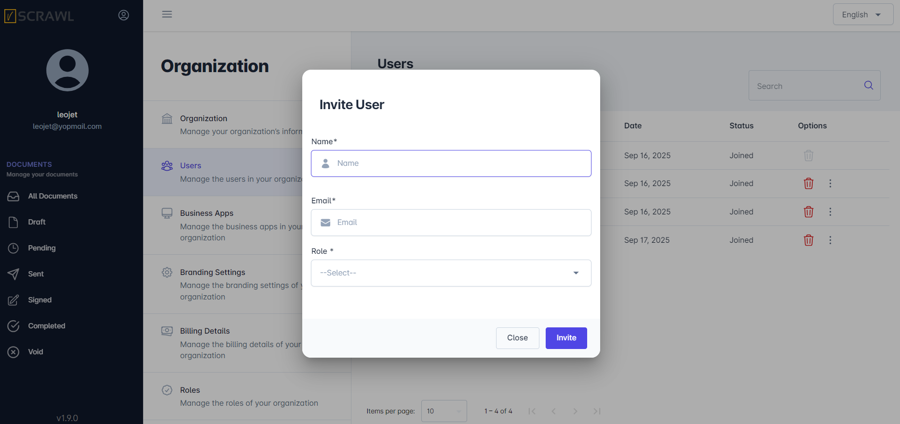

### Business Apps

- You can add Business App or any third party app with vScrawl by adding proper details of the app like:  
    **Client ID**  
    **App name**  
    **Description**  
    **Call back URL**  
    **Status**

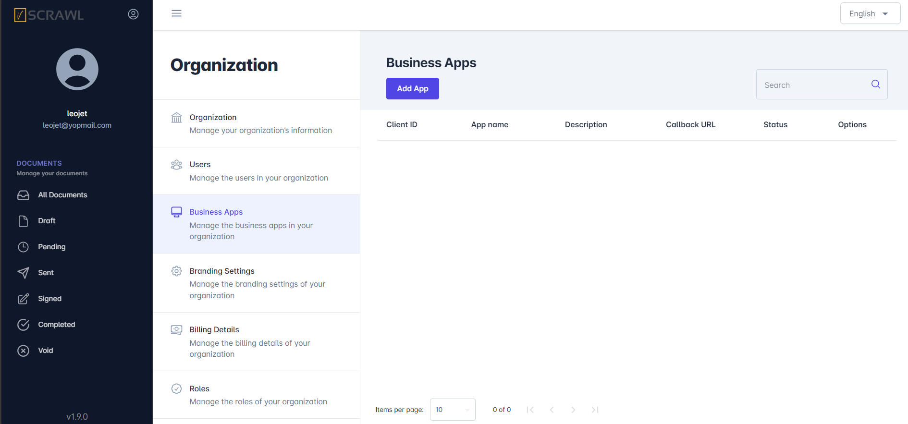

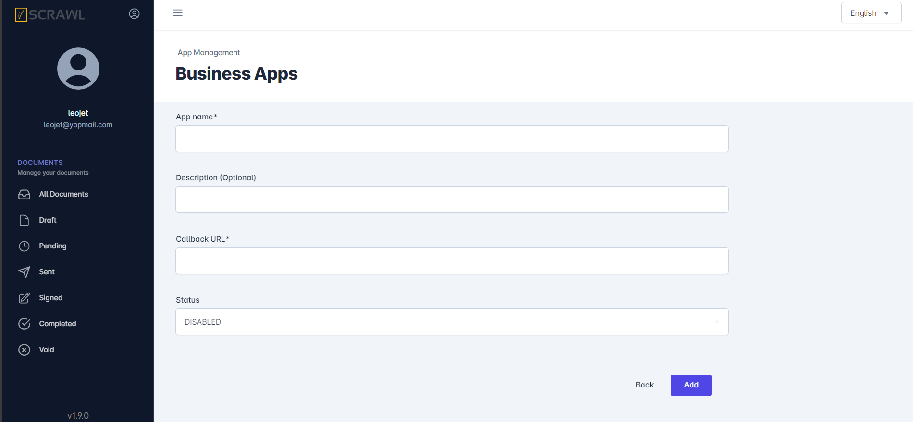
### Branding Settings
Here you can customize the **color,** **theme** and **overall look** of the app. There are **multiple options** for customization like:  
**Header Section**  
**Left Panel Section**  
**Buttons Section**

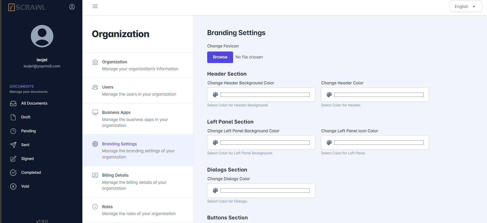

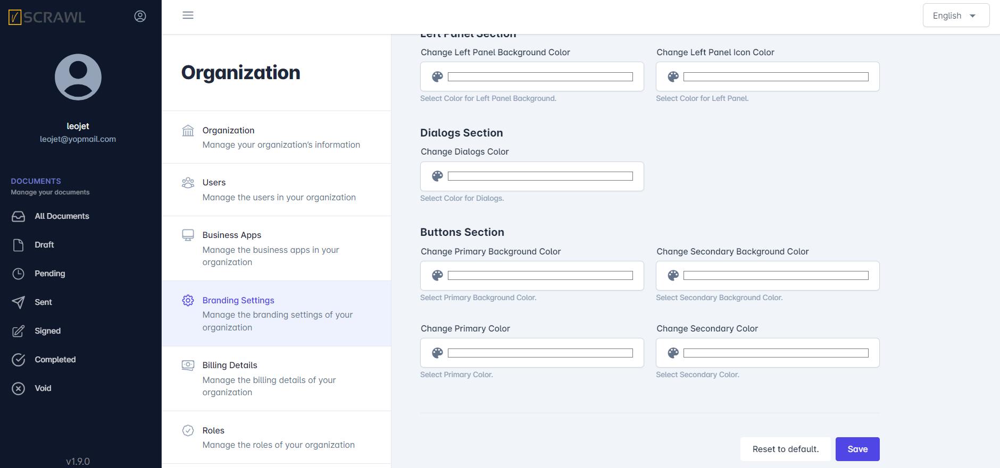

### Billing Details
- Here you can see your billing details like:  
    **Account Balance**  
    **Available Credits**  
    **Last Purchased Credits**  
    **Credits Purchased Date**  
    **Credits Expiry Date.**  
    This will depend on the admin **roles permission** and the **package** you have allocated. When you create a **new account** on vScrawl there will be a **package** allocated to you which have a **credit limits and duration** for signing the documents. Your **balance will be deducted** on each signature and other activities.

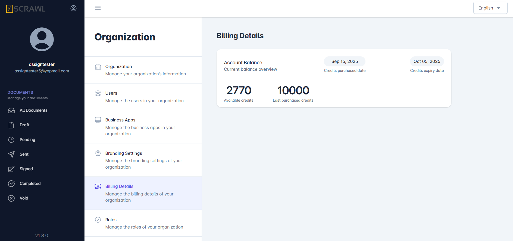

