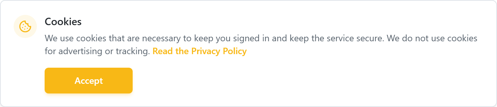
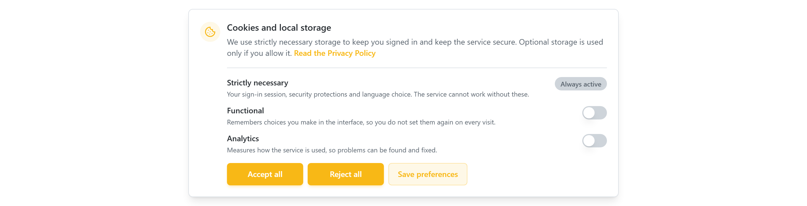
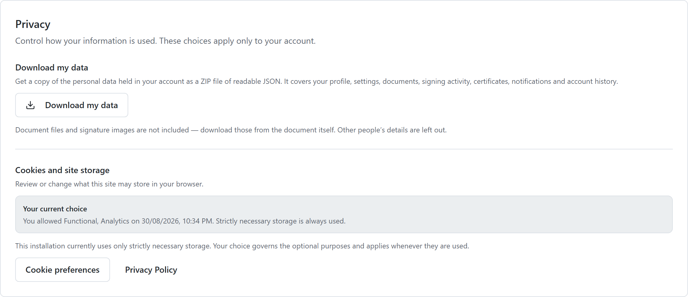

# User Settings

## User Specific Settings 
### Settings

The  **Settings** page** in vScrawl allows you to manage your **account details, security preferences, online signatures, and notifications**. This is where you personalize your profile and ensure your signing experience is both secure and efficient.

- Displays your **name and email address**.
    
- Useful for confirming which **account** you are logged into.
    
- Clicking the **Settings** option in the left-side navigation panel allows users to access and manage **Account Settings, Signature Settings, Notification Settings, Security Settings, Privacy, Assistant, and Auto Delegation** from a centralized location.

### Account Settings

- **Full Name** – Display name shown in your vScrawl account.
    
- **Username** – Unique identifier (used for login or internal reference).
    
- **Email** – Registered email address (used for login, notifications, and signing).

- **Language** - Your selected language.

    
- After changes, click **Save** to update your profile.

### Delete Account

Users also have the option to permanently delete their account.

To delete an account:

1. Click **Delete My Account**
2. Confirm the action when prompted

!!! warning ""
    **Note:** Account deletion may permanently remove user data and associated documents. This action should be performed carefully.

Deleting your account removes your sign-in, your draft documents, your saved signatures and initials, and your signing certificates. Documents you had already sent but that were not yet completed are voided, so no one can sign them afterwards.

Two things are worth knowing before you do it:

- **Documents you have already signed are not deleted.** Your name stays on them, along with the record that you signed them. Other people rely on those signatures, and the law requires them to be kept — a signature that could be erased would not be a signature.
- **If you own an organization with other members**, you cannot delete your account until you transfer ownership or remove the other members first.

### Your Privacy Rights

You have rights over the personal information held about you, and most of them you can exercise yourself from this Settings page.

| What you want | How |
| --- | --- |
| **Correct something that is wrong** | Edit it under **Account Settings** above and click **Save** |
| **Delete your account and data** | **Delete Account** above |
| **Get a copy of your data** | **Settings → Privacy → Download my data** |
| **See what the app remembers in your browser** | **Settings → Privacy** shows the answer you gave and when |
| **Turn off mobile crash reports and analytics** | In the mobile app, **Settings → Privacy** |
| **Ask a question about how your information is used** | Contact your organization owner, or the address given in the Privacy Policy |

#### Download my data

**Settings → Privacy → Download my data** gives you a ZIP file containing your
account details, your settings, the documents you own or were asked to sign,
your signing activity, your saved signatures, your certificates, your
notifications and your account history. If you applied for a qualified
certificate, it also contains the identity details you gave for that. Everything
in it is plain text you can open and read.

Start with **`README.md`** inside the archive. It lists what each file holds, what
is deliberately left out and why, and where to ask for anything missing.

The files are written to be read, not decoded. Dates appear as
*31 August 2026, 11:36 AM (UTC)* rather than as a machine timestamp, file sizes as
*13 KB*, and statuses in words — *"Sent — waiting for signatures"* rather than a
code. Internal record numbers are not included: they mean nothing outside our
database and answer no question you would have.

If your activity history is very long the archive holds your most recent entries
and says so — ask us and we will send you the rest.

Some things are deliberately left out:

- **The document files themselves and your signature images.** You already have
  these — download a document from the Documents screen, and your signature
  images from **Signature Settings**.
- **The scan of your identity document**, if you uploaded one. It is your own
  file, and we delete our copy once your application has been reviewed.
- **Your consent to sign electronically.** That is recorded per document and shown
  in full in each document's Audit Report, which you can download from the
  document itself.
- **Other people's names and email addresses.** Where a document had other
  signers, the file says how many there were, not who they were. They have
  privacy rights too.

Your security details — your two-factor code seed and your security-question
answer — are also left out on purpose. They protect your account, and putting
them in a file you are about to save or email would weaken that.

Each download is recorded in your account history, so you can always see when a
copy was taken.

### Cookies and what the site remembers

The first time you open vScrawl in a browser, a panel appears at the bottom of the
screen asking what the site may store on your device. Nothing optional is stored
until you answer, and the page behind the panel does not respond until you do —
that is deliberate, so the choice cannot be skipped by clicking past it.

You have three answers:

| Button | What it means |
| --- | --- |
| **Accept all** | Everything below is allowed |
| **Reject all** | Only the strictly necessary items are stored. This is not a degraded version of the site — signing, documents and settings all work exactly the same |
| **Customize** | Choose each optional purpose yourself |

What each purpose covers:

| Purpose | Can you refuse it | What it is for |
| --- | --- | --- |
| **Strictly necessary** | No — the site cannot work without it | Your sign-in session, security protections and your language choice |
| **Functional** | Yes | Remembers choices you make in the interface, so you do not set them again on every visit |
| **Analytics** | Yes | Measures how the service is used, so problems can be found and fixed |

!!! note ""
    **Settings → Privacy** shows the answer you gave and when you gave it — for example
    "Accept all" with the date, or the individual purposes you picked under **Customize**.
    It also states that strictly necessary storage is always used, whatever you chose.

!!! note ""
    **Refusing costs you nothing.** No feature is withheld from someone who rejects
    the optional purposes. If a site makes you accept in order to use it, that is
    not consent — it is a condition, and GDPR does not accept it as consent.

Your answer is remembered per account. Signing in on a new browser or after
clearing your browser data shows the panel again, because the answer was stored
on the device you cleared.

**Settings → Privacy** shows what you chose and when, so you can check without opening
anything technical.

!!! note ""
    To answer differently, clear this site's stored data in your browser — the panel then
    appears on your next visit and your new answer replaces the old one. Your documents,
    signatures and account are not affected; only the stored answer is.

### Where to read the Privacy Policy and Terms

Both are linked from the bottom of the left-hand menu on every page, from the
sign-up page, and from the cookie panel. They are
published by the organization that runs your vScrawl installation, so their content
is theirs — not the platform's.

If a page opens and says the policy is not available, that organization has not
published it yet. Ask your organization owner; they can publish it from the admin
console.

### What is recorded about you

So that nothing here is a surprise:

- **Your account details** — name, email, username, language and notification preferences.
- **Your documents** — what you upload, who you send it to, and what is typed into the fields.
- **Your signature and initials images**, and any stamps you add.
- **A record of your activity** — actions you take, with the time, your IP address and your browser. This is what makes the [Audit Report](audit_report.md) possible, and it is what makes a signature defensible if it is ever questioned.
- **Your consent to sign electronically**, where your organization requires it — including the exact wording you accepted, the time, your IP address and your browser.
- **Your acceptance of the Terms and Privacy Policy** when you created the account — the time, the address you accepted from, which screen asked you, and a short mark identifying the exact wording you were shown. This appears in your account history as **Terms and Privacy Policy Accepted**, and it is included in the copy you can download above.

!!! note ""
    The organization that sent you a document decides what information that document asks for and how long it is kept. If you want a document changed or removed, contact the organization that sent it — they control it, not the platform.

### Mobile privacy settings

The mobile app asks, the first time you open it, whether it may send crash reports and usage analytics. **Both start switched off.** You can change your answer at any time in **Settings → Privacy** in the app.

Choosing **Reset privacy choices** there stops all collection and deletes the diagnostic data held on your device. The app works exactly the same either way — nothing about signing, documents or your account depends on it.

### Security Settings

- Here you can set the security settings for your account by setting up:  
    - **Enable PassKey**
    - **Enable Security Question**
    - **Enable Two-Factor Authentication**
    - **Smart Card Authentication**
    

### Signature Settings

The **Signature Settings** tab is where you manage everything you sign with: the assurance level applied when you sign, and the items you apply to documents — your **signatures**, **initials** and **stamps**.

#### Signature type and allowance

- Choose the assurance level applied when you sign a document: **Simple Electronic Signature**, **Advanced Electronic Signature** or **Qualified Electronic Signature**. The level currently applied is marked **IN USE**.
    
- If you belong to an **organization**, **Signature allowance** shows how many Electronic, Advanced and Qualified signatures your current plan includes.

#### Your saved signatures, initials and stamps

vScrawl keeps **three separate libraries**, so you can save more than one of each and apply the right one to each field you sign.

| Section | Button | How the item is created |
| --- | --- | --- |
| **Your Saved Signatures** | **Add Signature** | Draw, type or upload |
| **Your Saved Initials** | **Add Initial** | Draw, type or upload |
| **Your Saved Stamps** | **Add Stamp** | Upload an image |

- Each saved item appears as a card with its preview and a label — **Signature 1**, **Initials 1**, **Stamp 1** — numbered in the order you created them.
    
- How many items you can keep in each library is set by your administrator (**5** by default). Once a library is full, delete an item before adding another.
    
- **Appearance** shows how your signature is rendered on a signed document.

!!! note ""
    A stamp is uploaded as an image — it is used as a company seal or mark, and it never replaces a signature.

#### Adding an item

Click **Add Signature**, **Add Initial** or **Add Stamp** in the matching section. A dialog opens for that type only. Fill it in and click **Save** — **Save** stays inactive until there is something to save. **Close** discards it.

**Add Signature** and **Add Initial** offer three ways to create the item, each on its own tab:

| Tab | What you do |
| --- | --- |
| **Upload** | Click **Browse** and choose an image file from your device |
| **Draw** | Draw the signature or initials by hand |
| **Type** | Type your name and have it rendered in a handwriting style |

**Add Stamp** has no tabs — a stamp can only be uploaded, so the dialog goes straight to **Browse**.

The new item is added to that library and appears as a new card. If it is the first item of its type, it also becomes the default.

#### The default item

- The card marked **DEFAULT** is the one applied automatically when you click an empty field of that type.
    
- To change it, click **Set as default** on another card.
    
- A new default applies to documents you sign from that point on. Documents you have already signed keep the item they were signed with.

#### Deleting an item

Click the bin icon on a card. A confirmation dialog opens, naming the exact item you are about to remove — **Signature 2**, **Initials 2**, **Stamp 1** — so you can be sure it is the right one. Click **Delete** to remove it, or **Cancel** to keep it.

- If you delete the default, your oldest remaining item of that type becomes the new default.
    
- Documents you have already signed are never changed — they keep the signature, initials or stamp they were signed with. If a document you currently have open uses the deleted item, that field is cleared so you can choose another one.

#### Choosing which item to apply in a document

Your saved items are applied while you fill in a document:

1. Click an **empty** signature, initials or stamp field — your default item (or the one you picked most recently) is applied straight away.
    
2. Click the **same field again** — the picker opens so you can apply a different item to that field.

The picker always matches the field you clicked, so it only ever offers items of the right type — signatures for a signature field, initials for an initials field, and stamps for a stamp field.

**Signature field — "Choose a signature"**

**Initials field — "Choose Initial"**

**Stamp field — "Choose a stamp"**

From any of the three you can:

- select any saved item — it is applied to **that field only**; the item currently in use is outlined and carries a tick,
    
- add a new item without leaving the document — **Add Signature**, **Add Initial** or **Add Stamp**, depending on which field you clicked,
    
- delete an item you no longer need, using the bin icon on its card.

!!! note ""
    Your choice is remembered per field, so one document can carry a different signature, set of initials or stamp on each field.

### Notifications Settings

The **Notifications** feature in vScrawl allows you to stay informed about the status of your documents throughout the signing workflow. You can customize which alerts you receive, ensuring that you are always up to date on important actions without unnecessary interruptions.

Here you can **choose** how you **receive updates**:

- **Notify me when someone shares a document with me**
    
- **Notify me when someone signs my document**
    
- **Notify me when a workflow is completed**
    
- **Notify me when someone declines to sign my document**
    
- **Notify all recipients when the workflow is completed**

### Assistant

The **Assistant** tab lets you route your incoming documents through a **Personal Assistant** — someone who pre-reviews, fills fields, and approves or declines on your behalf. You always remain the one who finishes signing or approving; other people on the document only ever see your name, never your assistant's.

By default, **Personal Assistant** is turned off.

To enable it:

1. Toggle **Personal Assistant** on.
2. Enter the **Assistant's Email** — the address that will receive documents to pre-review on your behalf.
3. Optionally enter the **Assistant's Name**.
4. Click **Save**.

!!! note ""
    Your assistant is never shown to other recipients or document owners — all activity still appears under your own name.

### Auto Delegation

The **Auto Delegation** tab lets you hand your signing and approval turns to someone else automatically while you are away, for a specific date range.

By default, **Enable Auto Delegation** is turned off.

To enable it:

1. Toggle **Enable Auto Delegation** on.
2. Enter the **Delegate Name** and **Delegate Email** of the person who should receive your documents.
3. Set **Away From** and **Away Until** — the date range during which delegation is active.
4. Click **Save**.

!!! warning ""
    Documents handed over while this is on stay with your delegate — turning Auto Delegation off later does not bring them back.

