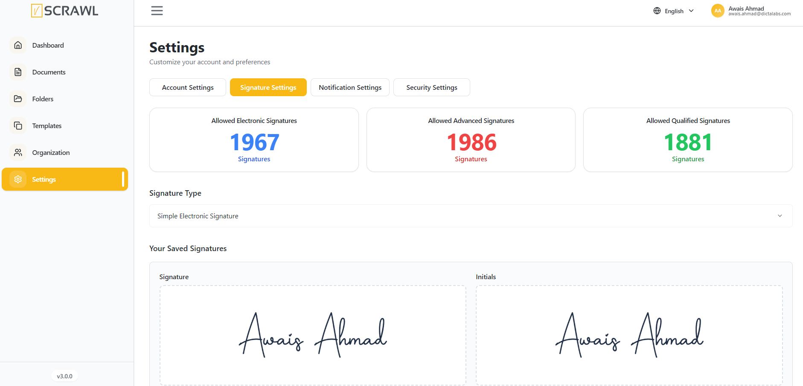

# User Settings

## User Specific Settings 
### Settings

The  **Settings** page** in vScrawl allows you to manage your **account details, security preferences, online signatures, and notifications**. This is where you personalize your profile and ensure your signing experience is both secure and efficient.

- Displays your **name and email address**.
    
- Useful for confirming which **account** you are logged into.
    
- Clicking the **Settings** option in the left-side navigation panel allows users to access and manage **Account Settings, Signature Settings, Notification Settings, and Security Settings** from a centralized location.

### Account Settings

- **Full Name** – Display name shown in your vScrawl account.
    
- **Username** – Unique identifier (used for login or internal reference).
    
- **Email** – Registered email address (used for login, notifications, and signing).

- **Language** - Your selected language.

    
- After changes, click **Save** to update your profile.

### Delete Account

Users also have the option to permanently delete their account.

To delete an account:

1. Click **Delete My Account**
2. Confirm the action when prompted

!!! warning ""
    **Note:** Account deletion may permanently remove user data and associated documents. This action should be performed carefully.

### Security Settings

- Here you can set the security settings for your account by setting up:  
    Enable PassKey
    Enable Security Question  
    Enable 2-Factor Authentication
    Enable Smart Card Authentication
    

### Signature Settings

- In vScrawl, you can set up and manage the type of electronic signature you want to use by default, directly from your **Settings**. This ensures flexibility and compliance with different levels of security and legal requirements.
    
- You can change your **signature type** and **appearance** anytime, depending on the security level required and **Set or update** your signature by clicking **Update Signature**.

- Your signature settings are applied across all documents you upload or sign in vScrawl.
    
- If you are present in someone’s **organization** you can see your **signature quota’s** for **Simple** and **Digital Signatures**.

### Notifications Settings

The **Notifications** feature in vScrawl allows you to stay informed about the status of your documents throughout the signing workflow. You can customize which alerts you receive, ensuring that you are always up to date on important actions without unnecessary interruptions.

Here you can **choose** how you **receive updates**:

- **Notify me when someone shares a document with me**
    
- **Notify me when someone signs my document**
    
- **Notify me when a workflow is completed**
    
- **Notify me when someone declines to sign my document**
    
- **Notify all signers when the workflow is completed**

