# User Settings

## User Specific Settings 
### Settings

The  **Settings** page** in vScrawl allows you to manage your **account details, security preferences, online signatures, and notifications**. This is where you personalize your profile and ensure your signing experience is both secure and efficient.

- Displays your **name and email address**.
    
- Useful for confirming which **account** you are logged into.
    
- Clicking the **Settings** option in the left-side navigation panel allows users to access and manage **Account Settings, Signature Settings, Notification Settings, Security Settings, Assistant, and Auto Delegation** from a centralized location.

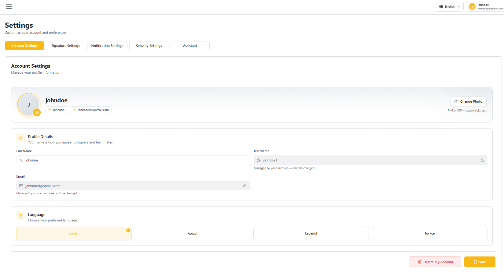

### Account Settings

- **Full Name** – Display name shown in your vScrawl account.
    
- **Username** – Unique identifier (used for login or internal reference).
    
- **Email** – Registered email address (used for login, notifications, and signing).

- **Language** - Your selected language.

    
- After changes, click **Save** to update your profile.

### Delete Account

Users also have the option to permanently delete their account.

To delete an account:

1. Click **Delete My Account**
2. Confirm the action when prompted

!!! warning ""
    **Note:** Account deletion may permanently remove user data and associated documents. This action should be performed carefully.

### Security Settings

- Here you can set the security settings for your account by setting up:  
    - **Enable PassKey**
    - **Enable Security Question**
    - **Enable Two-Factor Authentication**
    - **Smart Card Authentication**
    

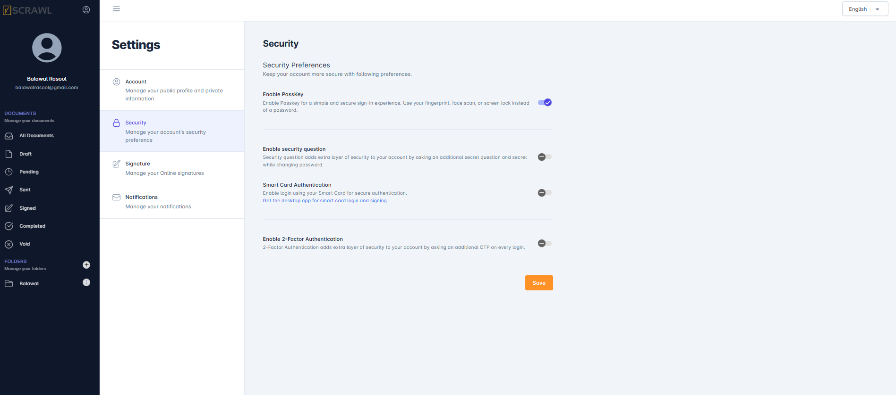

### Signature Settings

The **Signature Settings** tab is where you manage everything you sign with: the assurance level applied when you sign, and the items you apply to documents — your **signatures**, **initials** and **stamps**.

#### Signature type and allowance

- Choose the assurance level applied when you sign a document: **Simple Electronic Signature**, **Advanced Electronic Signature** or **Qualified Electronic Signature**. The level currently applied is marked **IN USE**.
    
- If you belong to an **organization**, **Signature allowance** shows how many Electronic, Advanced and Qualified signatures your current plan includes.

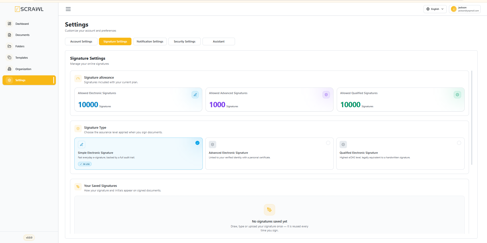

#### Your saved signatures, initials and stamps

vScrawl keeps **three separate libraries**, so you can save more than one of each and apply the right one to each field you sign.

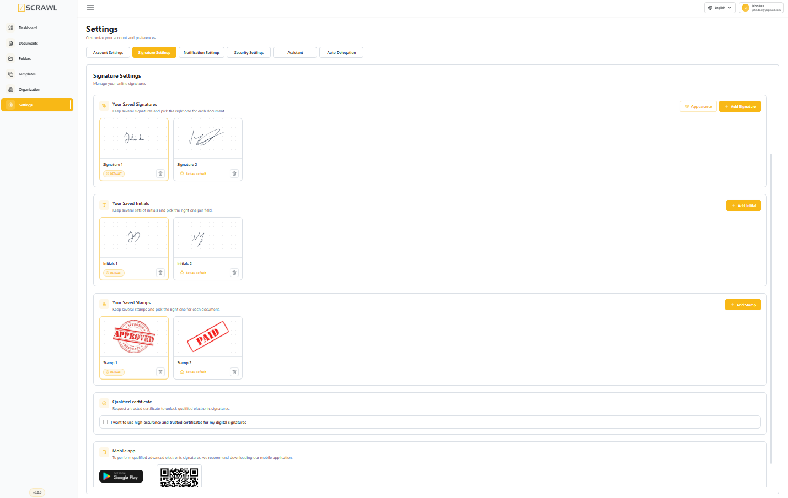

| Section | Button | How the item is created |
| --- | --- | --- |
| **Your Saved Signatures** | **Add Signature** | Draw, type or upload |
| **Your Saved Initials** | **Add Initial** | Draw, type or upload |
| **Your Saved Stamps** | **Add Stamp** | Upload an image |

- Each saved item appears as a card with its preview and a label — **Signature 1**, **Initials 1**, **Stamp 1** — numbered in the order you created them.
    
- How many items you can keep in each library is set by your administrator (**5** by default). Once a library is full, delete an item before adding another.
    
- **Appearance** shows how your signature is rendered on a signed document.

!!! note ""
    A stamp is uploaded as an image — it is used as a company seal or mark, and it never replaces a signature.

#### Adding an item

Click **Add Signature**, **Add Initial** or **Add Stamp** in the matching section. A dialog opens for that type only. Fill it in and click **Save** — **Save** stays inactive until there is something to save. **Close** discards it.

**Add Signature** and **Add Initial** offer three ways to create the item, each on its own tab:

| Tab | What you do |
| --- | --- |
| **Upload** | Click **Browse** and choose an image file from your device |
| **Draw** | Draw the signature or initials by hand |
| **Type** | Type your name and have it rendered in a handwriting style |

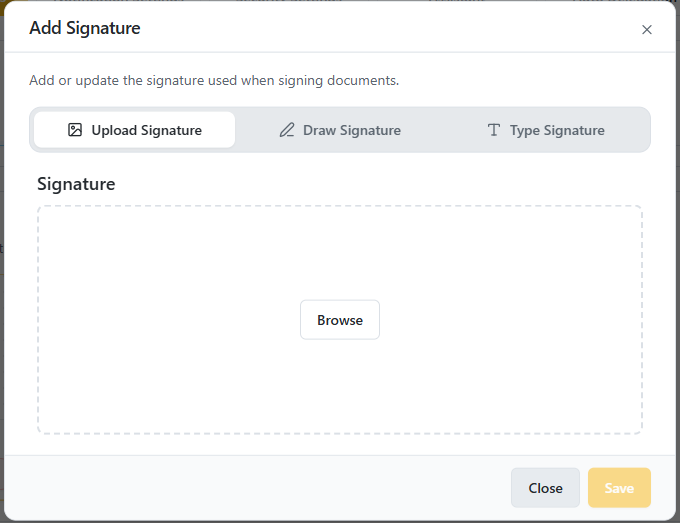

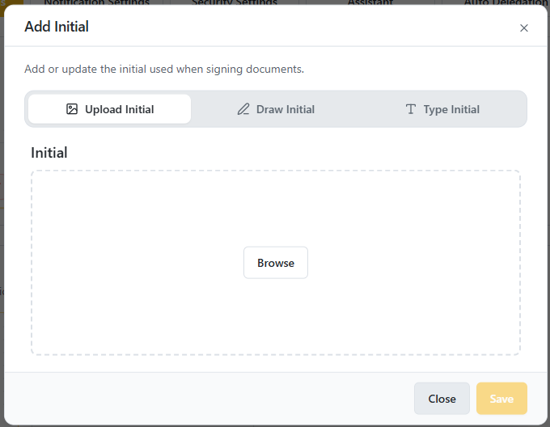

**Add Stamp** has no tabs — a stamp can only be uploaded, so the dialog goes straight to **Browse**.

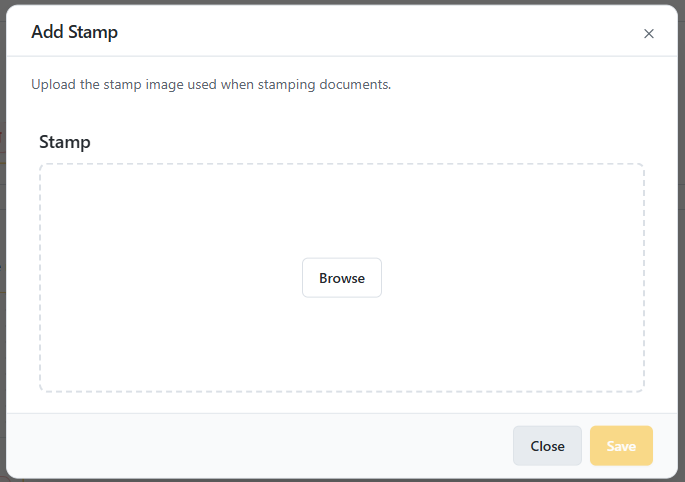

The new item is added to that library and appears as a new card. If it is the first item of its type, it also becomes the default.

#### The default item

- The card marked **DEFAULT** is the one applied automatically when you click an empty field of that type.
    
- To change it, click **Set as default** on another card.
    
- A new default applies to documents you sign from that point on. Documents you have already signed keep the item they were signed with.

#### Deleting an item

Click the bin icon on a card. A confirmation dialog opens, naming the exact item you are about to remove — **Signature 2**, **Initials 2**, **Stamp 1** — so you can be sure it is the right one. Click **Delete** to remove it, or **Cancel** to keep it.

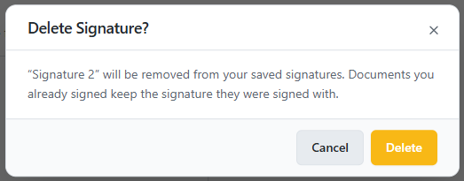

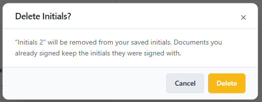

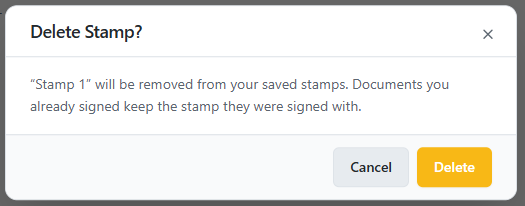

- If you delete the default, your oldest remaining item of that type becomes the new default.
    
- Documents you have already signed are never changed — they keep the signature, initials or stamp they were signed with. If a document you currently have open uses the deleted item, that field is cleared so you can choose another one.

#### Choosing which item to apply in a document

Your saved items are applied while you fill in a document:

1. Click an **empty** signature, initials or stamp field — your default item (or the one you picked most recently) is applied straight away.
    
2. Click the **same field again** — the picker opens so you can apply a different item to that field.

The picker always matches the field you clicked, so it only ever offers items of the right type — signatures for a signature field, initials for an initials field, and stamps for a stamp field.

**Signature field — "Choose a signature"**

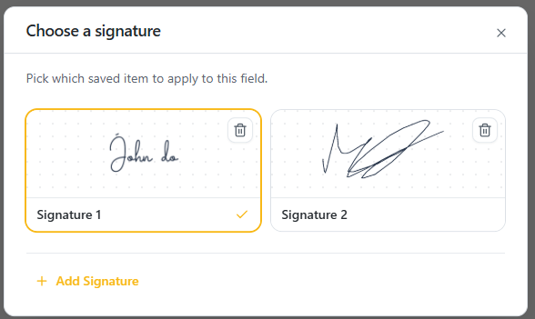

**Initials field — "Choose Initial"**

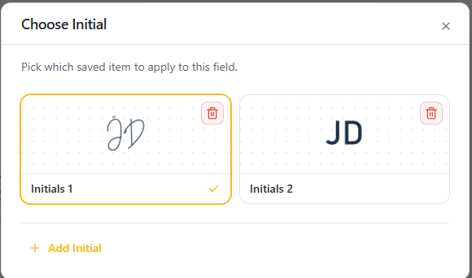

**Stamp field — "Choose a stamp"**

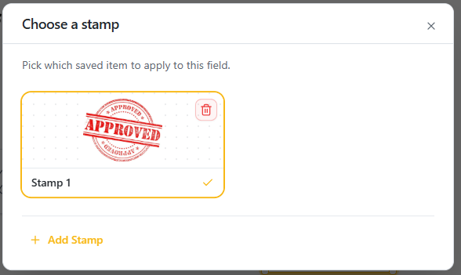

From any of the three you can:

- select any saved item — it is applied to **that field only**; the item currently in use is outlined and carries a tick,
    
- add a new item without leaving the document — **Add Signature**, **Add Initial** or **Add Stamp**, depending on which field you clicked,
    
- delete an item you no longer need, using the bin icon on its card.

!!! note ""
    Your choice is remembered per field, so one document can carry a different signature, set of initials or stamp on each field.

### Notifications Settings

The **Notifications** feature in vScrawl allows you to stay informed about the status of your documents throughout the signing workflow. You can customize which alerts you receive, ensuring that you are always up to date on important actions without unnecessary interruptions.

Here you can **choose** how you **receive updates**:

- **Notify me when someone shares a document with me**
    
- **Notify me when someone signs my document**
    
- **Notify me when a workflow is completed**
    
- **Notify me when someone declines to sign my document**
    
- **Notify all recipients when the workflow is completed**

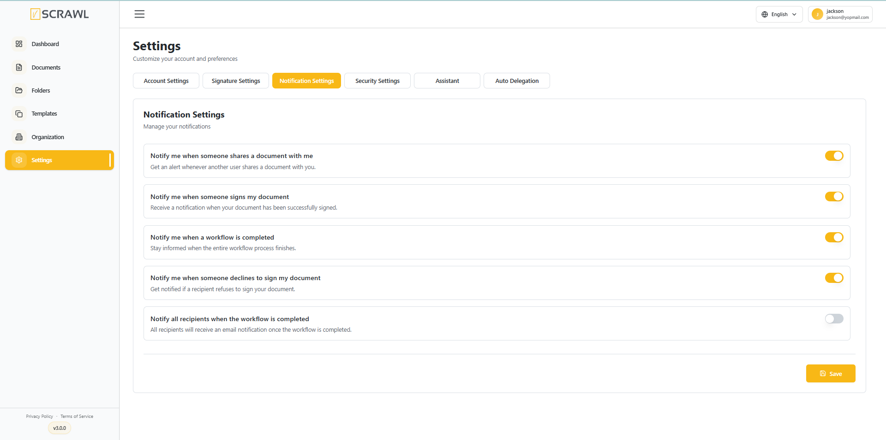

### Assistant

The **Assistant** tab lets you route your incoming documents through a **Personal Assistant** — someone who pre-reviews, fills fields, and approves or declines on your behalf. You always remain the one who finishes signing or approving; other people on the document only ever see your name, never your assistant's.

By default, **Personal Assistant** is turned off.

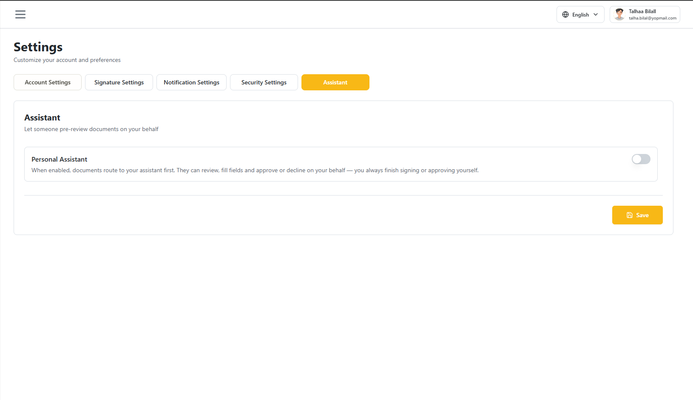

To enable it:

1. Toggle **Personal Assistant** on.
2. Enter the **Assistant's Email** — the address that will receive documents to pre-review on your behalf.
3. Optionally enter the **Assistant's Name**.
4. Click **Save**.

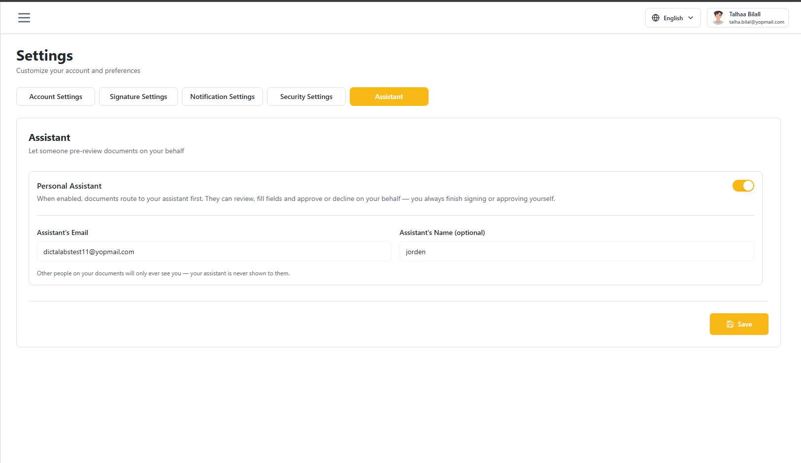

!!! note ""
    Your assistant is never shown to other recipients or document owners — all activity still appears under your own name.

### Auto Delegation

The **Auto Delegation** tab lets you hand your signing and approval turns to someone else automatically while you are away, for a specific date range.

By default, **Enable Auto Delegation** is turned off.

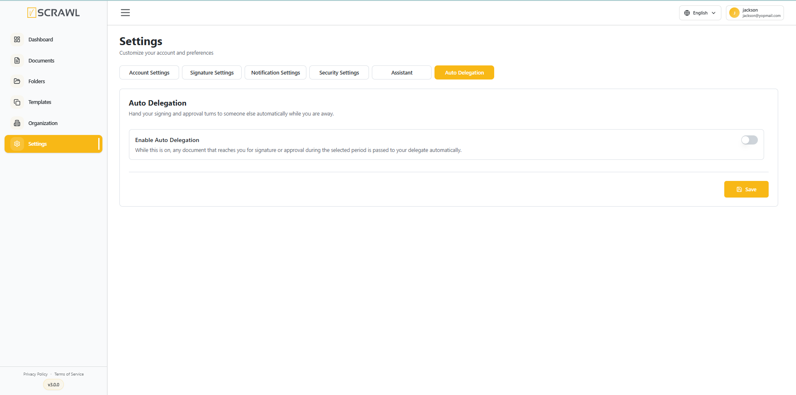

To enable it:

1. Toggle **Enable Auto Delegation** on.
2. Enter the **Delegate Name** and **Delegate Email** of the person who should receive your documents.
3. Set **Away From** and **Away Until** — the date range during which delegation is active.
4. Click **Save**.

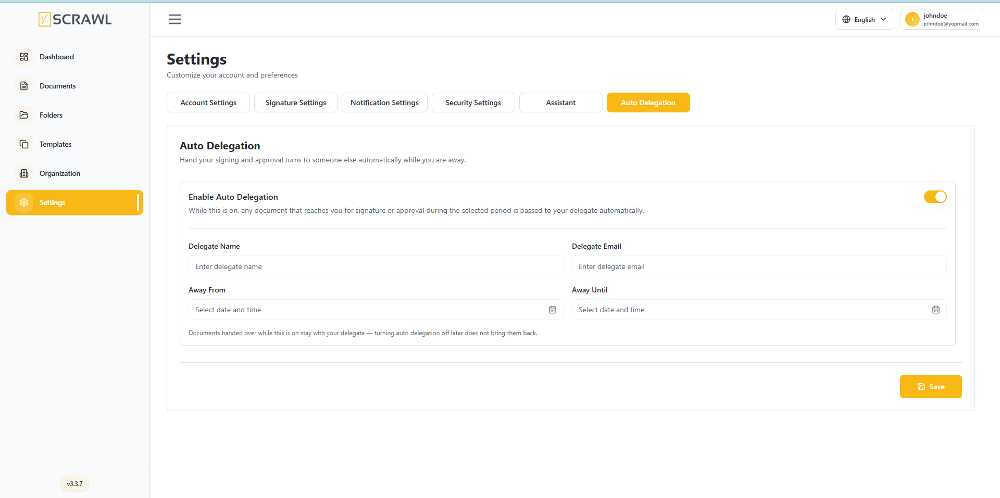

!!! warning ""
    Documents handed over while this is on stay with your delegate — turning Auto Delegation off later does not bring them back.

