# Self-Sign Workflows 

vScrawl supports **several signing options**, depending on your needs:

## Simple Electronic Signature
This is the most common and straightforward signing option.

- Upload a document → **Sign Yourself**.
    
- Drop a **signature field** and **annotations** on the document.
    
- Fill all the **necessary annotations** on the **documents** and click on the **signature field**.
    
- You can use the **Next Navigation Button (➜)** on the bottom of the document to **move from one annotation** to **another** on the **document**.

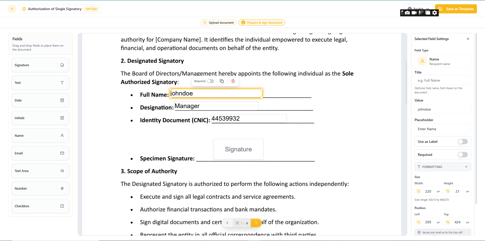

!!! note ""
    **Field Requirements:** Fields with the Required Toggle (Right Panel) set to Enabled must be filled to sign; otherwise, all fields are optional.

- For new users, you must choose how to create your signature: Upload an **Image**, **Draw**, or use **Text**.

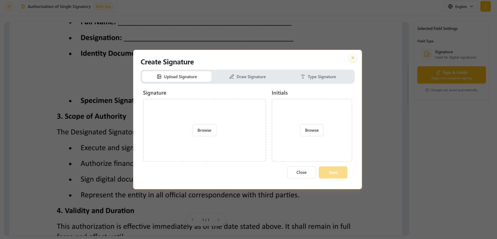

- After completing all required annotations and signature fields, click the **Sign & Finish** button to finalize the signing process.

- When completed, you will see the **All Done** notification.

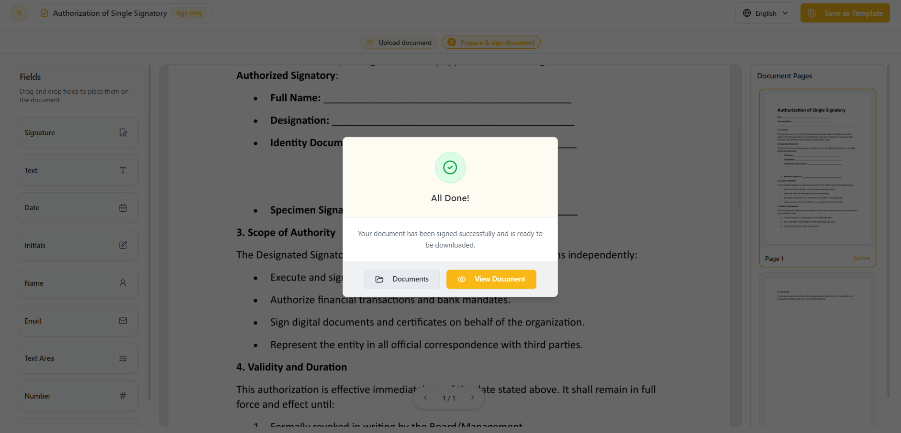

- When you click on the View button on the **All Done notification.** You can view your **signatures** along with the **annotations on the document.**

![[vscrawl-user-guide/docs/images/signed-document-ses-annotations.png|vScrawl Documents]]

- **You can also access the Audit Report for a document by clicking the Audit Report button.** The Audit Report provides a detailed history of the document workflow, including recipient actions, timestamps, status changes, IP addresses, and device information, helping maintain transparency and compliance throughout the signing process.
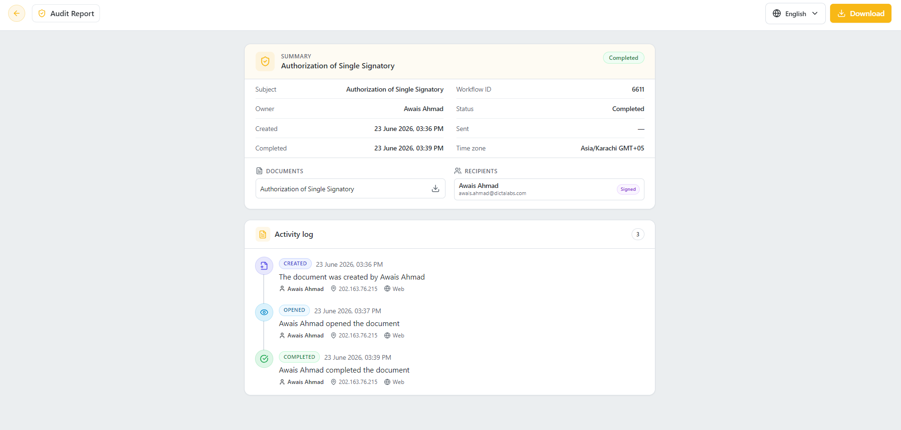
## Digital Signatures

In vScrawl, digital signatures provide a secure, reliable, and legally compliant way to sign documents, ensuring authenticity and trust at every step. The platform supports both **Advanced Electronic Signatures (AES)** and **Qualified Electronic Signatures (QES)**, offering flexibility depending on the level of assurance and compliance you require.

- Upload a document → **Sign Yourself**
    
- Drop a signature field and annotations on the document from the left-hand panel and select one of the **Advanced Electronic Signature / Qualified Electronic Signature** from the **signature type** drop down on right-hand panel.
    
- Fill all the **necessary annotations** on the **document.**
    
- Click on the **Signature field** or on the **Sign** button present on the right-hand panel.
    
- Different Signing servers will appear after clicking on the signature field or sign button. You may choose one of these based on your preference. Let's explore these options one by one.
### vScrawl Signing Server

- Choose the **vScrawl Signing Server** and enter your **password.**

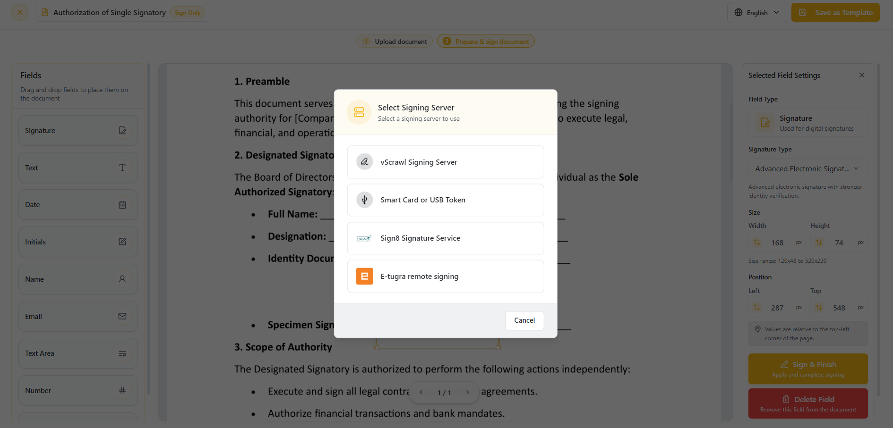

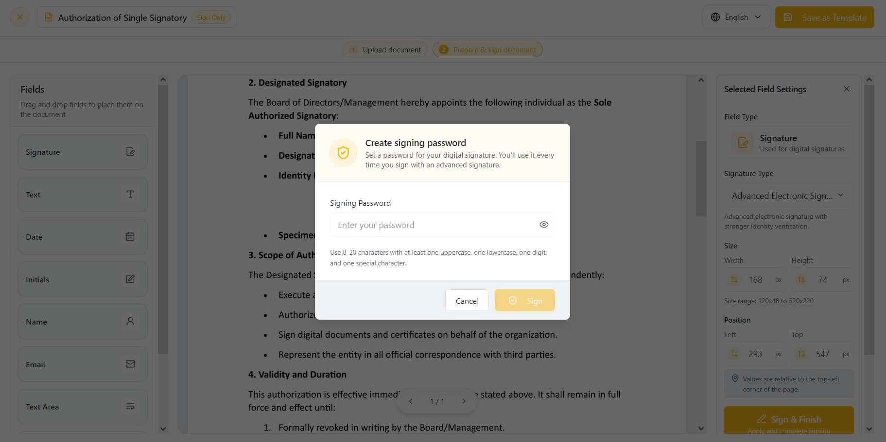

- If you are signing up on vScrawl for the first time using **Google Authentication** or **Keycloak**, you will be asked to **set up a password** before you can use **Advanced Signatures**. This password will be linked to your account and required each time you apply an AES signature.
    
- Now set up the **password** **(It must be at least 8 characters long and contain at least one lowercase letter, one uppercase letter, one digit, and one special character)** and click on the **OK** button.
    
- The **signing process will start** and **you will see progress (Loading Indicator)** for the signing.

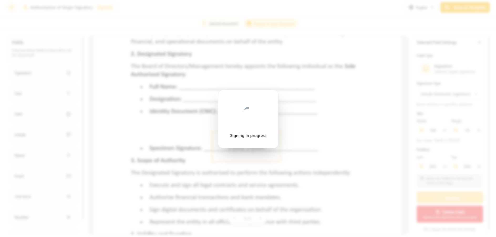

- When the process is **completed, then** the **All Done notification** will appear.

- Click on View button to see your signatures on the document and the **document is signed**.

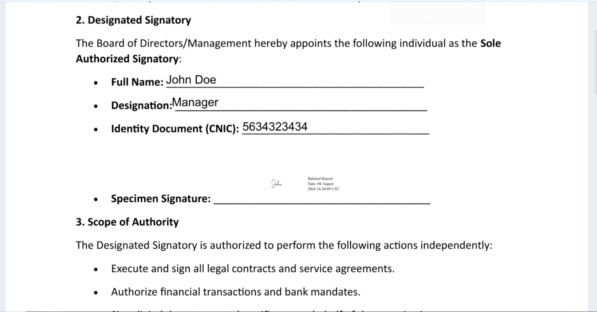

### eTugra Remote Signatures Server

- Choose the **eTugra Remote Signatures Server** option. Install the **eTugra Auth** mobile app from the **Google Play Store** or **Apple App Store**.
    
- An authorization **dialog box** will open after clicking on **eTugra Remote Signatures** server.
    
- Enter your **email address** in this **credential authorization** for **user ID.**
    
- After entering your **email address** now click on proceed.
    
- You will see the authorization request number being sent on your **eTugra Auth** mobile app**.**

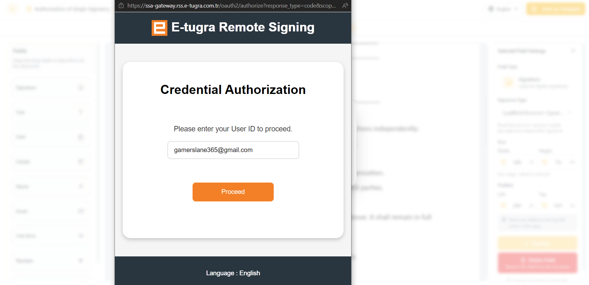

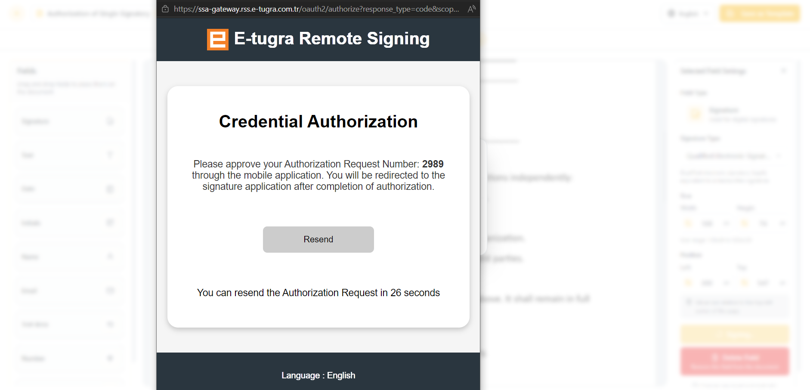

- Approve the request on your **eTugra Auth** mobile app**.**

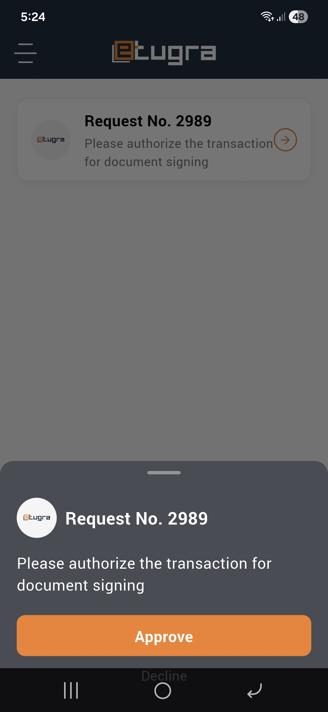

- After approving the request on **eTugra Auth** mobile app the process will be started for the Remote Signature and signature will be performed on the document.
    
### Smart Card or USB Token

- You can also perform the signing using the **Smart Card or USB Token** option**.**
    
- To perform signing using **Smart Card or USB Token** make sure a smart card or a USB token is connected with your PC and then select the desired option.
    
- Now for this you have to install **SmartXipher** **app** for desktop and your smart card or USB token drivers.

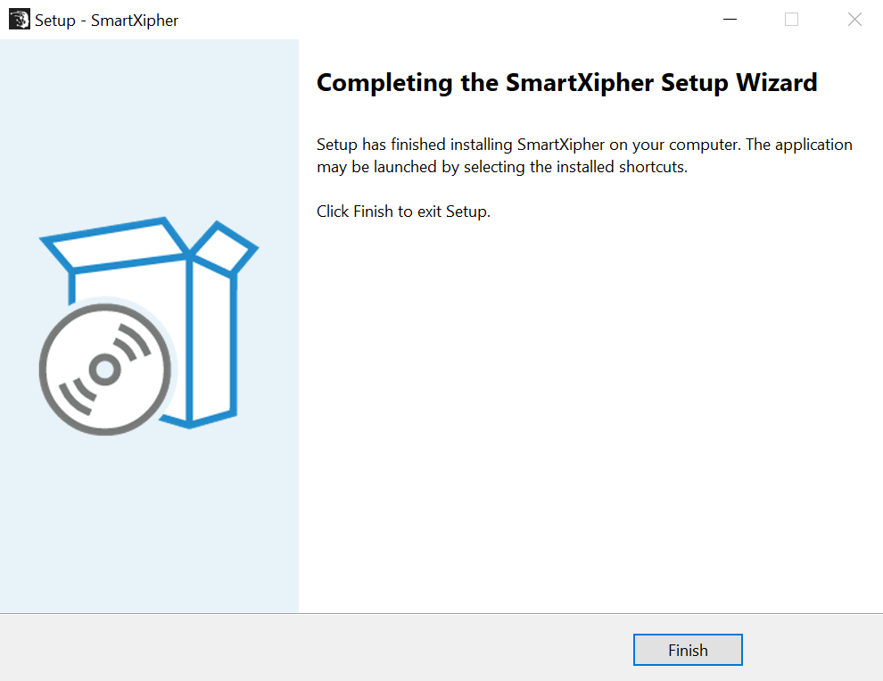

- When you select the **“Smart Card or USB Token”** option, the **SmartXipher** signing screen is displayed. The system verifies the user’s **digital certificate** through **SmartXipher**. Once the certificate is successfully validated, click the **Sign** button to complete the digital signing process.

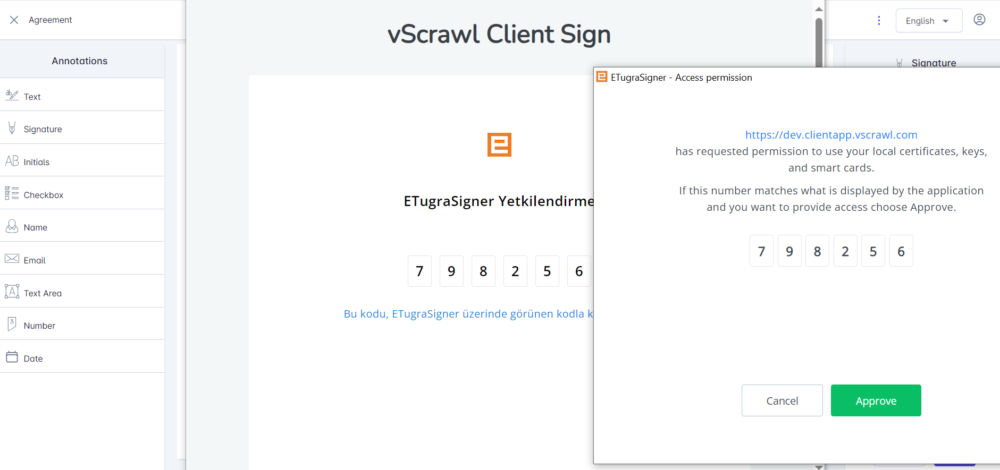

- A dialog will appear from where choose the appropriate signing **certificate**. On the next dialog, enter the **smart card or USB token** password and the signing process will be completed.
    
- Click on **View button** to see your signatures on the document and the **document is signed**.

