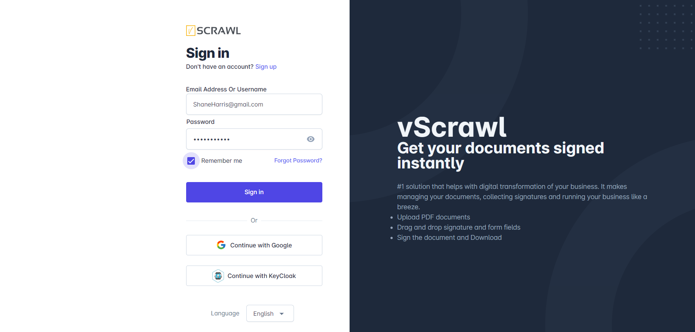

# Sign In

## Accessing the Login Page
Go to: [vScrawl Login](https://app.vscrawl.com/sign-in?redirectURL=%2Fdocuments%2Fall-documents)

## Enter Credentials

- Enter your **registered email address**.
    
- Type your **password** (case-sensitive).
    
- Click **Sign In** to access your **vScrawl** account.

## Signup / Sign-in using Google Authentication or Keycloak

You can sign in using either **Google authentication** or **Key cloak authentication**. On the login page, simply choose **“Continue with Google”** and select your Google account. If prompted, enter your Google password.

Alternatively, if your organization uses Key cloak, click **“Continue with Key cloak”** and enter your Key cloak username and password. Once authenticated, you will be redirected to the **vScrawl** **Dashboard**.
