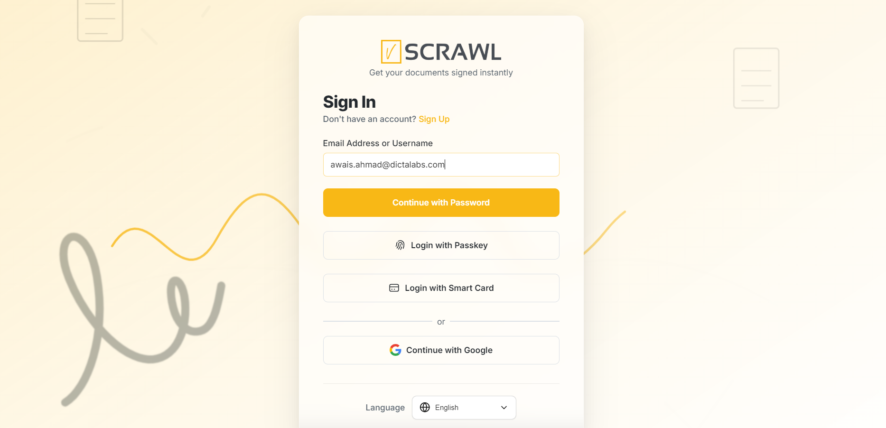
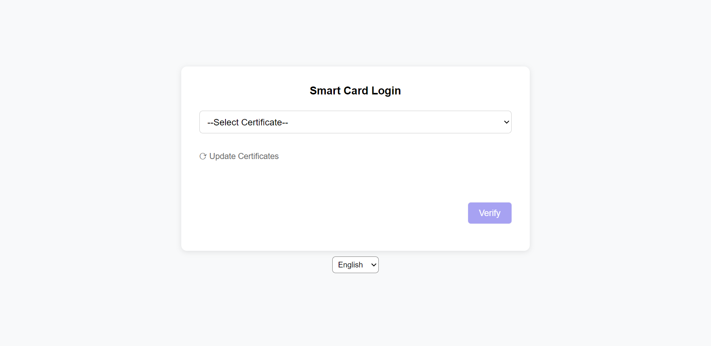
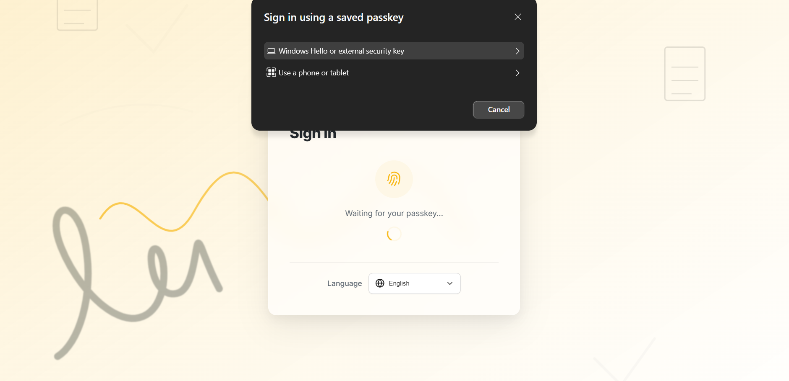

# Sign In

## Accessing the Login Page
Go to: [vScrawl Login](https://app.vscrawl.com/login)

## Enter Credentials

Signing in takes two short steps:

- Enter your **registered email address** or **username** in the **Email Address or Username** field, then click **Continue with Password**.
    
- Type your **password** (case-sensitive). Tick **Remember me** if you want to stay signed in on this device.
    
- Click **Sign In** to access your **vScrawl** account.

If you have forgotten your password, click **Forgot password?** on the password step, enter your email address or username and click **Send Reset Link**. A reset link is sent to your email.

!!! note ""
    If you have turned on **Two-Factor Authentication** (see [Security Settings](settings.md#security-settings)), a **Two-Factor Auth** step follows: enter the 6-digit code from your authenticator app and click **Verify Code**.

## Signup / Sign-in using Google Authentication

Where your administrator has enabled it, the login page shows a **“Continue with Google”** button below the sign-in form. Click it and select your Google account. If prompted, enter your Google password.

Once authenticated, you will be redirected to the **vScrawl** **Dashboard**.

## Signup / Sign-in with the Smart Card Using the SmartXipher App

vScrawl provides secure authentication through **Smart Card login** using the **SmartXipher App**. This ensures strong identity verification and protects access to your account.

When a user clicks **Login with Smart Card** on the login page, the system verifies their **digital certificate** through **SmartXipher**. Once the **certificate** is validated, the user is securely logged into their **dashboard.** The button appears only where your administrator has enabled Smart Card sign-in.

## Sign-in Using Passkey

To sign in with a passkey you must first have registered one — either when sign-up asks **Enable Passkey?** after you verify your email, or later under **Settings → Security Settings → Enable Passkey** (see [Security Settings](settings.md#security-settings)). Then open the login page and click **“Login with Passkey.”** You do not need to type your email address or password first. The page shows **Waiting for your passkey…** and your browser opens its own passkey prompt — on Windows, a dialog titled **“Sign in using a saved passkey”** will appear, allowing you to choose how you want to authenticate. You can select **Windows Hello or an external security key** to sign in using your device’s fingerprint, face recognition, PIN, or a USB security key. 

Alternatively, you can choose **Use a phone or tablet**, which will display a QR code on the screen; scan this QR code using your mobile phone and approve the sign-in using your device’s biometric authentication or screen lock. Once the authentication is successfully completed, you will be automatically logged in to your vScrawl account without entering a password.

After successfully signing in, users are redirected to the **vScrawl Dashboard [dashboard](dashboard.md)**, where they can access document management features, monitor workflow activity, and perform day-to-day operations within the platform.

