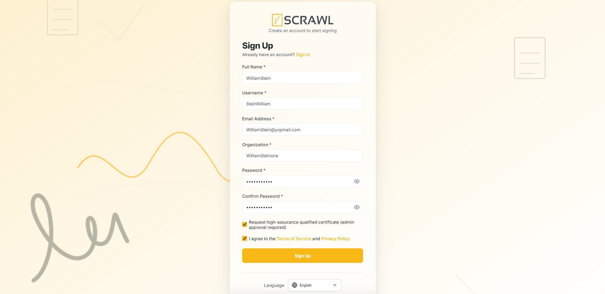
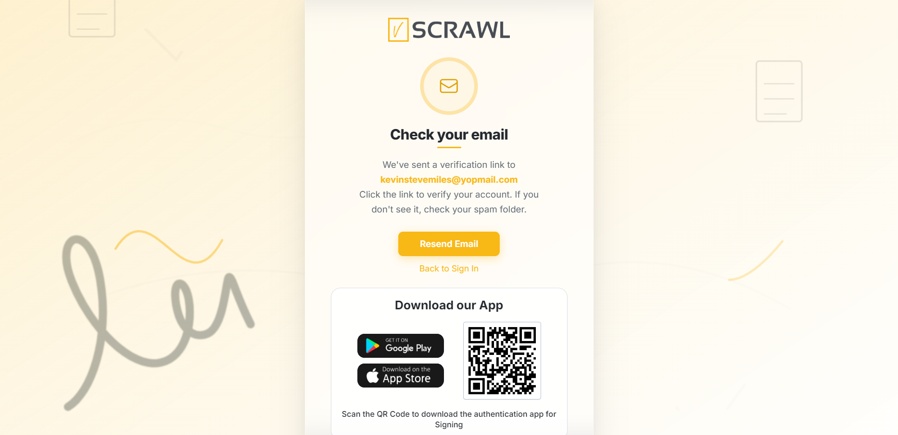
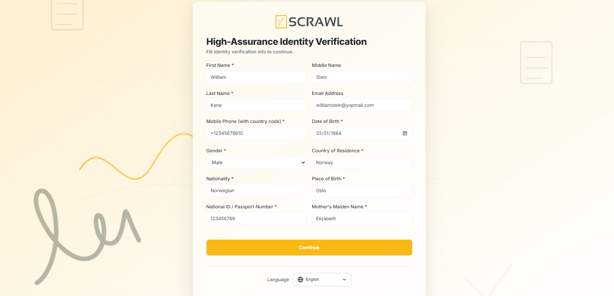
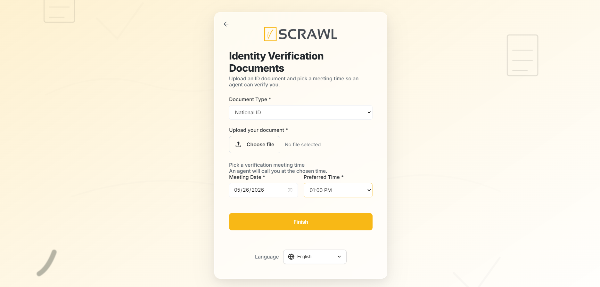

# Sign Up

## Create an Account

- Open a browser **(Chrome, Edge, or Firefox) or Safari**
    
- Navigate to: [vScrawl: #1 eSigning and CLM solution](https://app.vscrawl.com/sign-in?redirectURL=%2Fdocuments%2Fall-documents "https://app.vscrawl.com/sign-in?redirectURL=%2Fdocuments%2Fall-documents")
    
- Click **“Sign Up”.**
    
- Provide your **Full Name, Username, Email Address, Organization Name and password.**

- Select to agree the **Terms and Conditions** and **Privacy Policy** and click **“Create your free account”**.

!!! note ""
    The box is **not** ticked for you, and the account is not created until you tick
    it — that is what makes it consent rather than an assumption. Your acceptance is
    stored with your account, along with the date and the address you accepted from,
    so it can be shown later if anyone asks what you agreed to and when.
    
- An account activation email will be received, **Verify your account** → **account gets activated** → **login from the Login page.**

## High-Assurance Certificate Registration Guide

Users can also sign up by requesting a **High-Assurance Qualified Certificate** for secure and trusted digital signatures. This option provides enhanced identity verification and requires **administrator approval** before activation.

### How It Works

When registering, enable the option:

**“Request high-assurance qualified certificate (admin approval required)”**

Once selected, you will be asked to complete the **High-Assurance Identity Verification** form and upload supporting identification documents.
### Required Information

Please provide accurate details exactly as they appear on your official identification documents, including:

- First Name and Last Name
- Date of Birth
- Gender and Nationality
- Country and Place of Birth
- Phone Number and Email Address
- National ID / Passport Number
- Mother’s Maiden Name

### Identity Verification Documents

You must also:

1. Select a valid document type.
2. Upload a government-issued identity document (Image or PDF, max 5 MB).
3. Choose your preferred meeting date and time for verification.

Accepted documents may include:

- Passport
- National ID Card
- Driving License (if applicable)

### Approval Process

After submission:

- Your request will be reviewed by the administration team.
- Verification is performed based on the submitted identity details and uploaded documents.
- Additional verification or meeting confirmation may be required.
- Once approved, your high-assurance certificate will be issued and activated.

