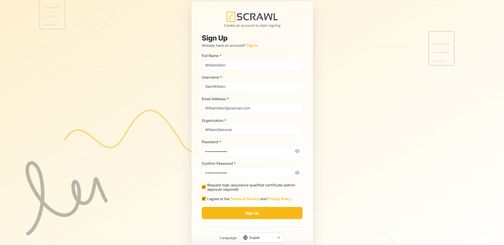
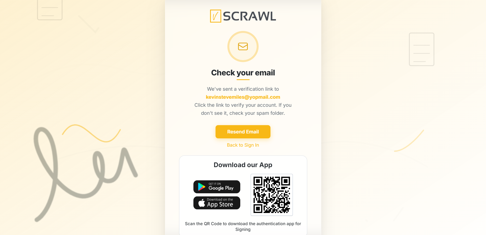
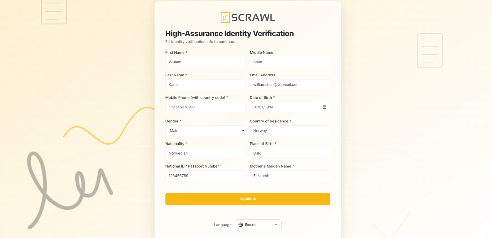
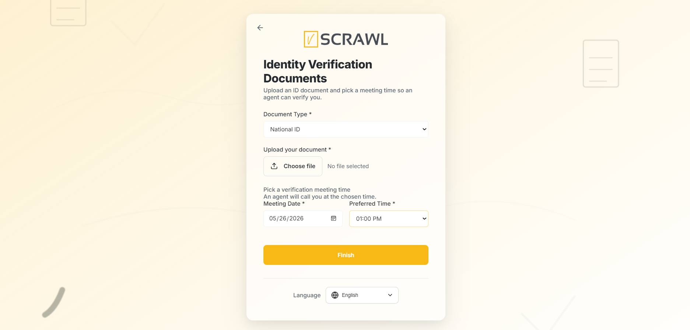

# Sign Up

## Create an Account

- Open a browser **(Chrome, Edge, or Firefox) or Safari**
    
- Navigate to: [vScrawl: #1 eSigning and CLM solution](https://app.vscrawl.com/login "https://app.vscrawl.com/login")
    
- Click **“Sign Up”** next to *Don't have an account?*
    
- Provide your **Full Name, Username, Email Address, Organization, Password** and **Confirm Password** (all required).

The form checks each field as you fill it in:

| Field | Rule |
| --- | --- |
| **Full Name** | 6–50 characters — letters, spaces, hyphens and apostrophes only |
| **Username** | 6–50 characters — letters, numbers, dots (.), underscores (_) and hyphens (-) |
| **Email Address** | A valid email address |
| **Organization** | 3–50 characters, including at least one letter |
| **Password** | 8–20 characters, with at least one uppercase letter, one lowercase letter, one number and one special character |
| **Confirm Password** | Must match the password |

- Tick **I agree to the Terms of Service and Privacy Policy** and click **“Sign Up”**. The **Sign Up** button stays inactive until every field is valid and the box is ticked.

!!! note ""
    The box is **not** ticked for you, and the account is not created until you tick
    it — that is what makes it consent rather than an assumption. Your acceptance is
    stored with your account, along with the date and the address you accepted from,
    so it can be shown later if anyone asks what you agreed to and when.
    
- A **Check your email** page confirms that a verification link has been sent to your address (use **Resend Email** if it does not arrive, and check your spam folder). Click the link in the email → **Account verified** → **sign in from the Login page.**

## High-Assurance Certificate Registration Guide

Users can also sign up by requesting a **High-Assurance Qualified Certificate** for secure and trusted digital signatures. This option provides enhanced identity verification and requires **administrator approval** before activation.

### How It Works

When registering, enable the option:

**“Request high-assurance qualified certificate (admin approval required)”**

The option appears on the sign-up form only where your installation offers qualified certificates. Once selected, you will be asked to complete the **High-Assurance Identity Verification** form and upload supporting identification documents.

If you did not request one when you signed up, you can still do it later from **Settings → Signature Settings → Qualified certificate** (see [Settings](settings.md#requesting-a-qualified-certificate)).
### Required Information

Please provide accurate details exactly as they appear on your official identification documents, including:

- First Name and Last Name (Middle Name is optional)
- Date of Birth — you must be at least 18 years old
- Gender and Nationality
- Country of Residence and Place of Birth
- Mobile Phone (with country code) — your Email Address is filled in for you
- National ID / Passport Number
- Mother’s Maiden Name

### Identity Verification Documents

You must also:

1. Select a valid document type.
2. Upload a government-issued identity document (Image or PDF, max 6 MB).
3. Choose your preferred **Meeting Date** and **Preferred Time** — an agent will call you at the chosen time to verify you.
4. Click **Finish**.

Accepted documents may include:

- Passport
- National ID Card
- Driving License (if applicable)

### Approval Process

After submission:

- Your request will be reviewed by the administration team.
- Verification is performed based on the submitted identity details and uploaded documents.
- Additional verification or meeting confirmation may be required.
- Once approved, your high-assurance certificate will be issued and activated.

