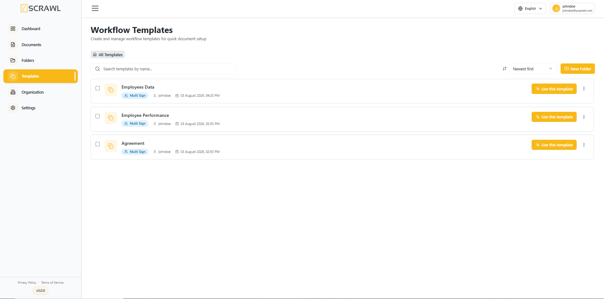
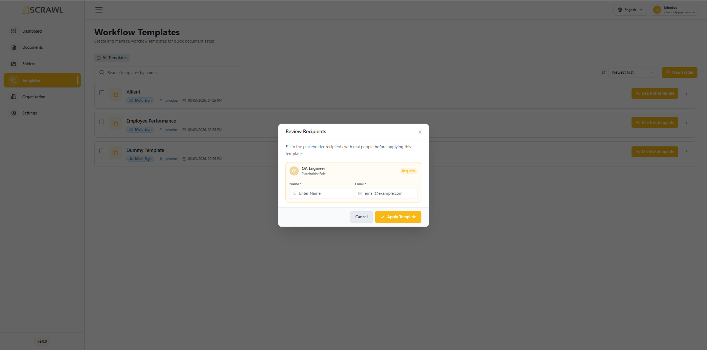
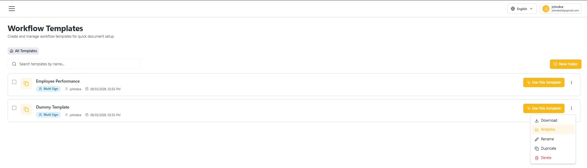
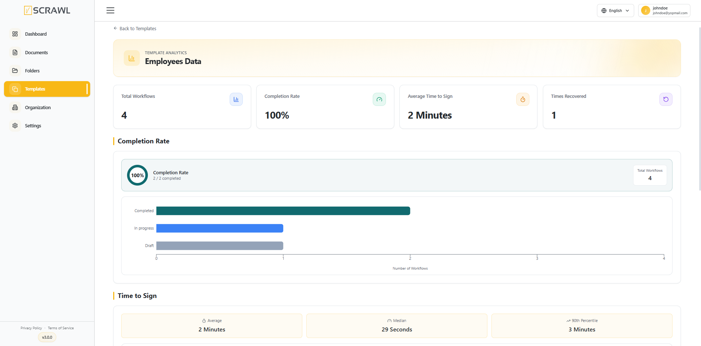
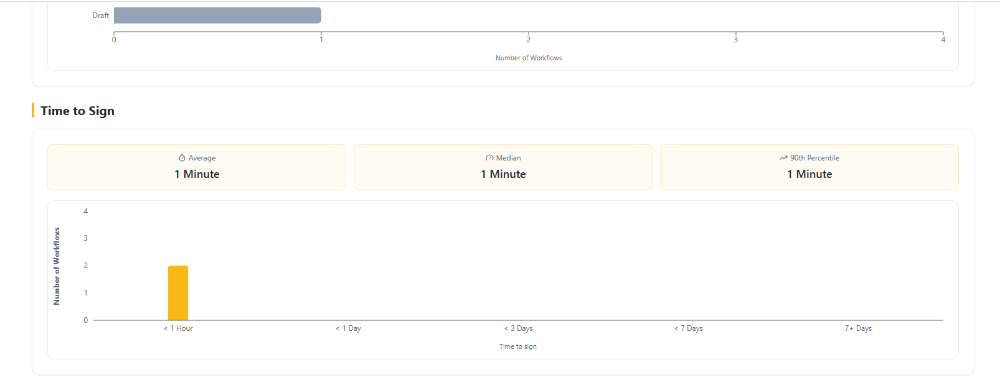
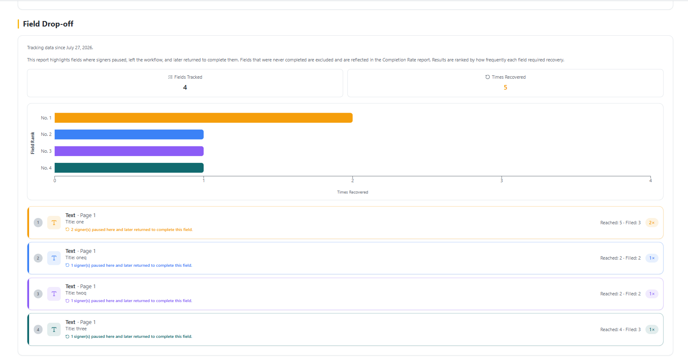

# Templates

The **Templates section** in vScrawl is designed to save time by allowing you to **create**, **store,** and **reuse** commonly used **document formats.** Instead of building a document signing workflow from scratch every time, you can quickly select a pre-defined template and start the signing process right away.

For each template, you have quick access controls:

- **Use this template** – Start a new signing process using the selected template.
    
- **More Options (⋮)** – Download, **Analytics**, Rename, Duplicate, or Delete, depending on permissions.
    
- Use the **search bar** at the top right to quickly locate templates by name.
    
- Useful when you have a large number of templates.
    
- Adjust how many templates are displayed per page (e.g., 10, 20, 50).
    
- Navigate between pages if there are many templates.

## Using a Template with Placeholder Recipients

If a template was saved with one or more [recipient labels](multiple_signers.md) (placeholder roles instead of real people), clicking **Use this template** first opens a **Review Recipients** dialog.

For each placeholder role shown (marked **Required**), enter the actual **Name** and **Email** of the person who should fill that role for this specific document. Click **Apply Template** once all placeholders are filled — the document then proceeds as normal with those recipients assigned.

!!! note ""
    Templates with no placeholder recipients skip this dialog and go straight to document preparation.

## Template Analytics

Every template tracks how it performs across the workflows created from it. Open **More Options (⋮)** on a template and select **Analytics**.

The **Template Analytics** page shows top-level stats — **Total Workflows**, **Completion Rate**, **Average Time to Sign**, **Times Recovered** — followed by:

- **Completion Rate** – Percentage of workflows completed, with a breakdown of **Completed**, **In progress**, and **Draft** workflow counts.

- **Time to Sign** – **Average**, **Median**, and **90th Percentile** time to sign, plotted as a distribution across time buckets (< 1 Hour, < 1 Day, < 3 Days, < 7 Days, 7+ Days).

- **Field Drop-off** – Highlights fields where signers paused, left the workflow, and later returned to complete them, ranked by how often each field required recovery (**Fields Tracked**, **Times Recovered**, and a per-field breakdown of **Reached** vs **Filled** counts).

Click **Back to Templates** to return to the templates list.

