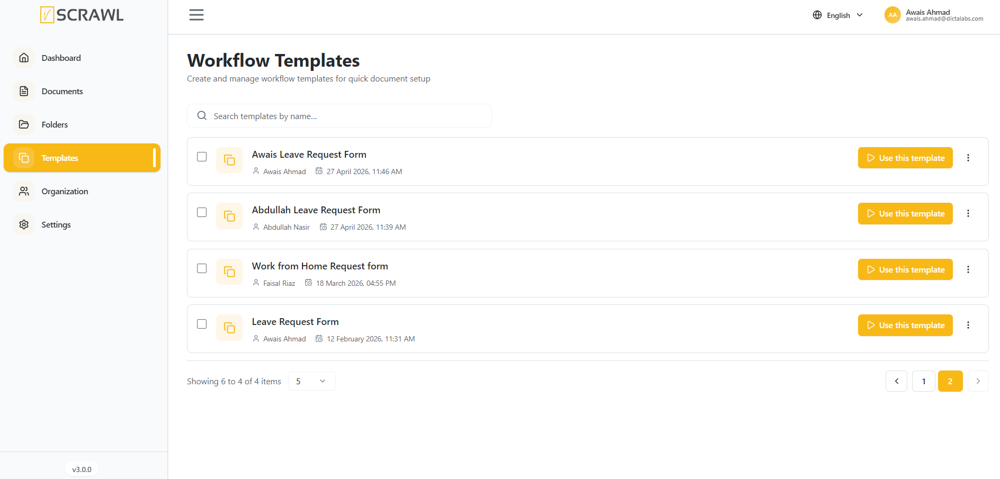

# Templates

The **Templates section** in vScrawl is designed to save time by allowing you to **create**, **store,** and **reuse** commonly used **document formats.** Instead of building a document signing workflow from scratch every time, you can quickly select a pre-defined template and start the signing process right away.

For each template, you have quick access controls:

- **Use** – Start a new signing process using the selected template.
    
- **More Options (⋮)** – Additional actions (e.g., download, rename, delete, depending on permissions).
    
- Use the **search bar** at the top right to quickly locate templates by name.
    
- Useful when you have a large number of templates.
    
- Adjust how many templates are displayed per page (e.g., 10, 20, 50).
    
- Navigate between pages if there are many templates.

