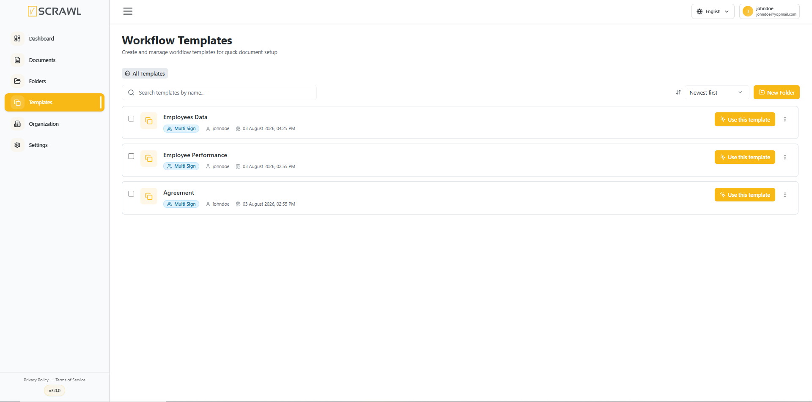
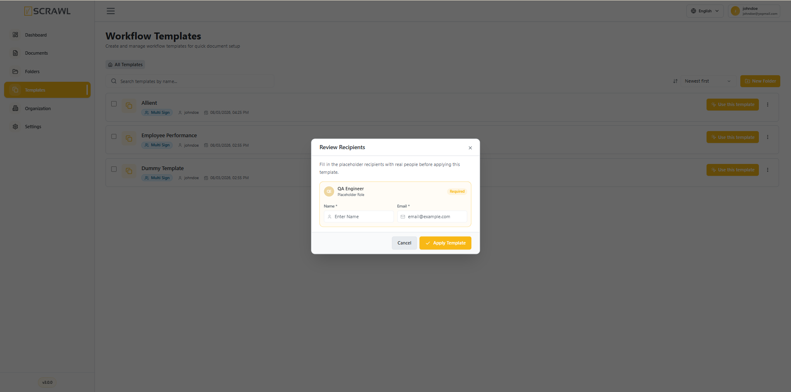
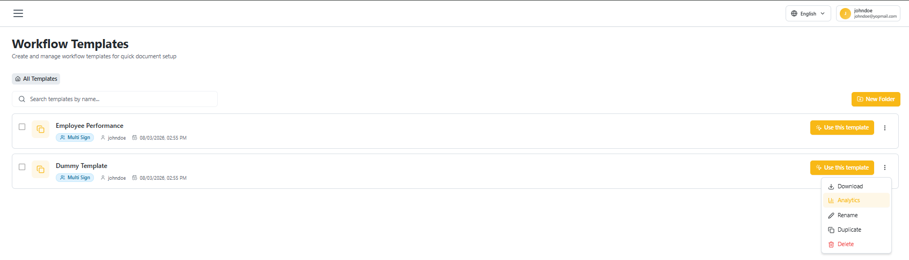
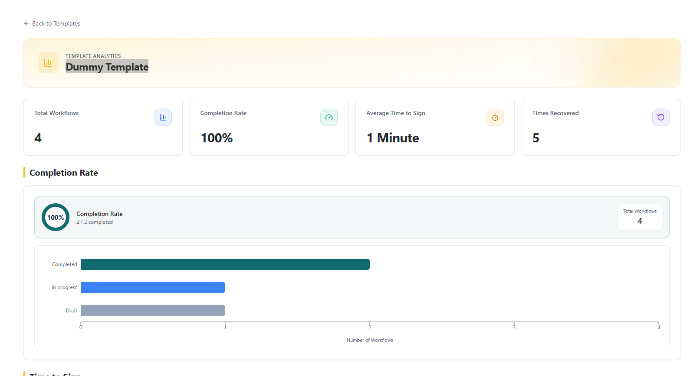
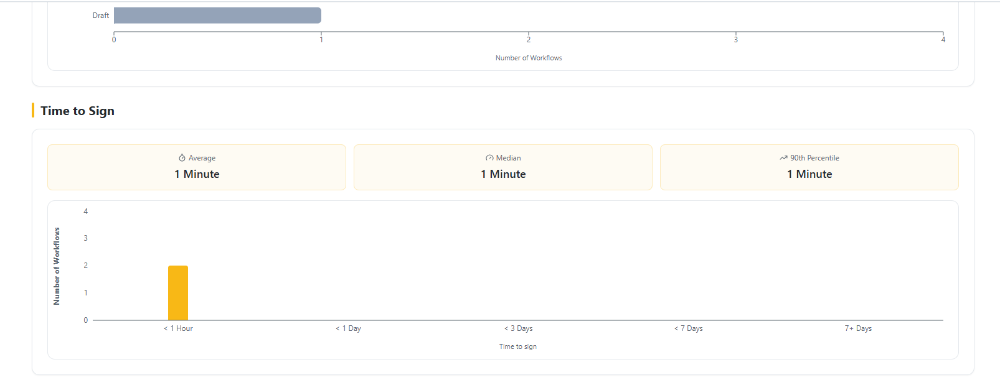
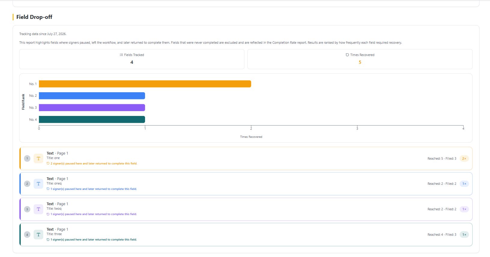

# Templates

The **Templates section** in vScrawl is designed to save time by allowing you to **create**, **store,** and **reuse** commonly used **document formats.** Instead of building a document signing workflow from scratch every time, you can quickly select a pre-defined template and start the signing process right away.

For each template, you have quick access controls:

- **Use this template** – Start a new signing process using the selected template (available when your role allows using templates).
    
- **More Options (⋮)** – Download, **Analytics**, Rename, Move to Folder, Copy to Folder, Duplicate, or Delete, depending on permissions. **Move to Folder** and **Copy to Folder** are available to the organization owner once at least one folder exists.
    
- Use the **search bar** to quickly locate templates by name.
    
- Useful when you have a large number of templates.
    
- Use **Sort** to order templates by **Newest first**, **Oldest first**, **A – Z** or **Z – A**.
    
- More templates load automatically as you scroll down the list.

- Select several templates and click **Delete Selected** to delete them together.

## Using a Template with Placeholder Recipients

If a template was saved with one or more [recipient labels](multiple_signers.md) (placeholder roles instead of real people), clicking **Use this template** first opens a **Review Recipients** dialog.

For each placeholder role shown (marked **Required**), enter the actual **Name** and **Email** of the person who should fill that role for this specific document, or click **Choose from team** to pick a colleague. Click **Apply Template** once all placeholders are filled — the document then proceeds as normal with those recipients assigned.

!!! note ""
    Templates with no placeholder recipients skip this dialog and go straight to document preparation.

If automatic reminders were turned on for the workflow when it was saved as a template, documents created from the template start with the same reminder setting.

## Template Folders

The organization owner can organize templates into folders:

- Click **New Folder** to create a folder in the current location. Open a folder to see its templates and sub-folders, and use the breadcrumb (**All Templates**) or **Back** to move up again.
- Use a folder's **⋮** menu to **Rename** it, **Manage Access** (choose which roles can see the folder and its templates), or **Delete** it.
- Use **Move to Folder** or **Copy to Folder** on a template to place it in a folder.

!!! warning ""
    Deleting a folder permanently deletes everything inside it, including its sub-folders and templates.

## Template Analytics

Every template tracks how it performs across the workflows created from it. Open **More Options (⋮)** on a template and select **Analytics**.

The **Template Analytics** page shows top-level stats — **Total Workflows**, **Completion Rate**, **Average Time to Sign**, **Times Recovered** — followed by:

- **Completion Rate** – Of the workflows that have finished (completed or void), the percentage that were completed, with a breakdown of workflow counts by status (**Completed**, **Void**, **In progress**, **Draft**).

- **Time to Sign** – **Average**, **Median**, and **90th Percentile** time to sign, plotted as a distribution across time buckets (< 1 Hour, < 1 Day, < 3 Days, < 7 Days, 7+ Days).

- **Field Drop-off** – Highlights fields where signers paused, left the workflow, and later returned to complete them, ranked by how often each field required recovery (**Fields Tracked**, **Times Recovered**, and a per-field breakdown of **Reached** vs **Filled** counts).

Click **Back to Templates** to return to the templates list.

