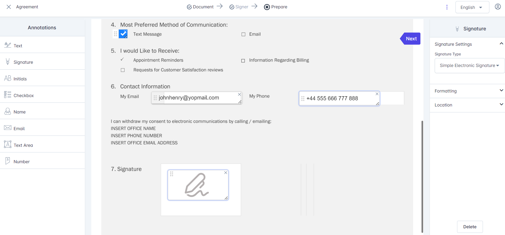
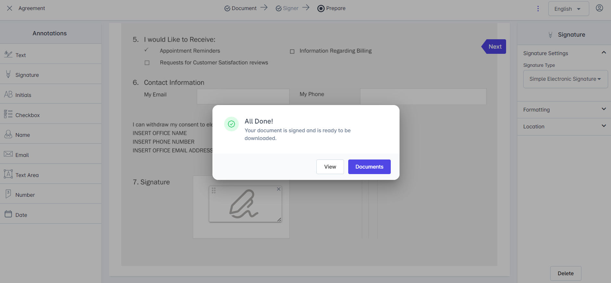
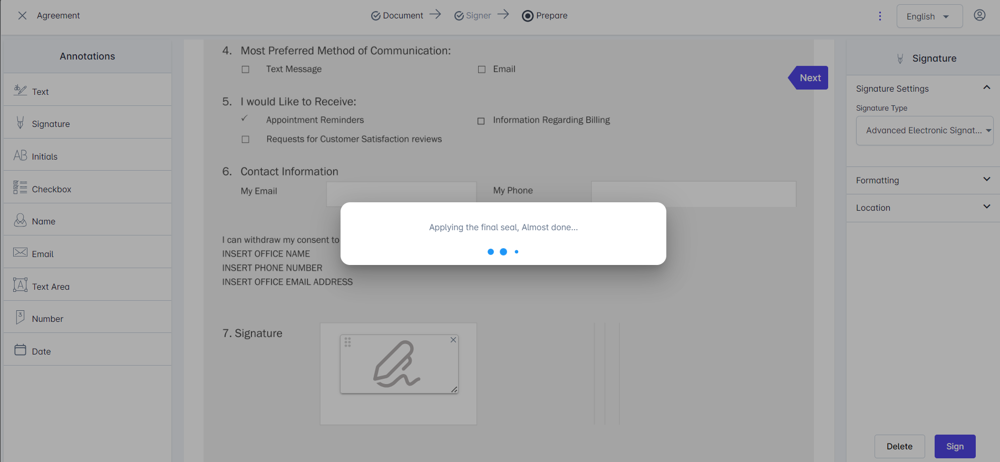
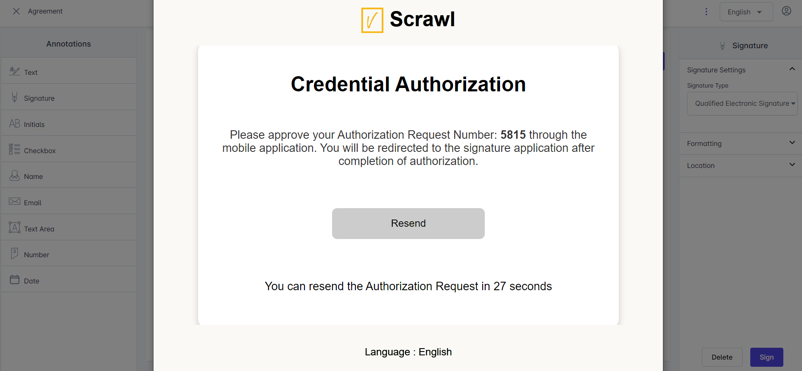
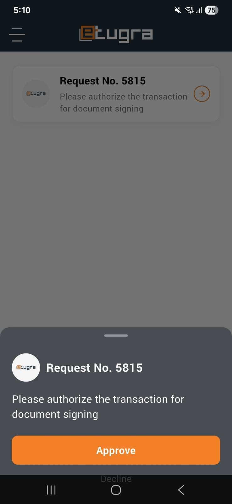
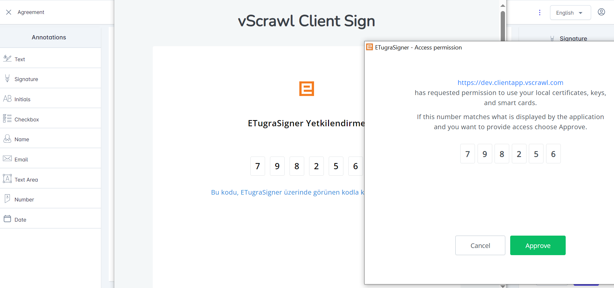
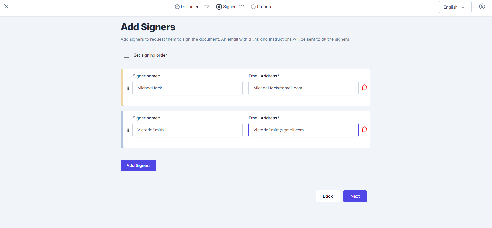
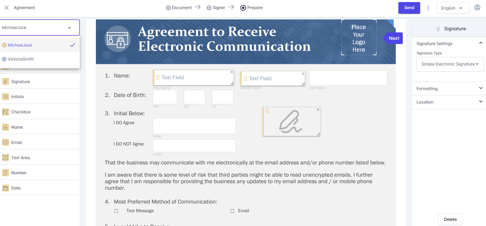
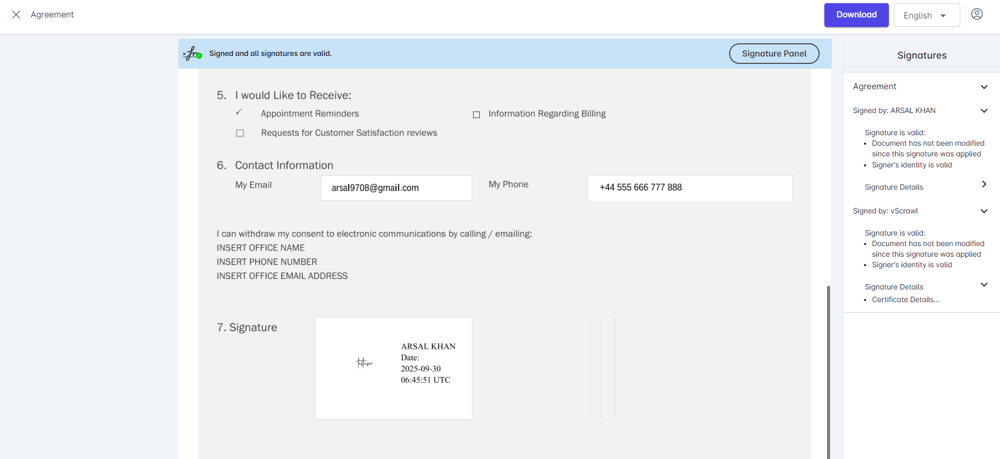

# Signing Workflows

vScrawl supports **several signing options**, depending on your needs:

## Simple Electronic Signature
This is the most common and straightforward signing option.

- Upload a document → **Sign Only**.
    
- Drop a **signature field** and **annotations** on the document.
    
- Fill all the **necessary annotations** on the **documents** and click on the **signature field**.
    
- You can use the **“Next” navigation pointer** on the document to **move from one annotation** to **another** on the **document**.

- For the **New User** You have to **Choose how to create your signature:** Upload an **Image,** **Draw, or use Text.**

- **Signing Process Confirmation** notification appears and Click **Ok**.

- When completed, you will see the **All Done** notification.

- When you click on the View button on the **All Done notification.** You can view your **signatures** along with the **annotations on the document.**

## Digital Signatures
In vScrawl, digital signatures provide a secure, reliable, and legally compliant way to sign documents, ensuring authenticity and trust at every step. The platform supports both **Advanced Electronic Signatures (AES)** and **Qualified Electronic Signatures (QES)**, offering flexibility depending on the level of assurance and compliance you require.

- Upload a document → **Sign Only**
    
- Drop a signature field and annotations on the document from the left-hand panel and select one of the **Advanced Electronic Signature / Qualified Electronic Signature** from the **signature type** drop down on right-hand panel.
    
- Fill all the **necessary annotations** on the **document.**
    
- Click on the **Signature field** or on the **Sign** button present on the right-hand panel.
    
- Different Signing servers will appear after clicking on the signature field or sign button. You may choose one of these based on your preference. Lets explore these options one by one.
### vScrawl Signing Server

- Choose the **vScrawl Signing Server** and enter your **password.**

- If you are signing up on vScrawl for the first time using **Google Authentication** or **Key cloak**, you will be asked to **set up a password** before you can use **Advanced Signatures**. This password will be linked to your account and required each time you apply an AES signature.
    
- Now set up the **password** **(It should be 8 characters long and at least contains one lowercase letter, one uppercase letter, one digit and one special character)** and click on Ok button.
    
- The **signing process will start** and **you will see progress (Loading Indicator)** for the signing.

- When the process is **completed t**hen **All Done notification** will appear.

- Click on View button to see your signatures on the document and the **document is signed**.

### eTugra Remote Signatures Server

- Choose **eTugra Remote Signatures Server** option. Install **eTugra Auth** mobile app from the **google play store** or **apple store.**
    
- An authorization **dialog box** will open after clicking on **eTugra Remote Signatures** server.
    
- Enter your **email address** in this **credential authorization** for **user ID.**
    
- After entering your **email address** now click on proceed.
    
- You will see the authorization request number being sent on your **eTugra Auth** mobile app**.**

- Approve the request on your **eTugra Auth** mobile app**.**

- After approving the request on **eTugra Auth** mobile app the process will be started for the Remote Signature and signature will be performed on the document.
    
### Smart Card or USB Token

- You can also perform the signing using the **Smart Card or USB Token** option**.**
    
- To perform signing using **Smart Card or USB Token** make sure a smart card or a USB token is connected with your PC and then select the desired option.
    
- Now for this you have to install **eTugra Signer** app for desktop and your smart card or USB token drivers.
    
- When you click on **“Smart Card or USB token”** option this is the screen you will get after clicking. Click on **Approve button for eTugra signer app.**

- A dialog will appear from where choose the appropriate signing certificate. On the next dialog, enter the smart card or USB token password and the signing process will be completed.
    
- Click on **View button** to see your signatures on the document and the **document is signed**.

## Multi-User Signing

- Click Upload Document → **Sign with Others**
- Select your file **(Browser from your PC or drag a document to upload)** Now click on the **Next**  
    **button**.  
    After clicking on the **Next button** you will progress to the **Add Signers** screen.

- Add the **Signer name** and **email address** for as many signers as you need for the workflow. To be able to add more than one signers, use **Add Signers** button.
    
- You can also set signing order for the recipients. When this option is enabled, each signer will sign on his own turn. When disabled, the added signers can sign the document in any order.
    
- After clicking on the **Next button** you will get **document preparation screen** with the **signers** drop down on the **top left**. Select all the **signers** one by one and add **annotations** and **signature fields for the particular signer.**  
    It is necessary to include the signature field for all the signers for sending the document(s) otherwise it will show you the notification “You cannot send the document without a signature field”. Click on the Send button on the top right corner to send the document to signers.
    
- You can move back to **Add Signers** screen by clicking on the **Signer** button on top of the document and **edit their details** before the document is sent for signing.
    
- Before Sending the document, you may click on ⋮ to choose **Save as Template.** A form will open where you can specify a template name and optional description. Such saved templates can later be reused to avoid uploading an preparing the same document in the future. This is explained more in **Templates** section below.

- Each signer will receive an email with the link to sign the document. The signer can login and sign the document in pending sate.
    
- After signing, the **document** automatically updates in real time, and other **designated signers** can proceed with their part of the **signing process**.

## Using the Signature Panel in vScrawl

The **Signature Panel** in **vScrawl** allows you to review **digital signatures** applied to a **document.** It provides a clear breakdown of **who signed,** and **whether the document has been modified since signing.** This ensures both **transparency** and trust in the **document’s authenticity**.

- When viewing a signed document in vScrawl, click on the **“Signature Panel”** button located at the top-right of the interface.
    
- Once opened, the **right-hand panel** displays a list of all signatures applied to the document.

## The vScrawl Seal

In addition to individual signers, on the completed documents, you will also see a digital signature from **vScrawl** itself:

- **vScrawl** applies a **sealing signature** to the document.
    
- This acts as a final certification that:
    
    - The document is locked and cannot be modified without breaking the seal.
        
    - All signatures remain intact and verifiable.
        
    - An identification that the document has been signed through vScrawl.

## Templates

The **Templates section** in vScrawl is designed to save time by allowing you to **create**, **store,** and **reuse** commonly used **document formats.** Instead of building a document signing workflow from scratch every time, you can quickly select a pre-defined template and start the signing process right away.

For each template, you have quick access controls:

- **Use** – Start a new signing process using the selected template.
    
- **More Options (⋮)** – Additional actions (e.g., edit, rename, delete, or duplicate, depending on permissions).
    
- Use the **search bar** at the top right to quickly locate templates by name.
    
- Useful when you have a large number of templates.
    
- Adjust how many templates are displayed per page (e.g., 10, 20, 50).
    
- Navigate between pages if there are many templates.
    
- Navigate between pages if there are many templates.

